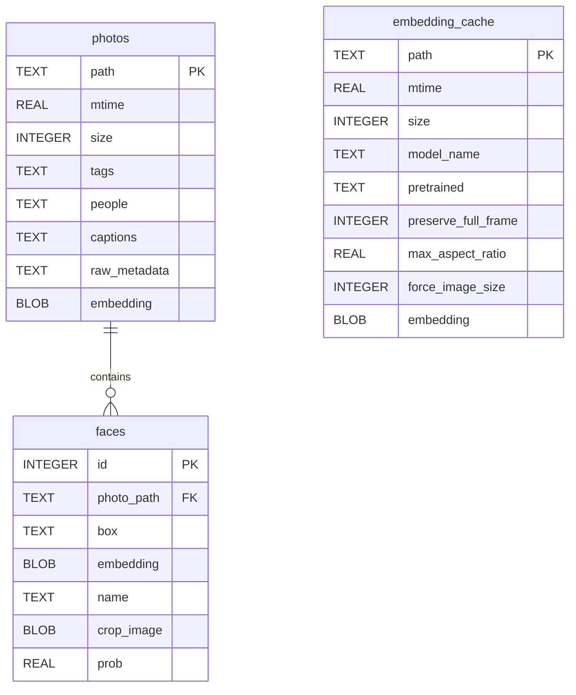
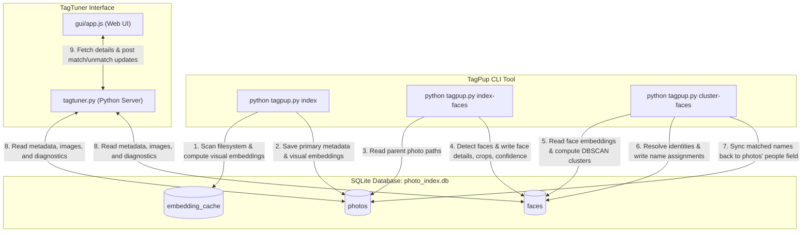

# TagPup Database Specification

TagPup uses an SQLite database (by default stored at `data/photo_index.db`) to manage photo metadata, visual embeddings, detected face crops, identity assignments, and embedding caches.

---

## Database Schema

The database consists of three primary tables: `photos`, `faces`, and `embedding_cache`.

### 1. `photos` Table
Stores high-level image metadata, tags (keywords), captions, resolved people lists, and the primary visual embedding vector used for semantic searches.

| Column | Type | Constraints | Description |
| :--- | :--- | :--- | :--- |
| `path` | TEXT | PRIMARY KEY | Absolute or relative path to the original image file. |
| `mtime` | REAL | | Last modification time (epoch timestamp) of the image file. |
| `size` | INTEGER | | File size in bytes. |
| `tags` | TEXT | | JSON-serialized array of metadata keyword strings (e.g., `["nature", "sunset"]`). |
| `people` | TEXT | | JSON-serialized array of resolved names present in the photo (sync'd from faces). |
| `captions` | TEXT | | JSON-serialized array of caption/description strings. |
| `raw_metadata` | TEXT | | JSON-serialized key-value dictionary of raw EXIF/IPTC properties. |
| `embedding` | BLOB | | FAISS / visual feature vector representation (binary representation of float array). |

### 2. `faces` Table
Stores details of faces detected within photos, including face crop coordinates, resolved name identities, confidence scores, and raw crop images.

| Column | Type | Constraints | Description |
| :--- | :--- | :--- | :--- |
| `id` | INTEGER | PRIMARY KEY AUTOINCREMENT | Unique face crop identifier. |
| `photo_path` | TEXT | FOREIGN KEY | Path to parent photo. References `photos(path)` with `ON DELETE CASCADE`. |
| `box` | TEXT | | JSON-serialized bounding box coordinates `[x1, y1, x2, y2]`. |
| `embedding` | BLOB | | 512-dimensional face embedding vector (binary representation of float32 array). |
| `name` | TEXT | | The resolved name of the person (or `NULL` if unmatched). |
| `crop_image` | BLOB | | Cache of the cropped face thumbnail (JPEG bytes). |
| `prob` | REAL | | Detection confidence/probability score from MTCNN. |

### 3. `embedding_cache` Table
Acts as a cache layer for photo visual embeddings to avoid recalculating heavy image representations when configuration profiles are modified.

| Column | Type | Constraints | Description |
| :--- | :--- | :--- | :--- |
| `path` | TEXT | PRIMARY KEY | Absolute or relative path to the image file. |
| `mtime` | REAL | | Last modification time. |
| `size` | INTEGER | | File size in bytes. |
| `model_name` | TEXT | | Name of the feature extraction model used. |
| `pretrained` | TEXT | | Pretrained weights identifier. |
| `preserve_full_frame` | INTEGER | | Flag (0 or 1) indicating if full frame aspect ratio was preserved. |
| `max_aspect_ratio` | REAL | | Max aspect ratio limit. |
| `force_image_size` | INTEGER | | Image dimension limit used for embedding calculation. |
| `embedding` | BLOB | | Visual feature vector representation. |

---

## Entity-Relationship (ER) Diagram

The relationships between the tables are structured as follows:

---

## Use Case & Data Flow Diagram

The following diagram illustrates how different application workflows (CLI commands, Web Server, and Web UI) interact with the database tables.

