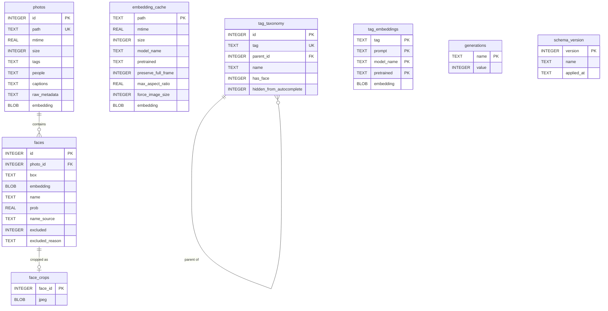
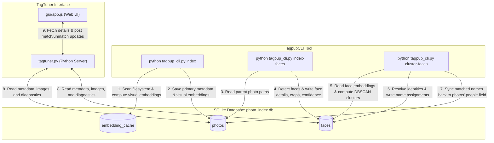

# TagPup Database Specification

---
[◀ Back to README](README.md) | [📖 Tutorial](TUTORIAL.md) | [💡 CLI Examples](EXAMPLE.md) | [🖥️ TagPup GUI Spec](SPEC_TAGPUP_GUI.md) | [🎯 TagTuner UI Spec](SPEC_TAGTUNER.md) | [🐶 CLI Engine Spec](SPEC_TAGPUP_CLI.md) | [🗄️ Database Spec](DATABASE.md)
---

TagPup uses an SQLite database (by default stored at `data/photo_index.db`) to manage photo metadata, visual embeddings, detected face crops, identity assignments, and embedding caches.

---

## Concurrency

This program is a reader and a writer at the same time, constantly: the server answers
the page while a background thread indexes a folder or runs tag suggestions, and the
suggester records the faces it detects through a connection of its own.

**Every connection comes from `tagpup/store/db.py`.** It opens in **WAL** mode with an
explicit **`busy_timeout`** (30s) and `synchronous=NORMAL`, and it owns a **write lock
keyed by database file** so that this process writes to one database one thread at a
time. There were 71 places opening a connection and 72 statements writing through one,
each deciding these settings for itself -- which is to say, none of them deciding.
`tests/test_db_access.py` fails if any module calls `sqlite3.connect` directly.In SQLite's default rollback-journal mode a writer needs an
exclusive lock on the whole file and any open reader denies it -- which is how clicking
**Suggest Tags** came to produce a wall of `database is locked` against its own server,
losing the detected faces for those photos. `journal_mode` is a property of the database
file, so it carries to every connection once set; `busy_timeout` is per-connection and
must be set on each.

WAL alone is not enough, which is why the lock exists. WAL permits many readers beside
**one** writer; it says nothing about two writers, and nearly every writer here is
another thread of this same program -- both servers handle each request on its own
thread, and the suggester runs a thread pool. The busy timeout does not cover that case
either: a connection holding an open read transaction that then tries to write must
upgrade its lock, and SQLite refuses that immediately **without calling the busy
handler**, so a 30-second timeout expires instantly.

**A writer gets a connection to itself.** A connection has one transaction state, and
the index's main connection is opened `check_same_thread=False` and handed to a thread
pool. Two threads writing through it interleave into each other's implicit transaction,
and the loser is told the database is locked -- immediately, with the busy timeout never
applying, because there is nothing to wait for. That is why the embedding cache kept
failing in the same instant that recording faces succeeded: faces had always opened a
connection of their own. Concurrent writers use `db.write_with_connection()`, which
takes the lock, opens a connection, commits and closes it.

The lock cannot see another process or a checkpoint, so writes also retry with a short
backoff.Recording faces reports an **error** when it finally gives up.Those faces are lost until the photo is indexed again, which is not a
warning-shaped event.

Any new connection should go through `configure_connection()`.

## Database Schema

The database consists of five primary tables: `photos`, `faces`, `embedding_cache`, `tag_taxonomy`, and `tag_embeddings`.

### 1. `photos` Table
Stores high-level image metadata, tags (keywords), captions, resolved people lists, and the primary visual embedding vector used for semantic searches.

| Column | Type | Constraints | Description |
| :--- | :--- | :--- | :--- |
| `id` | INTEGER | PRIMARY KEY | The photo's row, and what its faces point at. Kept when the photo is renamed or moved: only `path` changes, and its faces go with it. Migration 4 gave every row its old rowid. |
| `path` | TEXT | NOT NULL UNIQUE | The image file. Absolute path in stored form -- `paths.stored()`: native separators, as the indexer writes it. Compared case-insensitively on Windows through `paths.sql_equals()`, which the `*_path_nocase` indexes answer; never by `LOWER()` or `LIKE`. |
| `mtime` | REAL | | Last modification time (epoch timestamp) of the image file. |
| `size` | INTEGER | | File size in bytes. |
| `tags` | TEXT | | JSON-serialized array of metadata keyword strings (e.g., `["nature", "sunset"]`). |
| `people` | TEXT | | JSON-serialized array of resolved names present in the photo (sync'd from faces). |
| `captions` | TEXT | | JSON-serialized array of caption/description strings. |
| `raw_metadata` | TEXT | | JSON-serialized key-value dictionary of raw EXIF/IPTC properties. |
| `embedding` | BLOB | | FAISS / visual feature vector representation (binary representation of float array). |
| `document_id` | TEXT | INDEXED | The photo's identity, independent of its path: `XMP-xmpMM:DocumentID`. Read from the file where present — most photos already carry one, written by Lightroom or Camera Raw — and minted as `xmp.did:<uuid>` where absent. A path is a bad name for a photo: rename it and the row describes something that no longer exists, while the photo looks unindexed. `scripts/relink_renamed_photos.py` matches on this first. NULL on rows indexed before this column existed; they fill in as those photos are re-indexed. |

### 2. `faces` Table
Stores details of faces detected within photos, including face crop coordinates, resolved name identities and confidence scores. Their crops are in `face_crops`.

| Column | Type | Constraints | Description |
| :--- | :--- | :--- | :--- |
| `id` | INTEGER | PRIMARY KEY AUTOINCREMENT | Unique face crop identifier. |
| `photo_id` | INTEGER | NOT NULL, FOREIGN KEY, INDEXED | The photo the face is in. References `photos(id)` with `ON DELETE CASCADE`; the store deletes faces explicitly too, since most connections leave foreign keys off. A face found in a photo never indexed -- the suggester records the faces it detects -- first gets its photo a row holding only the path (`photos.ensure_row`), its `mtime` and `size` empty so the scan reads the file. |
| `box` | TEXT | | JSON-serialized bounding box coordinates `[x1, y1, x2, y2]`. |
| `embedding` | BLOB | | 512-dimensional face embedding vector (binary representation of float32 array). |
| `name` | TEXT | | The resolved name of the person (or `NULL` if unmatched). |
| `prob` | REAL | | Detection confidence/probability score from MTCNN. |
| `name_source` | TEXT | | Who decided `name`. `'manual'` marks a decision made by a person in TagTuner — including a deliberate unmatch, which is stored as `name = NULL` with this column set. `cluster-faces` re-derives every other name from scratch but preserves manual rows and uses them as anchors. `NULL` means the name was assigned automatically and may be revised. |
| `excluded` | INTEGER | DEFAULT 0 | `1` marks a face as not-a-person: a passer-by in a crowd shot, or a detection that is not a face at all. Excluded faces are dropped before identity resolution runs, and are hidden from match suggestions and the Identify Faces queue, so they cannot cluster, vote, or pull a person's centroid around. Reversible. |
| `excluded_reason` | TEXT | | Free text recorded alongside `excluded`, e.g. `stranger`, `bad crop`. |

### 3. `embedding_cache` Table
Acts as a cache layer for photo visual embeddings to avoid recalculating heavy image representations when configuration profiles are modified.

| Column | Type | Constraints | Description |
| :--- | :--- | :--- | :--- |
| `path` | TEXT | PRIMARY KEY | The image file, in stored form (see `photos.path`). |
| `mtime` | REAL | | Last modification time. |
| `size` | INTEGER | | File size in bytes. |
| `model_name` | TEXT | | Name of the feature extraction model used. |
| `pretrained` | TEXT | | Pretrained weights identifier. |
| `preserve_full_frame` | INTEGER | | Flag (0 or 1) indicating if full frame aspect ratio was preserved. |
| `max_aspect_ratio` | REAL | | Max aspect ratio limit. |
| `force_image_size` | INTEGER | | Image dimension limit used for embedding calculation. |
| `embedding` | BLOB | | Visual feature vector representation. |

### 4. `tag_taxonomy` Table
Stores the hierarchical tag relationships, autocomplete status, and person designations.

| Column | Type | Constraints | Description |
| :--- | :--- | :--- | :--- |
| `id` | INTEGER | PRIMARY KEY AUTOINCREMENT | Unique taxonomy node ID. |
| `tag` | TEXT | UNIQUE | Full hierarchical path representing the tag (e.g., `Family/John Doe`). |
| `parent_id` | INTEGER | FOREIGN KEY | References parent tag node. References `tag_taxonomy(id)` with `ON DELETE CASCADE`. |
| `name` | TEXT | | Leaf name of the tag (e.g., `John Doe`). |
| `has_face` | INTEGER | DEFAULT 0 | Flag (0 or 1) indicating if the branch represents a person/pet with a face. |
| `hidden_from_autocomplete` | INTEGER | DEFAULT 0 | Flag (0 or 1) to hide the tag from autocomplete prompts. |

### 5. `tag_embeddings` Table
Stores cached visual embeddings of tag prompts to accelerate zero-shot tag consensus calculations.

| Column | Type | Constraints | Description |
| :--- | :--- | :--- | :--- |
| `tag` | TEXT | PRIMARY KEY | Leaf tag name or path. |
| `prompt` | TEXT | PRIMARY KEY | The prompt string run through CLIP (e.g. `a photo of John Doe in 2026`). |
| `model_name` | TEXT | PRIMARY KEY | Name of the CLIP model used. |
| `pretrained` | TEXT | PRIMARY KEY | Pretrained weights identifier of the model. |
| `embedding` | BLOB | | Binary representation of float array for the prompt embedding. |

### 6. `face_crops` Table
Each face's crop, a JPEG no larger than 256 px on a side, cut when the face is detected or the first time it is shown (`tagpup.store.faces.cache_crop`). Out of `faces` since migration 3: 6 KB a face, carried by every read of `faces` that forgot to leave it out. The trigger `face_crops_go_with_their_face` deletes a face's crop with the face, whichever connection deletes it; rotating a photo whose boxes turn drops its faces' crops, to be cut again.

| Column | Type | Constraints | Description |
| :--- | :--- | :--- | :--- |
| `face_id` | INTEGER | PRIMARY KEY, → `faces.id` ON DELETE CASCADE | The face. |
| `jpeg` | BLOB | NOT NULL | The crop. |

### 7. `generations` Table
Counters that move whenever a table changes, whoever changes it: TagPup, TagTuner, the CLI or a script. A cache stores the generations it was built at and is current while they have not moved (`tagpup.store.generations`). Triggers made by `tagpup.store.schema` bump them:

- `photos`: every insert, delete and update of a photo row (`generation_photos_insert`, `_delete`, `_update`). The Suggest index reloads when it moves.
- `faces`: every insert and delete, and every update of `name`, `name_source`, `excluded`, `embedding` or `photo_id`. Caching a crop does not move it. Identify Faces keys its queue and match lists on it.
- `taxonomy`: every insert and delete in `tag_taxonomy`, and every update of `tag`, `name`, `parent_id` or `has_face`. TagPup keys who the tree says each person is on it, and so sees TagTuner's edits.

Replaces `faces_generation` and `taxonomy_generation`, one table each, whose counts it carried over (migration 2).

| Column | Type | Constraints | Description |
| :--- | :--- | :--- | :--- |
| `name` | TEXT | PRIMARY KEY | `photos`, `faces` or `taxonomy`. |
| `value` | INTEGER | NOT NULL | Bumped by the triggers; only ever compared for change. |

### 8. `schema_version` Table
The migrations applied to this library, one row each, in order (`tagpup.store.schema`). `schema.ensure()` applies the ones missing wherever a library is opened: by PhotoIndex, TagTuner's start-up, the desktop runner, the tag tree, and each request that names a library. Migration 1 makes the tables of 2026-09; each one after is a step forward. A library older than those tables -- missing a column such as `faces.excluded` -- is refused (`schema.TooOld`), not converted: every library in use was already that shape, and the conversions retired on 2026-09-24.

| Column | Type | Constraints | Description |
| :--- | :--- | :--- | :--- |
| `version` | INTEGER | PRIMARY KEY | The migration's number. |
| `name` | TEXT | NOT NULL | What it did. |
| `applied_at` | TEXT | NOT NULL | Local time it was applied, `YYYY-MM-DD HH:MM:SS`. |

---

## Entity-Relationship (ER) Diagram

The relationships between the tables are structured as follows:

```mermaid
erDiagram
    photos {
        INTEGER id PK
        TEXT path UK
        REAL mtime
        INTEGER size
        TEXT tags
        TEXT people
        TEXT captions
        TEXT raw_metadata
        BLOB embedding
    }
    
    faces {
        INTEGER id PK
        INTEGER photo_id FK
        TEXT box
        BLOB embedding
        TEXT name
        REAL prob
        TEXT name_source
        INTEGER excluded
        TEXT excluded_reason
    }
    
    embedding_cache {
        TEXT path PK
        REAL mtime
        INTEGER size
        TEXT model_name
        TEXT pretrained
        INTEGER preserve_full_frame
        REAL max_aspect_ratio
        INTEGER force_image_size
        BLOB embedding
    }

    tag_taxonomy {
        INTEGER id PK
        TEXT tag UK
        INTEGER parent_id FK
        TEXT name
        INTEGER has_face
        INTEGER hidden_from_autocomplete
    }

    tag_embeddings {
        TEXT tag PK
        TEXT prompt PK
        TEXT model_name PK
        TEXT pretrained PK
        BLOB embedding
    }

    face_crops {
        INTEGER face_id PK
        BLOB jpeg
    }

    generations {
        TEXT name PK
        INTEGER value
    }

    schema_version {
        INTEGER version PK
        TEXT name
        TEXT applied_at
    }

    photos ||--o{ faces : "contains"
    faces ||--o| face_crops : "cropped as"
    tag_taxonomy ||--o{ tag_taxonomy : "parent of"
```

---

## Use Case & Data Flow Diagram

The following diagram illustrates how different application workflows (CLI commands, Web Server, and Web UI) interact with the database tables.

```mermaid
flowchart TD
    subgraph CLI Commands [TagpupCLI Tool]
        A["python tagpup_cli.py index"]
        B["python tagpup_cli.py index-faces"]
        C["python tagpup_cli.py cluster-faces"]
    end

    subgraph Web App [TagTuner Interface]
        D["tagtuner.py (Python Server)"]
        E["gui/app.js (Web UI)"]
    end

    subgraph DB [SQLite Database: photo_index.db]
        T1[(photos)]
        T2[(faces)]
        T3[(embedding_cache)]
    end

    %% CLI Indexing Interactions
    A -->|1. Scan filesystem & compute visual embeddings| T3
    A -->|2. Save primary metadata & visual embeddings| T1
    
    %% CLI Face Extraction Interactions
    B -->|3. Read parent photo paths| T1
    B -->|4. Detect faces & write face details, crops, confidence| T2
    
    %% CLI Identity Clustering Interactions
    C -->|5. Read face embeddings & compute DBSCAN clusters| T2
    C -->|6. Resolve identities & write name assignments| T2
    C -->|7. Sync matched names back to photos' people field| T1

    %% Server & Web UI Interactions
    D <-->|8. Read metadata, images, and diagnostics| T1 & T2
    E <-->|9. Fetch details & post match/unmatch updates| D
```

---
[◀ Back to README](README.md) | [📖 Tutorial](TUTORIAL.md) | [💡 CLI Examples](EXAMPLE.md) | [🖥️ TagPup GUI Spec](SPEC_TAGPUP_GUI.md) | [🎯 TagTuner UI Spec](SPEC_TAGTUNER.md) | [🐶 CLI Engine Spec](SPEC_TAGPUP_CLI.md) | [🗄️ Database Spec](DATABASE.md)
