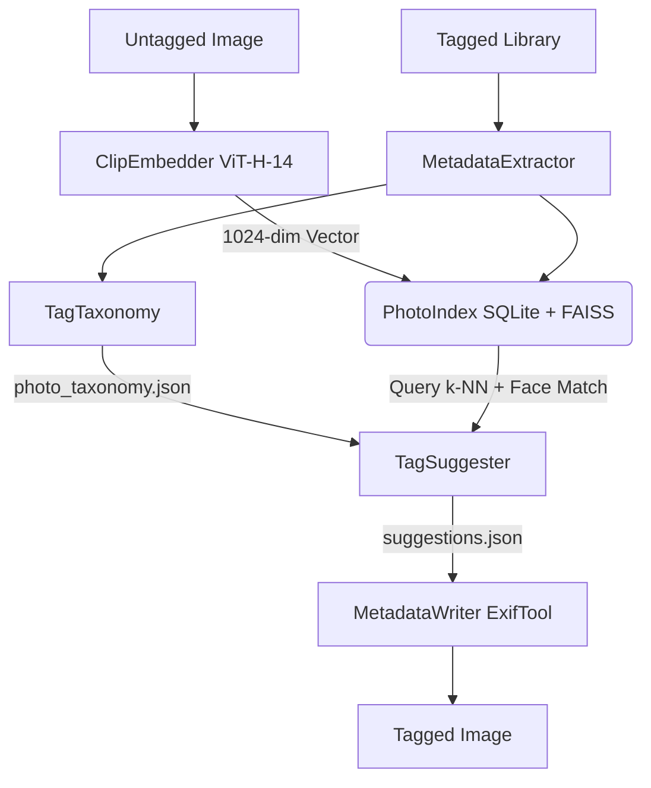

# 🏷️ ImageTagger (Photo Tagger)

[](https://www.python.org/)
[](#preconditions)
[](https://opensource.org/licenses/MIT)

**ImageTagger** is a modular, AI-powered local photo tagging and semantic search engine. It automatically indexes, clusters, searches, and tags your local photo library entirely offline. By leveraging state-of-the-art vision models (CLIP), face detection and recognition models (MTCNN + Facenet), and standard metadata tools (ExifTool), ImageTagger helps you organize your photos without sending your private data to the cloud.

---

## 🗺️ System Architecture

ImageTagger processes photos in three main phases: **Indexing**, **Suggestion**, and **Metadata Writing**.



---

## ✨ Features

- **🔒 100% Offline & Private:** Runs entirely on your local machine using PyTorch. No cloud APIs, no telemetry, and no external tracking.
- **🧠 Semantic Image Embedding:** Uses **CLIP** (`ViT-H-14` by default) to generate rich visual embeddings for precise semantic categorization and searching.
- **⚡ Fast Vector Indexing:** Employs **FAISS** (Facebook AI Similarity Search) and **SQLite** to manage vectors and search results with sub-millisecond query responses.
- **👤 Local Face Recognition:** Detects faces with **MTCNN**, creates face vectors via **InceptionResnetV1**, and clusters identities using **DBSCAN**. Recognizes faces in new photos and auto-boosts suggestions.
- **🏷️ Hierarchical Taxonomy:** Resolves flat tags into hierarchical structures (e.g., `Family/Immediate/John Doe` expands to the leaf and all ancestors).
- **📂 Event-Level Folder Consensus:** Group-processes suggestions by folder. Boosts high-frequency tags and penalizes outlier tags to filter out localized noise.
- **📅 Era-Aware Zero-Shot Prompting:** Uses the photo's capture year to customize prompts (e.g., `"a photo of {tag} in {year}"`), adjusting CLIP's visual recognition to stylistic eras.
- **🔄 Smart Incremental Indexing:** Compares modification times (`mtime`) and file sizes before processing. Unchanged photos are skipped, making successive runs near-instant.
- **🛠️ ExifTool Metadata Integration:** Batch-reads and writes metadata fields directly into image files (supports Flat Keywords, Hierarchical Subject, Captions, Comments, and Ratings).

---

## 🚀 Getting Started

### 📋 Preconditions
- **OS:** Windows 10 or 11
- **Python:** Python 3.10+ added to your system PATH
- **ExifTool:** Installed on your computer.
  - Default expected path: `%USERPROFILE%\AppData\Local\Programs\ExifTool\exiftool.exe`
  - *If installed elsewhere, update the path in your `config.ini`.*

---

### 🔧 Installation & Setup

1. **Clone or download** this repository to your computer.
2. **Run the setup script** to automatically create a virtual environment (`.venv`), upgrade pip, install requirements (including PyTorch with NVIDIA GPU acceleration if available, CLIP, and FAISS), and set up the data directories.

   **Using PowerShell:**
   ```powershell
   powershell -ExecutionPolicy Bypass -File .\setup.ps1
   ```

   **Using Command Prompt:**
   ```cmd
   setup.bat
   ```

3. **Verify Configuration:** Open [config.ini](config.ini) to configure paths, model parameters, and candidate tags if needed.

---

## 📖 Command Reference & Workflows

ImageTagger comes with a unified CLI entry point wrapper (`run.bat` / `run.ps1`) to automatically execute operations within the local environment.

> [!TIP]
> **Testing Mode:** Prefix any command with the global `--test` option (e.g., `run.bat --test index ...`) to redirect database operations to a separate test index (`test_photo_index.db`). This allows you to experiment freely without altering your production data.

### 📥 1. Indexing Your Tagged Library
Build the knowledge base by scanning folders of photos that already have tags or metadata.
```cmd
# Standard index (CLIP + Face detection in a single pass)
run.bat index "D:\Photos\Tagged_Archive"

# Index but skip face detection
run.bat index "D:\Photos\Tagged_Archive" --skip-faces

# Force recreation of all embeddings from scratch
run.bat index "D:\Photos\Tagged_Archive" --force-reembed

# Clear the database and start a clean index scan
run.bat index "D:\Photos\Tagged_Archive" --reset
```

### 👥 2. Face Identity Clustering (Self-Tuning)
Map detected face vectors into named identities based on photo-level metadata tags.
```cmd
# Perform density clustering (DBSCAN) and associate face groups with names
run.bat cluster-faces
```

### 💡 3. Suggesting Tags for Untagged Photos
Generate tag suggestions for a folder of new, untagged images based on visual similarity and face matches.
```cmd
run.bat suggest "D:\Photos\2026_Imports"
```
*Outputs recommendations and neighbor metadata directly to `suggestions.json`.*

### ✍️ 4. Reviewing and Applying Suggestions
Preview suggestion mappings or write them to the images' metadata.

```cmd
# Dry Run / Preview: Print a summary table of proposed tags
run.bat write suggestions.json

# Live Write: Save tags with a confidence score of 0.60 or higher
run.bat write suggestions.json -Live -MinScore 0.60
```
*Note: ExifTool preserves original files by renaming them with a `_original` suffix.*

### 🔍 5. Semantic Search
Search your indexed collection using natural language text descriptions.
```cmd
run.bat search "sunset at the beach"
run.bat search "birthday party family gathering"
```

### 📊 6. Database Statistics & Inspection
Monitor index statistics, examine taxonomy roots, or debug individual file tags.
```cmd
# View index coverage, unique counts, top tags, and top people
run.bat stats

# Inspect parsed tags and raw ExifTool metadata for a single photo
run.bat inspect "D:\Photos\Tagged_Archive\sample.jpg"
```

### 🧹 7. Managing the Index
List files present in the index database or delete them.
```cmd
# List all indexed photos (or filter by folder)
run.bat list-index
run.bat list-index --folder "D:\Photos\Tagged_Archive\Family"

# Remove a specific file or folder from the database index
run.bat remove --path "D:\Photos\Tagged_Archive\Family\sample.jpg"
run.bat remove --folder "D:\Photos\Tagged_Archive\Family"
```

---

## ⚙️ Configuration (`config.ini`)

The project configurations are managed via [config.ini](config.ini):

```ini
[paths]
exiftool = %USERPROFILE%\AppData\Local\Programs\ExifTool\exiftool.exe
data_dir = data
embedding_cache_dir = data/embedding_cache

[model]
name = ViT-H-14                      # CLIP Model architecture
pretrained = laion2b_s32b_b79k       # Pretrained weights
preserve_full_frame = true           # Whether to preserve original aspect ratio
max_aspect_ratio = 1.4               # Maximum aspect ratio for padding
force_image_size = 512               # Input resolution size

[candidates]
tags = Landscape, Portrait, Nature, Urban, Sunset, Sunrise, Night, Ocean, Mountain, Forest, Animal, Cat, Dog, Food, Indoor, Outdoor, Vehicle, Flower, Architecture, Party, Wedding, Beach, Sports, Concert
```

---

## 📝 License
This project is licensed under the MIT License. ExifTool is owned by Phil Harvey and licensed under its own terms.
