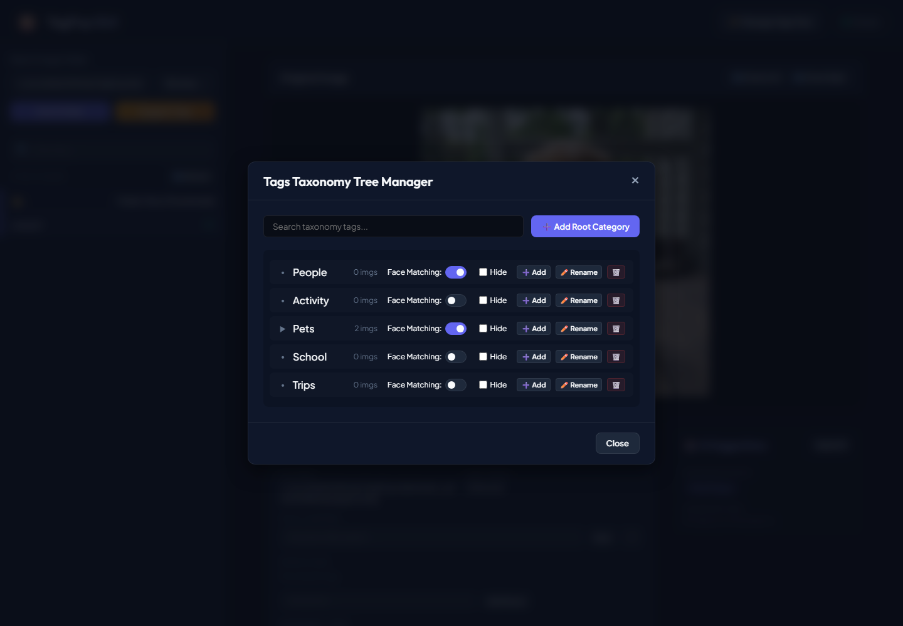
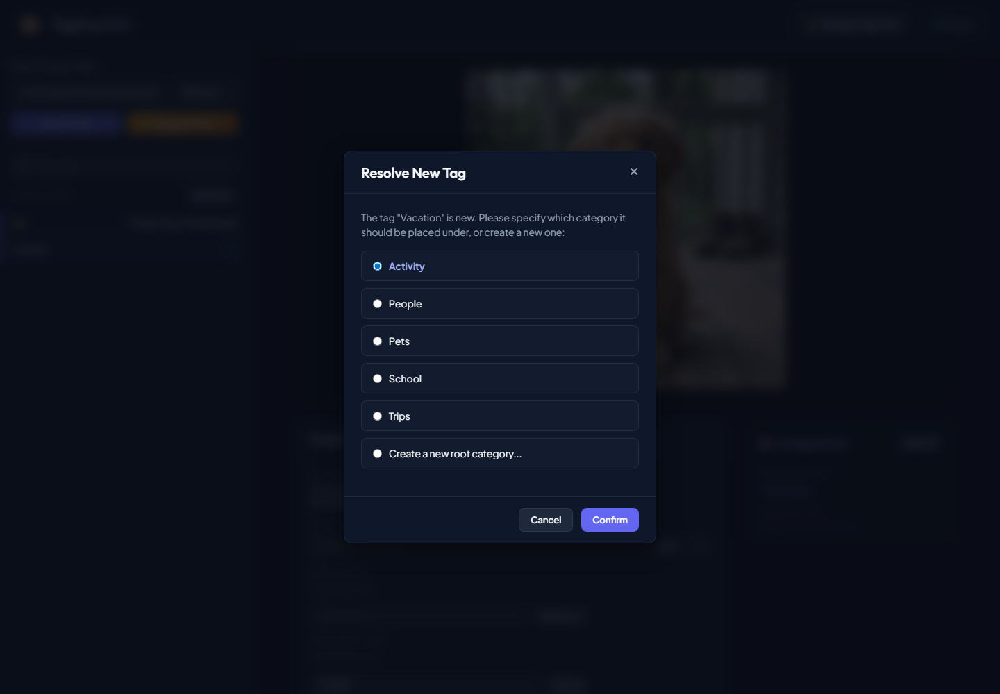
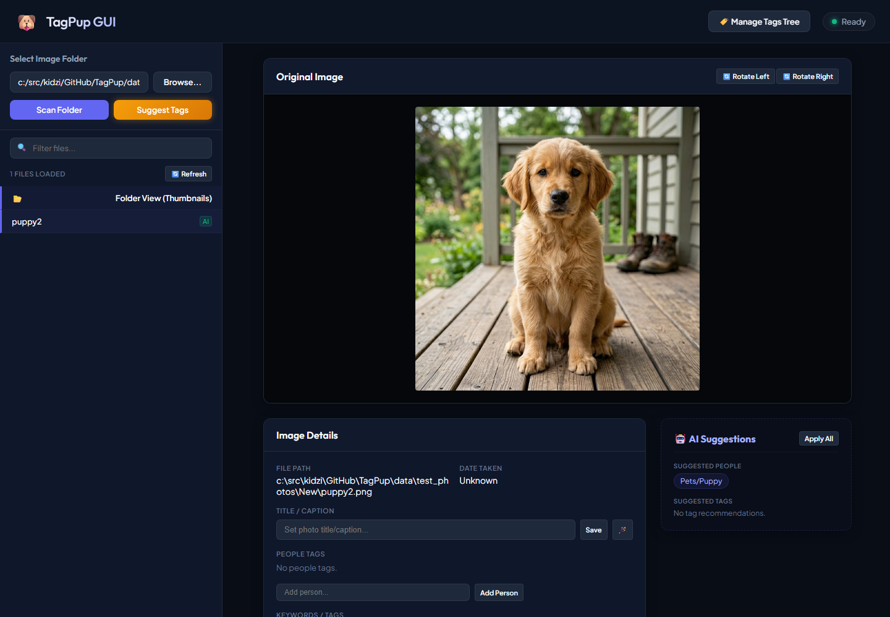

# TagPup GUI — Folder Tagging & Metadata Editor Specification

---
[◀ Back to README](README.md) | [📖 Tutorial](TUTORIAL.md) | [💡 CLI Examples](EXAMPLE.md) | [🖥️ TagPup GUI Spec](SPEC_TAGPUP_GUI.md) | [🎯 TagTuner UI Spec](SPEC_TAGTUNER.md) | [🐶 CLI Engine Spec](SPEC_TAGPUP_CLI.md) | [🗄️ Database Spec](DATABASE.md)
---

This document records the design, specifications, prerequisites, and instructions for the TagPup Graphical User Interface (Web Workspace) and its matching tag taxonomy mechanics.

## Design and Visual Aesthetics
- **Core Principle**: Dark mode, premium styling with Outfit (headings) and Plus Jakarta Sans (body) typography.
- **Glassmorphism**: Header and modal elements feature subtle transparent background blur (`backdrop-filter: blur(12px)`) with elegant border outlines.
- **Layout**: Flexible layout consisting of a collapsible folder directory tree on the left sidebar, an interactive thumbnail grid in the center, and a multi-select editing metadata details panel on the right.

## Features and Mechanics

### 1. Folder Browser & Grid Selection
- **Directory Tree**: Scans image folders and lists subfolders grouped chronologically by capture year. Folder structures start collapsed on page boot.
- **Thumbnails sizes**: Segment buttons dynamically switch card sizes between **Small**, **Medium**, and **Large**.
- **Multiselect actions**: Standard checkbox check toggles and range select (Shift-Click) select contiguous items in the list.

### 2. Smart Renaming & Eviction
- Sequential renaming based on a custom `[Grouping] - [Index] - [Caption]` format.
- Evicts conflicts automatically to temporary filenames.
- Preserves the original filename in `XMP-xmpMM:PreservedFileName` metadata.

### 3. Tag Taxonomy Tree Manager
- Open the hierarchical tree modal via **Manage Tags Tree** button.
- Lists categories in a tree starting collapsed by default.
- **Create Child**: Prompts for a child category tag and inserts it under the parent.
- **Rename**: Prompts for a new name, automatically updates the tag itself, updates all child sub-tags recursively in the database and fallback files, and dynamically updates any photo files on disk and records using the tag.
- **Delete with check**: Inspects how many photos use the tag. If a tag is used, displays a conflict modal offering to remove it from all photos or move the photos to another target category before deleting.
- **People List Toggle**: Root branches can be toggled as "People" category lists, which drives the dynamic extraction of names from tags.
- **Hide Toggle**: Allows hiding tags and children from auto-complete datalists on new photo metadata entry.

### 4. Interactive Tag Resolution
- Typing a new tag name when tagging single/bulk photos triggers a placement selector modal.
- The dialog asks which existing root category to place the new tag under, or allows creating a new root category.
- Resolves ambiguous names (e.g. if the same name exists under different parent paths) by letting the user choose the correct path.

### 5. Camera Time-Shifting
- Toggles a clock adjustment panel to offset capture timestamps recursively for specific camera models.

## Backend APIs

### `GET` Endpoints
- `/api/browse-folder`: Invokes native folder dialog and returns selected path.
- `/api/folder/scan?path=<path>`: Scans folder and returns JSON array of photos.
- `/api/photo-file?path=<photo_path>`: Serves the photo image binary (supports resizing via `size` parameter).
- `/api/tags`: Returns all autocomplete-visible tags.
- `/api/people`: Returns all autocomplete-visible people names.
- `/api/taxonomy/tree`: Returns the hierarchical tree nodes of tags with counts of photo usage and status attributes (`has_face`, `hidden_from_autocomplete`).

### `POST` Endpoints
- `/api/photo/save-metadata`: Saves caption, people, and tags metadata directly to the image file via ExifTool and syncs the DB.
- `/api/photos/bulk-tags`: Adds or removes tags in bulk across a selection of photo paths.
- `/api/folder/time-shift`: Shifts timestamps recursively by camera model.
- `/api/taxonomy/create`: Expects JSON body `{"name": string, "parent_id": int, "has_face": int}`. Creates a new tag path.
- `/api/taxonomy/update`: Expects JSON body `{"id": int, "has_face": int, "hidden_from_autocomplete": int}`. Updates attributes for the tag and propagates to child nodes.
- `/api/taxonomy/delete-check`: Expects JSON body `{"tag_id": int}`. Checks if a tag is used by any photo and returns the count of affected files.
- `/api/taxonomy/delete-confirm`: Expects JSON body `{"tag_id": int, "action": string, "target_tag": string}`. Deletes the tag node, clearing or moving the tag on photos on disk/db.
- `/api/taxonomy/rename`: Expects JSON body `{"tag_id": int, "new_name": string}`. Renames a tag node, cascades path updates to descendants, and updates photo metadata on disk/db.

## Database Schema (SQLite)

### Table: `tag_taxonomy`
- `id` (INTEGER PRIMARY KEY AUTOINCREMENT)
- `tag` (TEXT UNIQUE)
- `parent_id` (INTEGER, FOREIGN KEY)
- `name` (TEXT)
- `has_face` (INTEGER DEFAULT 0)
- `hidden_from_autocomplete` (INTEGER DEFAULT 0)

---

## 📸 Visual Previews

### 1. Hierarchical Tag Taxonomy Tree Manager
Displays a clean, collapsed tree of tag hierarchies. Users can manage category attributes, add children, rename tags, or clean up deletion dependencies.

### 2. Interactive New Tag Placement & Resolution Prompt
Triggers when entering a new keyword tag. Allows the user to select which category it belongs under or create a new root category.

### 3. TagPup GUI Workspace Main Screen
Displays the primary tagging interface containing the scanned photo thumbnail grid, interactive selections, and the metadata editing panel on the right.

---
[◀ Back to README](README.md) | [📖 Tutorial](TUTORIAL.md) | [💡 CLI Examples](EXAMPLE.md) | [🖥️ TagPup GUI Spec](SPEC_TAGPUP_GUI.md) | [🎯 TagTuner UI Spec](SPEC_TAGTUNER.md) | [🐶 CLI Engine Spec](SPEC_TAGPUP_CLI.md) | [🗄️ Database Spec](DATABASE.md)
