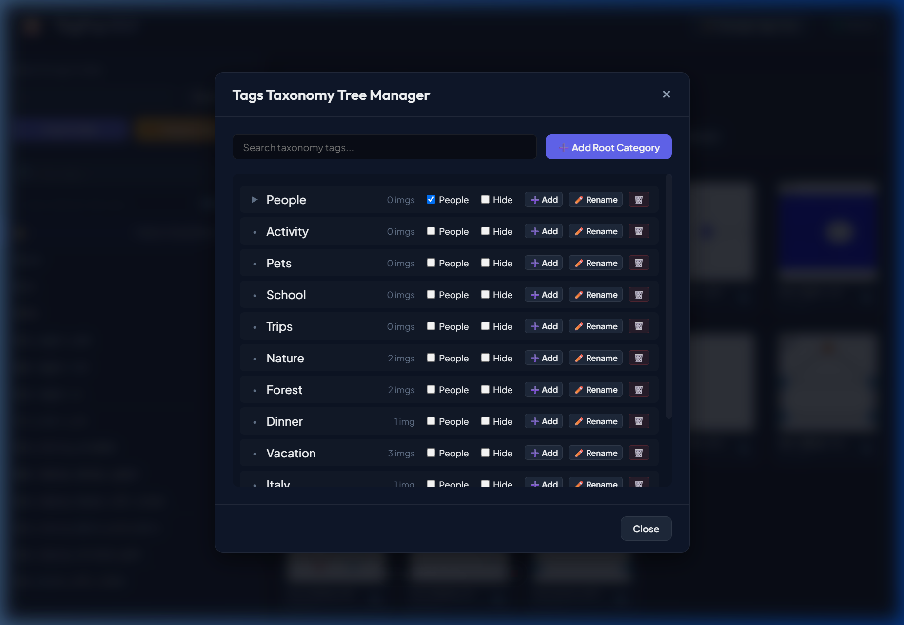
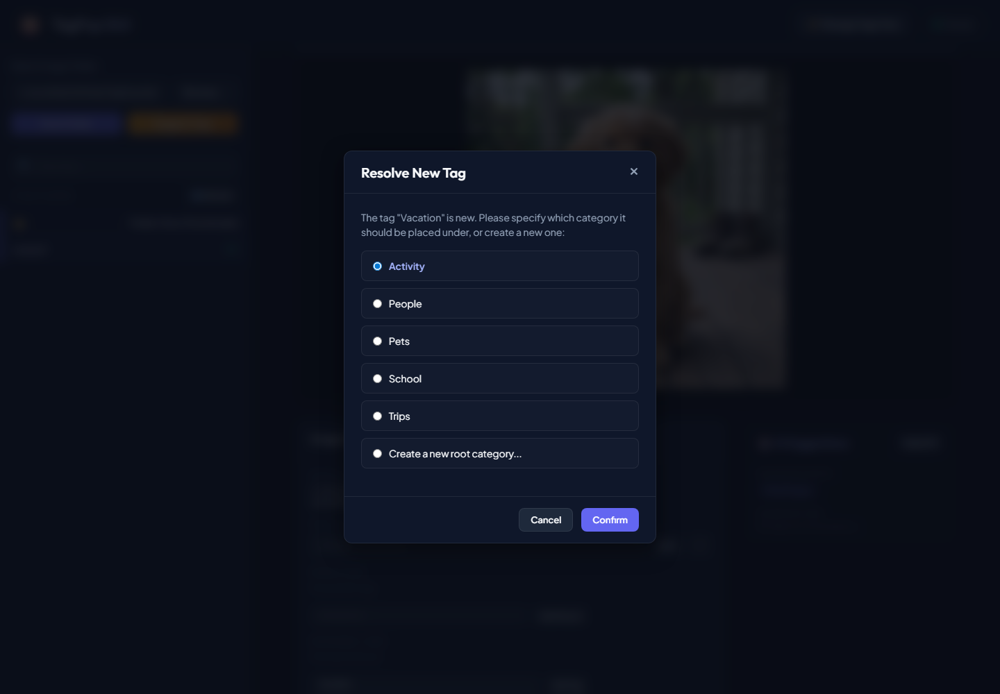
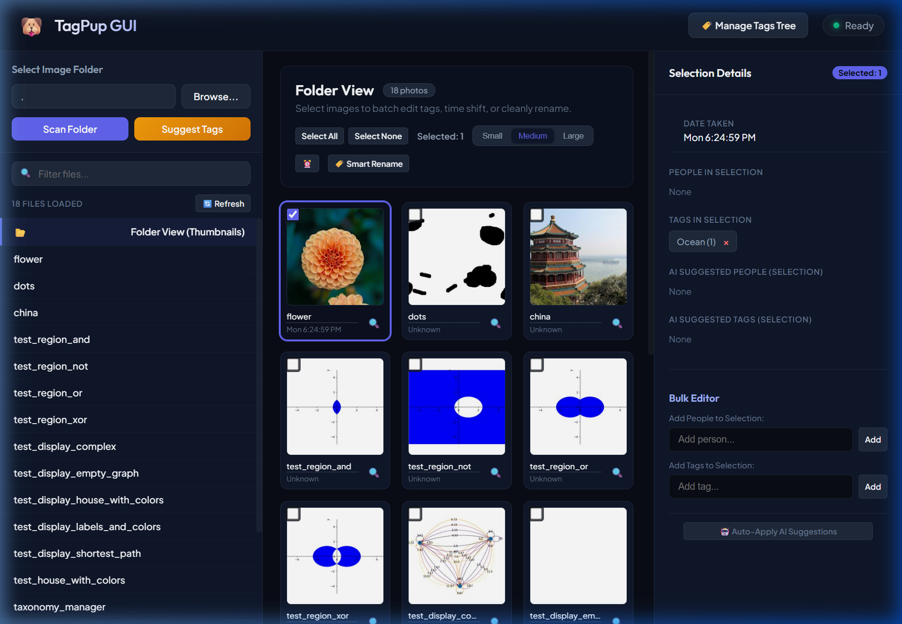

# TagPup GUI — Folder Tagging & Metadata Editor Specification

---
[◀ Back to README](README.md) | [📖 Tutorial](TUTORIAL.md) | [💡 CLI Examples](EXAMPLE.md) | [🖥️ TagPup GUI Spec](SPEC_TAGPUP_GUI.md) | [🎯 TagTuner UI Spec](SPEC_TAGTUNER.md) | [🐶 CLI Engine Spec](SPEC_TAGPUP_CLI.md) | [🗄️ Database Spec](DATABASE.md)
---

This document records the design, specifications, prerequisites, and instructions for the TagPup Graphical User Interface (Web Workspace) and its matching tag taxonomy mechanics.

## Design and Visual Aesthetics
- **Core Principle**: Dark mode, premium styling with Outfit (headings) and Plus Jakarta Sans (body) typography.
- **Glassmorphism**: Header and modal elements feature subtle transparent background blur (`backdrop-filter: blur(12px)`) with elegant border outlines.
- **Layout**: Flexible layout consisting of a collapsible folder directory tree on the left sidebar, an interactive thumbnail grid in the center, and a multi-select editing metadata details panel on the right.

## Features and Mechanics

### 0. The Tagging Loop

The work TagPup exists for is: look at a photo, tag it, move to the next one. These
behaviours serve that loop and are specified together because they depend on each
other.

**Moving between photos.** `ArrowDown`/`ArrowRight` go forwards, `ArrowUp`/`ArrowLeft`
go back; both pairs do the same thing, because which one a person reaches for depends
on whether they are looking at the list or at the image. Movement stops at either end
rather than wrapping. A horizontal swipe or drag across the main image does the same,
right-to-left for forwards, matching every photo viewer people already use; the
gesture must clear 60px **and** exceed its own vertical movement, so a tap and a
scroll that drifts sideways are both ignored. Modifier combinations are left to the
browser.

Arrow keys are ignored while the caret is in a field where they mean something to the
text being typed — but **not** in the filter box, which is a search control. A blanket
check on `INPUT` used to catch it and return before `preventDefault`, so the browser
scrolled instead: the keys appeared dead in the one place you most want them, right
after narrowing the list.

**Knowing where you are.** Each sidebar row carries a filled or hollow dot for tagged
or not, and a tag count where it has any. The count line reads `38 of 80 tagged, 42 to
go` rather than `80 files loaded` — on returning to a folder, the question is how much
is left. A photo counts as tagged if it has any tag, any person, or a title: the
question is "have I been here yet", not "is this perfect".

The folder's own name — the last segment of its path, not the whole thing — sits under
the path box and in the window title. The absolute path is long enough to be unreadable
in a sidebar, and the shoot's name is what identifies it.

A checkbox narrowing the list to untagged photos was removed: it added a line of noise
above a list that is read constantly, for a filter reached rarely. The idea is worth
returning to in a better home, and everything it was built on remains.

Selecting a photo resets the details panel to the top, so each one starts at its own
image rather than mid-panel at the previous photo's scroll position.

**Carrying tags forward.** **Same as previous** (`Ctrl+D`) copies the tags of the
photo above in the list onto the current one. It is additive — tags already present
are kept and only what is missing is added — because replacing would quietly undo work
on a partly tagged photo, which is the one you are most likely to be standing on. It
is offered only when the previous photo has something this one lacks, and the button
says what it would copy and from where.

**Not losing what was typed.** Enter in a field, its Add button, the title's own Save
and a click on a pill still write at once. What is typed and not yet written — text in
the tag or person field, or a title that differs from the photo's — is an **unsaved
edit**, and nothing is ever dropped silently:
- **Save** at the right of the Image Details header writes all of it in one request.
  It is disabled whenever the panel matches the photo: typing and deleting, or putting
  the title back, leaves nothing to save. Its tooltip is `Save (Ctrl+S)`.
- **`Ctrl+S`** (`Cmd+S` on macOS) does the same from anywhere, including from inside
  the field being typed in. It is always kept from the browser, so its Save Page
  dialog never opens.
- **Every way off the photo asks first** — arrow keys, swipe, clicking or pressing
  Enter on another row, the folder view, opening another folder, Refresh: "Save
  changes to `<file>`?" with **Save** (focused; `Enter`), **Discard** and **Cancel**
  (`Escape`). Save moves on only if the write succeeded; on failure you stay, with the
  error and the edit. Discard drops the edit and moves on. Cancel stays with the edit
  intact.
- Closing or reloading the tab with an unsaved edit raises the browser's own prompt.
- A typed name must resolve before anything is written. One whose placement is not
  settled (a placement question cancelled) stops the save and stays in the field.
  Names the photo already carries are not written again — compared the way the rest of
  the app compares them (`photoAlreadyHas`, so a person matches by name).

Leaving a field no longer commits it. It used to, and that lost the tag anyway: the
commit resolved the name first — a round trip for a pathed tag or a new person — and
clicking the next photo blurs the field on mousedown and navigates on click, long
before that returns. By then the field had been cleared for the next photo, and the
save found nothing. The prompt replaced it.

`Escape` in the tag or person field empties it; in the title field it puts back the
photo's title.

### 0.2 What the analysis found

Below the photo's details sit two halves of one row: **AI Suggestions** on the left,
**Detected Faces** on the right. Suggestions lead because they are the thing to act on;
the faces are reference, and the place to pick up a match the suggester was not
confident enough to propose. Either half takes the full width when the other is empty.

Clicking a face adds that person to the photo — a recognised one as readily as a
proposed one. Only unnamed faces carrying a suggestion used to be clickable, so a photo
whose faces were already identified offered no way to act on them: the strip said who
was in the picture while People Tags sat empty. A face whose person the photo already
names is dimmed and says so rather than looking live and doing nothing, and an excluded
face is never offered.

The suggestions box lists **only what the photo does not already carry**. It previously
listed everything the analysis produced, so after Apply All it sat there repeating back
the tags it had just written; a suggestion you have taken is a tag, and it is shown as
one a few inches above. Taking one removes it, and when nothing is left the box goes
away rather than becoming a heading over two empty lists. A person is matched by who
they are, so a bare suggested name counts as present on a photo tagged with their path.

### 0.1 Feedback, Scope and Undo

**One status channel.** Results and validation go to the status line, which was
already carrying them. Modals are kept for exactly two cases: a question that must be
answered before acting, and a failure that would otherwise pass unnoticed. Success
confirmations were removed — stopping the work to report that the work worked is
worst precisely during bulk operations, when you are moving fastest. Validation
messages appear beside the field they are about, which is marked, rather than in a box
that hides the form you need to correct.

**Scope before irreversible writes.** Auto-apply states how many photos it will write
to, how many of those already carry tags, that suggestions are added rather than
replacing, and that it writes into the photo files. The common mistake is not
misreading the button — it is having the wrong selection, which a bare count does not
surface. Camera time-shift states the number of photos affected, resolving
`All Cameras` to a real count, and says plainly that it **cannot be undone**, because
it rewrites EXIF timestamps that the undo below does not cover.

**Undo.** One step deep, covering the last bulk tag write (`Ctrl+Z`). Photos are
restored from a snapshot of the tags and title they had before the write, rather than
by reversing the change field by field: a snapshot cannot be confused about what an
addition or a removal was. It is one step on purpose — the mistake it catches is a
bulk write against the wrong selection, noticed immediately, and a deeper stack would
imply a guarantee this cannot make, since the photo files are the source of truth and
anything can edit them behind the app's back. A partial restore says so.

**Keyboard reachability.** Sidebar rows are focusable and carry `role="option"`;
`Enter` or `Space` opens the focused row, and focus is visible. Previously nothing in
the list was focusable, which is why the arrow keys worked only while focus happened
to be sitting on `<body>`.

### 1. Folder Browser & Grid Selection
- **Choosing a dog park**: the database picker is labelled *Dog Park* — it holds one library's photos, people, tags and suggestions. It is free to change until a folder is open, and locked behind a **Change** button afterwards: switching reloads the page carrying the same `?path=`, so the same folder would come back attached to a different index with nothing marking the change. Change closes the folder and drops it from the URL, so the new dog park starts from a deliberate choice.
- **Adding a folder to a database**: not here. TagPup has no Index button — queueing folders is TagTuner's job, where the queue survives a page refresh. TagPup still shows an index's progress if one is running on the folder you have open. Keywords TagPup writes are recorded in the index as it writes them, so there is nothing to press afterwards.
- **Opening a folder**: Choosing one opens it. Browse, picking from the autocomplete list, pressing Enter, or leaving the path box all scan immediately; there is no separate Scan Folder step, because choosing a folder and asking to see it were never two decisions. Re-committing the folder already open does nothing, so blurring the box does not rescan. **Refresh** re-reads the open folder from disk.
- **Directory Tree**: Scans image folders and lists subfolders grouped chronologically by capture year. Folder structures start collapsed on page boot.
- **Thumbnails sizes**: Segment buttons dynamically switch card sizes between **Small**, **Medium**, and **Large**.
- **Multiselect actions**: Standard checkbox check toggles and range select (Shift-Click) select contiguous items in the list.

### 2. Smart Renaming & Eviction
- Sequential renaming based on a custom `[Grouping] - [Index] - [Caption]` format.
- Evicts conflicts automatically to temporary filenames.
- Preserves the original filename in `XMP-xmpMM:PreservedFileName` metadata.

### 3. Tag Taxonomy Tree Manager
- Open the hierarchical tree modal via **Manage Tags Tree** button.
- Lists categories in a tree starting collapsed by default.
- **Create Child**: Prompts for a child category tag and inserts it under the parent.
- **Rename**: Prompts for a new name, automatically updates the tag itself, updates all child sub-tags recursively in the database and fallback files, and dynamically updates any photo files on disk and records using the tag.
- **Delete with check**: Inspects how many photos use the tag. If a tag is used, displays a conflict modal offering to remove it from all photos or move the photos to another target category before deleting.
- **People List Toggle**: Root branches can be toggled as "People" category lists, which drives the dynamic extraction of names from tags.
- **Hide Toggle**: Allows hiding tags and children from auto-complete datalists on new photo metadata entry.

### 4. Interactive Tag Resolution
- Typing a new tag name when tagging single/bulk photos triggers a placement selector modal.
- The dialog asks which existing root category to place the new tag under, or allows creating a new root category.
- Resolves ambiguous names (e.g. if the same name exists under different parent paths) by letting the user choose the correct path.

### 5. Detected Faces Strip
- The details panel lists the faces detected on the selected photo, each as a cropped thumbnail.
- Face recognition already runs during tag suggestion; this shows its result rather than only the resulting name pill, so an unidentified face is visible while tagging instead of being discovered later in TagTuner.
- A face carrying a name shows it. An unidentified face shows the closest match and its confidence when one clears 0.5 similarity, and reads *Unidentified* otherwise. Excluded faces appear dimmed with their reason.
- Clicking a suggested face adds that person to the photo — the small correction TagPup is for; grouping and confidence work belongs to TagTuner.

### 6. Camera Time-Shifting
- Toggles a clock adjustment panel to offset capture timestamps recursively for specific camera models.

## Backend APIs

### `GET` Endpoints
- `/api/databases`: Returns `{"databases": list, "selected": string}` — the selectable database names (without the `.db` suffix) and the current default from `config.ini`. Test databases and internal ones (validation, startup, embedding-cache) are excluded.
- `/api/folder/index-status?path=<folder_path>`: Returns the status of the background folder indexing thread as `{"status": string, "percent": int, "message": string}`. Status values are `running`, `completed`, or `failed`; a folder that has never been indexed in this session reports `completed`.
- `/api/browse-folder`: Invokes native folder dialog and returns selected path.
- `/api/autocomplete-folder?path=<path_prefix>`: Returns autocomplete folder path suggestions based on Windows folder hierarchies.
- `/api/folder/scan?path=<path>`: Scans folder and returns JSON array of photos.
- `/api/folder/suggest-status?path=<folder_path>`: Returns the status, counts, and computed suggestions of the background tag suggest thread. Status values are `idle`, `preparing`, `running`, `completed`, or `error`.
- `/api/photo-faces?path=<photo_path>`: Returns `{"faces": list, "total": int, "unmatched": int}` for the faces detected on one photo. Each entry carries its box, any assigned `name`, whether it is `excluded`, and for unidentified faces the closest `suggestion` with its `similarity` — measured against the nearest single resolved face of that person, the same way TagTuner's suggestion list measures it. A suggestion is only offered at 0.5 similarity or above; below that the nearest name is noise rather than a candidate. Named faces are listed first, then by confidence, then by size.
- `/api/face-crop?id=<face_id>`: Serves the face thumbnail as JPEG, cropping from the original photo and caching the result in `faces.crop_image` when it is not already stored.
- `/api/photo-file?path=<photo_path>`: Serves the photo image binary (supports resizing via `size` parameter).
- `/api/tags`: Returns all autocomplete-visible tags.
- `/api/people`: Returns all autocomplete-visible people names.
- `/api/taxonomy/tree`: Returns the hierarchical tree nodes of tags with counts of photo usage and status attributes (`has_face`, `hidden_from_autocomplete`).

### `POST` Endpoints
- `/api/databases/select`: Expects JSON body `{"db_name": string}`. Persists the chosen database as `default_db` in `config.ini`, changing which database every subsequent launch opens by default.
- `/api/databases/create`: Expects JSON body `{"db_name": string}`. Creates a new empty database file, seeded with the default taxonomy categories.
- `/api/folder/suggest-start`: Expects JSON body `{"folder_path": string}`. Starts the background tagging suggest thread for a folder.
- `/api/folder/index-start`: Expects JSON body `{"folder_path": string}`. Starts a background thread that runs `tagpup_cli.py index` over the folder and then `cluster-faces`, streaming progress to `/api/folder/index-status`. Only photos that already carry a tag, person, or caption are added to the index.
- `/api/photo/delete`: Expects JSON body `{"path": string}`. Sends the photo to the Windows Recycle Bin and removes it from the index.
- `/api/photo/rotate`: Expects JSON body `{"path": string, "direction": string}`. Rotates the photo 90 degrees on disk. `direction` must be `"left"` or `"right"`; any other value is rejected with `400`.
- `/api/photo/open-explorer`: Expects JSON body `{"path": string}`. Opens the photo's directory in Windows File Explorer and selects it.
- `/api/photo/save-metadata`: Saves caption, people, and tags metadata directly to the image file via ExifTool and syncs the DB.
- `/api/photos/bulk-tags`: Adds or removes tags in bulk across a selection of photo paths.
- `/api/folder/auto-apply`: Expects JSON body `{"folder_path": string, "threshold": float, "photo_paths": list (optional)}`. Applies the folder's computed suggestions scoring at or above `threshold` (default `0.75`). Suggestions are read from the server's in-memory results for that folder, not sent in the request; omit `photo_paths` to apply across the whole folder. Returns `400` if no suggestions have been computed.
- `/api/folder/time-shift`: Shifts timestamps recursively by camera model.
- `/api/folder/rename-photos`: Expects JSON body `{"photo_paths": list, "grouping": string}`. Sequentially renames selected photos based on the custom pattern and grouping template.
- `/api/taxonomy/create`: Expects JSON body `{"name": string, "parent_id": int, "has_face": int}`. Creates a new tag path.
- `/api/taxonomy/update`: Expects JSON body `{"id": int, "has_face": int, "hidden_from_autocomplete": int}`. Updates attributes for the tag and propagates to child nodes.
- `/api/taxonomy/delete-check`: Expects JSON body `{"tag_id": int}`. Checks if a tag is used by any photo and returns the count of affected files.
- `/api/taxonomy/delete-confirm`: Expects JSON body `{"tag_id": int, "action": string, "target_tag": string}`. Deletes the tag node, clearing or moving the tag on photos on disk/db.
- `/api/taxonomy/rename`: Expects JSON body `{"tag_id": int, "new_name": string}`. Renames a tag node, cascades path updates to descendants, and updates photo metadata on disk/db.

## Database Schema (SQLite)

### Table: `tag_taxonomy`
- `id` (INTEGER PRIMARY KEY AUTOINCREMENT)
- `tag` (TEXT UNIQUE)
- `parent_id` (INTEGER, FOREIGN KEY)
- `name` (TEXT)
- `has_face` (INTEGER DEFAULT 0)
- `hidden_from_autocomplete` (INTEGER DEFAULT 0)

---

## 📸 Visual Previews

### 1. Hierarchical Tag Taxonomy Tree Manager
Displays a clean, collapsed tree of tag hierarchies. Users can manage category attributes, add children, rename tags, or clean up deletion dependencies.

### 2. Interactive New Tag Placement & Resolution Prompt
Triggers when entering a new keyword tag. Allows the user to select which category it belongs under or create a new root category.

### 3. TagPup GUI Workspace Main Screen
Displays the primary tagging interface containing the scanned photo thumbnail grid, interactive selections, and the metadata editing panel on the right.

---
[◀ Back to README](README.md) | [📖 Tutorial](TUTORIAL.md) | [💡 CLI Examples](EXAMPLE.md) | [🖥️ TagPup GUI Spec](SPEC_TAGPUP_GUI.md) | [🎯 TagTuner UI Spec](SPEC_TAGTUNER.md) | [🐶 CLI Engine Spec](SPEC_TAGPUP_CLI.md) | [🗄️ Database Spec](DATABASE.md)
