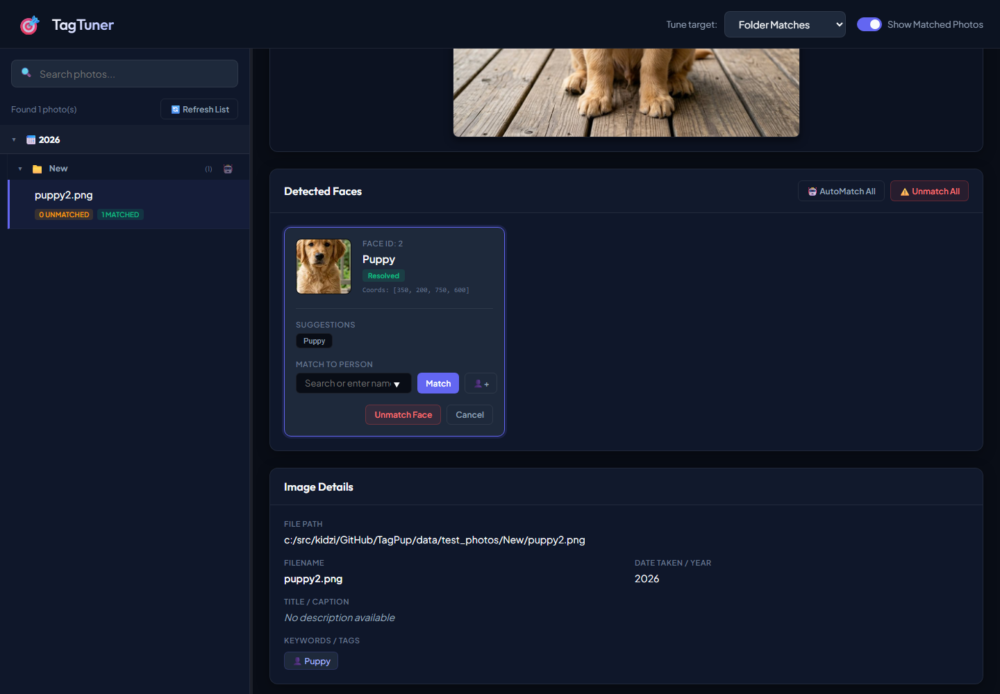

# Getting Started with TagPup: From Raw Pixels to Organized Memories

---
[◀ Back to README](README.md) | [📖 Tutorial](TUTORIAL.md) | [💡 CLI Examples](EXAMPLE.md) | [🖥️ TagPup GUI Spec](SPEC_TAGPUP_GUI.md) | [🎯 TagTuner UI Spec](SPEC_TAGTUNER.md) | [🐶 CLI Engine Spec](SPEC_TAGPUP_CLI.md) | [🗄️ Database Spec](DATABASE.md)
---

Welcome to TagPup! This guide will walk you through the journey of transforming a raw, untagged folder of images into a deeply organized library using AI-powered inference.

## The Core Concept: "Train Once, Benefit Forever"
TagPup works by building a local knowledge base. By taking a small amount of time to "train" the system on your familiar world (family, pets, and favorite places), you enable the system to automatically organize hundreds or thousands of new photos with just a few clicks in the future.

---

## Step 1: Preparing Your Training Data (TagPup GUI)

When you start with a brand-new collection, TagPup acts as your research assistant. You first prepare your training data by tagging a folder of photos where you already know the contents (e.g., a "Family Favorites" collection).

> [!NOTE]
> **Organizing Your Training Set:**
> When selecting your initial training photos, you can either point to your **original, existing photo folders** directly, or create a **new dedicated folder** specifically to store these "seed" photos.
> 
> Keep this folder intact on your hard drive! As you import new photos over time, you will benefit from adding them to your training set and re-indexing. This continues to refine the AI's matching process and makes future auto-suggestions increasingly accurate.


### 1. Tagging & Organizing Taxonomy
Launch the **TagPup GUI** to scan your initial training folder:
```cmd
.venv\Scripts\python tagpup_gui.py
```
Open the **Taxonomy Manager** modal to organize category nodes. The default categories include **People** and **Pets** (which are both pre-configured to allow face-matching). Because of **Tree Propagation**, updating a category path here automatically cascades to update every photo using that tag on your hard drive:


When entering tags for photos, the **Resolution Prompt** modal helps you place the tag under the correct branch or resolve ambiguous names:


---

## Step 2: Building the AI Knowledge Base (CLI Indexing)

Once your training folder is tagged with metadata, run the AI CLI command to scan the folder and build the database index. This processes the files, extracts CLIP visual embeddings, and detects face coordinates in a single pass:
```cmd
.venv\Scripts\python tagpup_cli.py index "path/to/training_photos"
```

---

## Step 3: Refining Face Profiles (TagTuner)

Open **TagTuner** to view unmatched faces detected during the indexing step and associate them with identities in your taxonomy:
```cmd
.venv\Scripts\python tagtuner.py
```
Clicking on a photo on the left sidebar opens its face cards on the right. You can assign names, view similar match recommendations, or create new people/pet profiles in bulk. The default `Pets` tag category functions identically to the `People` tag category for facial matching:



---

## Step 4: Automatic Inference on New Content (TagPup GUI)

Once your training database is populated with these visual patterns and names, you can scan a **different folder** containing new, untagged content (e.g., a recent imports folder) in the **TagPup GUI**.

### 1. Automatic Suggestions
Select a photo in the grid and click the **Get AI Suggestions** button in the sidebar. The system compares the new images against the training database, running face recognition and boosting matching tags:
- **Face Match Boost:** If a face belonging to `Buddy` (under `Pets/Buddy`) is recognized, the system boosts the confidence of his associated tags to 100%.
- **Visual Similarity:** If the scenery matches your previous "Backyard" images, it automatically suggests the `Garden` tag.


### 2. Handling Certainty: The Confidence Tiers
TagPup calculates confidence scores to keep you in control:
- **High Confidence (>90%):** Automatic matches based on clear face hits or high visual similarity.
- **Review Needed (60-90%):** Suggested tags that you can confirm with a single click.
- **New Discovery (<60%):** Exploring new keywords and categories.

---

## Step 5: The Growth Loop

Every time you confirm a suggestion in the GUI, you feed data back into the system. The local AI learns your specific routines, environments, and people, making future suggestions increasingly accurate.

---

## Quick Start Checklist
1. **Prepare Training Set:** Open the **TagPup GUI** on 50-100 "known" photos to tag them and structure your category tree.
2. **Index Training Set:** Run the CLI command on your training set folder to generate embeddings and detect faces.
3. **Resolve Faces:** Open **TagTuner** to name detected faces (e.g., under the `Pets` or `People` categories).
4. **Run Inference:** Point the **TagPup GUI** at a different, untagged folder and run the AI suggestions.

---

## 🛠️ Developer Tip: Automating Tutorial Setup & Screenshots

For developers who want to regenerate screenshots or test these steps locally, you can automate the folder structure setup, face crop extraction, and database seeding using the provided script:

```cmd
.venv\Scripts\python scripts/prepare_test_environment.py
```

This script:
1. Re-initializes `data/test_photo_index.db` from scratch.
2. Creates separate `Training/` and `New/` folders under `data/test_photos/`.
3. Seeds the taxonomy so that the `Pets` category is face-matchable by default, and populates `Pets/Puppy`.
4. Extracts actual puppy and cat faces to display in the UI details panels.
5. Populates the database so that `Training/puppy.png` has a matched face and `New/cat.png` has an unmatched face.

After running this script, start the servers pointing to `test_photo_index.db` to view or capture the UI states:
- **GUI:** `python tagpup_gui.py test_photo_index.db`
- **Tuner:** `python tagtuner.py test_photo_index.db`

---

## Troubleshooting & Tips
*   **Not seeing a tag?** Check the **Taxonomy Manager**. Ensure it is marked as a "People" type if you want face-based boosting to work for that item.
*   **Slow processing?** The first time you index, TagPup must generate "embeddings." This is a one-time cost; subsequent runs are nearly instant because of the **Smart Skip** logic.

---
[◀ Back to README](README.md) | [📖 Tutorial](TUTORIAL.md) | [💡 CLI Examples](EXAMPLE.md) | [🖥️ TagPup GUI Spec](SPEC_TAGPUP_GUI.md) | [🎯 TagTuner UI Spec](SPEC_TAGTUNER.md) | [🐶 CLI Engine Spec](SPEC_TAGPUP_CLI.md) | [🗄️ Database Spec](DATABASE.md)