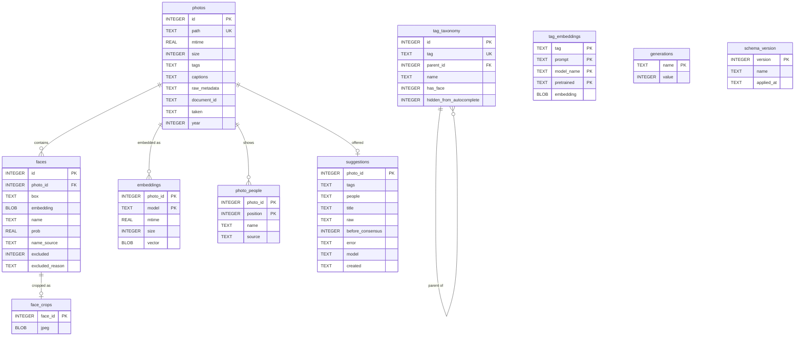
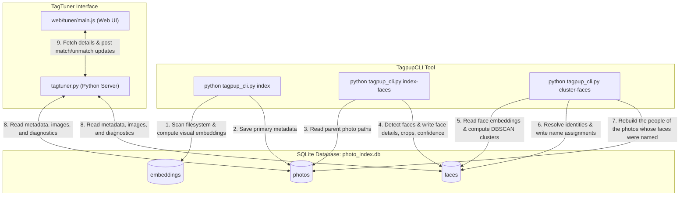

# TagPup Database Specification

---
[◀ Back to README](../README.md) | [📖 Tutorial](TUTORIAL.md) | [💡 CLI Examples](EXAMPLE.md) | [🖥️ TagPup GUI Spec](SPEC_TAGPUP_GUI.md) | [🎯 TagTuner UI Spec](SPEC_TAGTUNER.md) | [🐶 CLI Engine Spec](SPEC_TAGPUP_CLI.md) | [🗄️ Database Spec](DATABASE.md)
---

TagPup uses an SQLite database (by default stored at `data/photo_index.db`) to manage photo metadata, each photo's CLIP vectors, detected face crops and identity assignments.

---

## Concurrency

This program is a reader and a writer at the same time, constantly: the server answers
the page while a background thread indexes a folder or runs tag suggestions, and the
suggester records the faces it detects through a connection of its own.

**Every connection comes from `tagpup/store/db.py`.** It opens in **WAL** mode with an
explicit **`busy_timeout`** (30s) and `synchronous=NORMAL`, and it owns a **write lock
keyed by database file** so that this process writes to one database one thread at a
time. There were 71 places opening a connection and 72 statements writing through one,
each deciding these settings for itself -- which is to say, none of them deciding.
`tests/test_db_access.py` fails if any module calls `sqlite3.connect` directly.In SQLite's default rollback-journal mode a writer needs an
exclusive lock on the whole file and any open reader denies it -- which is how clicking
**Suggest Tags** came to produce a wall of `database is locked` against its own server,
losing the detected faces for those photos. `journal_mode` is a property of the database
file, so it carries to every connection once set; `busy_timeout` is per-connection and
must be set on each.

WAL alone is not enough, which is why the lock exists. WAL permits many readers beside
**one** writer; it says nothing about two writers, and nearly every writer here is
another thread of this same program -- both servers handle each request on its own
thread, and the suggester runs a thread pool. The busy timeout does not cover that case
either: a connection holding an open read transaction that then tries to write must
upgrade its lock, and SQLite refuses that immediately **without calling the busy
handler**, so a 30-second timeout expires instantly.

**A writer gets a connection to itself.** A connection has one transaction state, and
the index's main connection is opened `check_same_thread=False` and handed to a thread
pool. Two threads writing through it interleave into each other's implicit transaction,
and the loser is told the database is locked -- immediately, with the busy timeout never
applying, because there is nothing to wait for. That is why the embedding cache kept
failing in the same instant that recording faces succeeded: faces had always opened a
connection of their own. Concurrent writers use `db.write_with_connection()`, which
takes the lock, opens a connection, commits and closes it.

The lock cannot see another process or a checkpoint, so writes also retry with a short
backoff.Recording faces reports an **error** when it finally gives up.Those faces are lost until the photo is indexed again, which is not a
warning-shaped event.

Any new connection should go through `configure_connection()`.

## Database Schema

The database consists of seven primary tables: `photos`, `faces`, `embeddings`, `photo_people`, `suggestions`, `tag_taxonomy`, and `tag_embeddings`.

### 1. `photos` Table
Stores high-level image metadata, tags (keywords) and captions. Its people are in `photo_people`, its CLIP vectors in `embeddings`.

| Column | Type | Constraints | Description |
| :--- | :--- | :--- | :--- |
| `id` | INTEGER | PRIMARY KEY | The photo's row, and what its faces point at. Kept when the photo is renamed or moved: only `path` changes, and its faces go with it. Migration 4 gave every row its old rowid. |
| `path` | TEXT | NOT NULL UNIQUE | The image file. Absolute path in stored form -- `paths.stored()`: native separators, as the indexer writes it. Compared case-insensitively on Windows through `paths.sql_equals()`, which the `*_path_nocase` indexes answer; never by `LOWER()` or `LIKE`. |
| `mtime` | REAL | | Last modification time (epoch timestamp) of the image file. |
| `size` | INTEGER | | File size in bytes. |
| `tags` | TEXT | | JSON-serialized array of metadata keyword strings (e.g., `["nature", "sunset"]`). |
| `captions` | TEXT | | JSON-serialized array of caption/description strings. |
| `raw_metadata` | TEXT | | JSON-serialized key-value dictionary of raw EXIF/IPTC properties. |
| `document_id` | TEXT | INDEXED | The photo's identity, independent of its path: `XMP-xmpMM:DocumentID`. Read from the file where present — most photos already carry one, written by Lightroom or Camera Raw — and minted as `xmp.did:<uuid>` where absent. A path is a bad name for a photo: rename it and the row describes something that no longer exists, while the photo looks unindexed. `scripts/relink_renamed_photos.py` matches on this first. NULL on rows indexed before this column existed; they fill in as those photos are re-indexed. |
| `taken` | TEXT | | When the photo was taken: its first Date Taken field, as ExifTool gives it (`2026:06:27 12:00:00`), or NULL (`tagpup.core.dates.date_taken`). Derived from `raw_metadata` by `tagpup.store.photos.date_photos` at every write of the photo's metadata or path; added in migration 8. |
| `year` | INTEGER | | The year it was taken: of `taken`, else a year in its file or folder names, or NULL (`tagpup.core.dates.photo_year`). Kept with `taken`; what the Identify views file faces under and what a face is compared across (`tagpup.core.clustering.KnownFaces`). |

### 2. `faces` Table
Stores details of faces detected within photos, including face crop coordinates, resolved name identities and confidence scores. Their crops are in `face_crops`.

| Column | Type | Constraints | Description |
| :--- | :--- | :--- | :--- |
| `id` | INTEGER | PRIMARY KEY AUTOINCREMENT | Unique face crop identifier. |
| `photo_id` | INTEGER | NOT NULL, FOREIGN KEY, INDEXED | The photo the face is in. References `photos(id)` with `ON DELETE CASCADE`; the store deletes faces explicitly too, since most connections leave foreign keys off. A face found in a photo never indexed -- the suggester records the faces it detects -- first gets its photo a row holding only the path (`photos.ensure_row`), its `mtime` and `size` empty so the scan reads the file. |
| `box` | TEXT | | JSON-serialized bounding box coordinates `[x1, y1, x2, y2]`. |
| `embedding` | BLOB | | 512-dimensional face embedding vector (binary representation of float32 array). |
| `name` | TEXT | | The resolved name of the person (or `NULL` if unmatched). |
| `prob` | REAL | | Detection confidence/probability score from MTCNN. |
| `name_source` | TEXT | | Who decided `name`. `'manual'` marks a decision made by a person in TagTuner — including a deliberate unmatch, which is stored as `name = NULL` with this column set. `cluster-faces` re-derives every other name from scratch but preserves manual rows and uses them as anchors. `NULL` means the name was assigned automatically and may be revised. |
| `excluded` | INTEGER | DEFAULT 0 | `1` marks a face as not-a-person: a passer-by in a crowd shot, or a detection that is not a face at all. Excluded faces are dropped before identity resolution runs, and are hidden from match suggestions and the Identify Faces queue, so they cannot cluster, vote, or pull a person's centroid around. Reversible. |
| `excluded_reason` | TEXT | | Free text recorded alongside `excluded`, e.g. `stranger`, `bad crop`. |

### 3. `embeddings` Table
Each photo's CLIP vector, one per set of model settings, with the stamp of the file it was computed from (`tagpup/store/embeddings.py`). Search reads the vectors of the model the config names; Suggest reads one when the file still matches its stamp, and computes it again when not. Replaced `photos.embedding` and the path-keyed `embedding_cache` in migration 5, which held the same vectors twice and let them drift apart (findings #62, #65).

| Column | Type | Constraints | Description |
| :--- | :--- | :--- | :--- |
| `photo_id` | INTEGER | PRIMARY KEY (with `model`), FOREIGN KEY | The photo, `photos(id)`. A trigger, `embeddings_go_with_their_photo`, deletes a photo's vectors with its row on any connection; a rename moves nothing. |
| `model` | TEXT | PRIMARY KEY (with `photo_id`) | `embeddings.model_key` of the five settings that change what a photo embeds to: model, weights, full frame or cropped, maximum aspect ratio, image size. Vectors compare only under one key. |
| `mtime` | REAL | | The file's mtime when the vector was computed. A metadata write of the app's own carries it forward (`restamp`); a rotation deletes the vector, since the embedder applies the Orientation. |
| `size` | INTEGER | | The file's size then, likewise. |
| `vector` | BLOB | NOT NULL | float32 bytes. |

### 4. `tag_taxonomy` Table
Stores the hierarchical tag relationships, autocomplete status, and person designations.

| Column | Type | Constraints | Description |
| :--- | :--- | :--- | :--- |
| `id` | INTEGER | PRIMARY KEY AUTOINCREMENT | Unique taxonomy node ID. |
| `tag` | TEXT | UNIQUE | Full hierarchical path representing the tag (e.g., `Family/John Doe`). |
| `parent_id` | INTEGER | FOREIGN KEY | References parent tag node. References `tag_taxonomy(id)` with `ON DELETE CASCADE`. |
| `name` | TEXT | | Leaf name of the tag (e.g., `John Doe`). |
| `has_face` | INTEGER | DEFAULT 0 | Flag (0 or 1) indicating if the branch represents a person/pet with a face. |
| `hidden_from_autocomplete` | INTEGER | DEFAULT 0 | Flag (0 or 1) to hide the tag from autocomplete prompts. |

### 5. `tag_embeddings` Table
Stores cached visual embeddings of tag prompts to accelerate zero-shot tag consensus calculations.

| Column | Type | Constraints | Description |
| :--- | :--- | :--- | :--- |
| `tag` | TEXT | PRIMARY KEY | Leaf tag name or path. |
| `prompt` | TEXT | PRIMARY KEY | The prompt string run through CLIP (e.g. `a photo of John Doe in 2026`). |
| `model_name` | TEXT | PRIMARY KEY | Name of the CLIP model used. |
| `pretrained` | TEXT | PRIMARY KEY | Pretrained weights identifier of the model. |
| `embedding` | BLOB | | Binary representation of float array for the prompt embedding. |

### 6. `face_crops` Table
Each face's crop, a JPEG no larger than 256 px on a side, cut when the face is detected or the first time it is shown (`tagpup.store.faces.cache_crop`). Out of `faces` since migration 3: 6 KB a face, carried by every read of `faces` that forgot to leave it out. The trigger `face_crops_go_with_their_face` deletes a face's crop with the face, whichever connection deletes it; rotating a photo whose boxes turn drops its faces' crops, to be cut again.

| Column | Type | Constraints | Description |
| :--- | :--- | :--- | :--- |
| `face_id` | INTEGER | PRIMARY KEY, → `faces.id` ON DELETE CASCADE | The face. |
| `jpeg` | BLOB | NOT NULL | The crop. |

### 7. `generations` Table
Counters that move whenever a table changes, whoever changes it: TagPup, TagTuner, the CLI or a script. A cache stores the generations it was built at and is current while they have not moved (`tagpup.store.generations`). Triggers made by `tagpup.store.schema` bump them:

- `photos`: every insert, delete and update of a photo row (`generation_photos_insert`, `_delete`, `_update`). The Suggest index reloads when it moves.
- `faces`: every insert and delete, and every update of `name`, `name_source`, `excluded`, `embedding` or `photo_id`. Caching a crop does not move it. Identify Faces keys its queue and match lists on it.
- `taxonomy`: every insert and delete in `tag_taxonomy`, and every update of `tag`, `name`, `parent_id` or `has_face`. TagPup keys who the tree says each person is on it, and so sees TagTuner's edits.

Replaces `faces_generation` and `taxonomy_generation`, one table each, whose counts it carried over (migration 2).

| Column | Type | Constraints | Description |
| :--- | :--- | :--- | :--- |
| `name` | TEXT | PRIMARY KEY | `photos`, `faces` or `taxonomy`. |
| `value` | INTEGER | NOT NULL | Bumped by the triggers; only ever compared for change. |

### 8. `photo_people` Table
Each photo's people, in order (`tagpup/store/people.py`). Written only by `people.rebuild`, from the photo's keywords, the names on its faces that are not excluded, and the tag tree, by the one rule (`vocabulary.people_in_photo`); read as the JSON list `photos.people` held (`people.PEOPLE_JSON`). Whatever changes one of the three rebuilds the photos it touched: a keyword write, every write of the faces store, and a tree edit that changes who is a person (`people.tree_edit`). Replaced `photos.people`, which seven face actions patched by a rule of their own and clustering, re-detection and tree edits never updated (findings #42, #63), in migration 6. The doctor's `people_out_of_date` finds a photo whose rows are not what the rule makes them.

| Column | Type | Constraints | Description |
| :--- | :--- | :--- | :--- |
| `photo_id` | INTEGER | PRIMARY KEY (with `position`), FOREIGN KEY | The photo, `photos(id)`. A trigger, `photo_people_go_with_their_photo`, deletes its rows with it on any connection. |
| `position` | INTEGER | PRIMARY KEY (with `photo_id`) | Order in the photo's list: keyword people first, then the names on its faces, each name once whatever its case. |
| `name` | TEXT | NOT NULL, INDEXED | The person, as spelled where they were first found. |
| `source` | TEXT | NOT NULL | `keyword` when the photo's metadata names them, else `face`. |

A row's insert or delete moves the `photos` generation, as a change to the old list did.

### 9. `suggestions` Table
What Suggest offered each photo (`tagpup/store/suggestions.py`), read by TagPup's Suggest panel and Apply All through `tagpup.jobs.suggestions`. Kept by the photo's id: a trigger, `suggestions_go_with_their_photo`, deletes a photo's row with it, and a rename moves nothing. Replaced, in migration 7, a JSON file beside each library keyed by path, which deleting a photo, removing a folder or relinking left behind, and which a photo renamed outside TagPup's save lost (finding #64); the migration took in the entries of photos the library has, or whose files are still there, and left the file where it was. A run's own progress stays in the server's memory.

| Column | Type | Constraints | Description |
| :--- | :--- | :--- | :--- |
| `photo_id` | INTEGER | PRIMARY KEY, FOREIGN KEY | The photo, `photos(id)`. A photo Suggest saw that was never indexed gets a row holding only its path (`photos.ensure_row`). |
| `tags` | TEXT | | JSON list of `{tag, score}` offered, after the folder's consensus. |
| `people` | TEXT | | JSON list of `{name, score}` offered. |
| `title` | TEXT | | The caption offered. |
| `raw` | TEXT | | JSON of the suggester's own output, from which consensus is taken again as a folder grows. |
| `before_consensus` | INTEGER | NOT NULL DEFAULT 0 | `1` while `raw` is as the suggester made it; entries saved before that was recorded are left out of consensus. |
| `error` | TEXT | | Why suggesting failed; the next run tries the photo again. |
| `model` | TEXT | | `embeddings.model_key` of the model the suggestion came from. |
| `created` | TEXT | | Local time it was made, `YYYY-MM-DD HH:MM:SS`. |

### 10. `schema_version` Table
The migrations applied to this library, one row each, in order (`tagpup.store.schema`). `schema.ensure()` applies the ones missing wherever a library is opened: by PhotoIndex, TagTuner's start-up, the desktop runner, the tag tree, and each request that names a library. Migration 1 makes the tables of 2026-09; each one after is a step forward. A library older than those tables -- missing a column such as `faces.excluded` -- is refused (`schema.TooOld`), not converted: every library in use was already that shape, and the conversions retired on 2026-09-24.

Each migration declares its kind (ARCHITECTURE.md, phase 7.5) and runs in one transaction with the checks it names, rolled back when one fails (`schema.CheckFailed`). An additive one takes no backup and may change no row that was there; a data-changing one records every row it changes in the journal, as a change named `migration N: name`; a destructive one -- dropping a column or a table, rebuilding a table, losing information -- takes one full backup first. Every run is a row of `changes`, whatever its kind.

| Column | Type | Constraints | Description |
| :--- | :--- | :--- | :--- |
| `version` | INTEGER | PRIMARY KEY | The migration's number. |
| `name` | TEXT | NOT NULL | What it did. |
| `applied_at` | TEXT | NOT NULL | Local time it was applied, `YYYY-MM-DD HH:MM:SS`. |

### 11. `changes` Table
The journal: one row for each bulk edit applied to the library (`tagpup.store.journal`, migration 9; ARCHITECTURE.md, phase 7.5). A maintenance operation (`tagpup.services.maintenance`) records what it changed here instead of copying the whole library first. A change is applied under the write lock in one transaction, only where every row is still what its plan read, and marked `derived_pending`; the derived data it touched (each photo's people and dates) is then rebuilt and it is marked `applied`. A change a crash left `derived_pending` is finished the first time a process opens the library (`journal.settle`, from `schema.ensure`). An undo is the same with old and new swapped, refused when a row is not what the change left, when a newer change touched the same rows, or when `schema_version` has moved on. After `journal.RETENTION_DAYS` (90) pruning deletes a change's `change_rows` and keeps this row, `pruned`.

| Column | Type | Constraints | Description |
| :--- | :--- | :--- | :--- |
| `id` | INTEGER | PRIMARY KEY AUTOINCREMENT | The change; `tagpup_cli.py undo <id>` and the MCP `undo` tool name it. |
| `operation` | TEXT | NOT NULL | What made it: `merge_duplicate_person_tags`, `dedupe_faces`, `refresh_rows`, `relink_renamed_photos`, `backfill_document_ids`, `change settings`, `stamp settings from config.ini`, `stamp settings with the defaults`, or a migration, `migration 11: photo files in the journal`; and the changes of photo files (`change_files`): `add to all selected`, `apply all suggestions`, `save photo`, `write suggestions`, `time shift`, `smart rename: original names`, `smart rename`, `rename tag`, `remove tag`, `backfill_document_ids: mint`. |
| `status` | TEXT | NOT NULL, one of `planned`, `applied`, `derived_pending`, `undone`, `failed`, `pruned` | Where it stands. `planned`: a change of photo files whose files are not all written yet -- or, with `undone` set, not all put back. `failed`: a change of photo files every file was taken out of again, so nothing was written. |
| `schema_version` | INTEGER | NOT NULL | The migration the library was at when it was made; an undo at another is refused. A migration's change is at the version it made when it recorded rows, and at the one before when it did not, so that it is never undone. |
| `created` | TEXT | NOT NULL | Local time it was made, `YYYY-MM-DD HH:MM:SS`. |
| `applied` | TEXT | | When it was applied. |
| `undone` | TEXT | | When it was undone; NULL while it stands. |
| `summary` | TEXT | | JSON: the operation's counts and the rows it wrote per table -- or, for a change of photo files, how many files ended in each state. Never names; kept when the change is pruned. |
| `owner` | TEXT | | The process carrying a change of photo files out, `<host>:<pid>`, while it does (migration 11); NULL once it is finished, or when an error stopped it. A change owned by a process still running is not settled by another. |

### 12. `change_rows` Table
What each change found and left, one row per changed column (`tagpup.store.journal`). An update records the columns it changed; an inserted or deleted row records every column. A delete records what it takes with it as deletes of their own: a face's crop, a photo's faces, vectors and suggestions (`journal.CASCADES`); a photo's people are derived and rebuilt instead, and a tag node with nodes under it is refused. Rows are keyed only by ids SQLite never hands out again (AUTOINCREMENT), so putting a deleted row back cannot meet a newer one.

| Column | Type | Constraints | Description |
| :--- | :--- | :--- | :--- |
| `id` | INTEGER | PRIMARY KEY | The order the rows were written in; an undo reverses it. |
| `change_id` | INTEGER | NOT NULL, → `changes.id`, INDEXED | The change. |
| `action` | TEXT | NOT NULL, `insert`, `update` or `delete` | What was done to the row: tells an insert from an update whose old values were NULL. |
| `table_name` | TEXT | NOT NULL, INDEXED (with `row_key`) | The table: `photos`, `faces`, `tag_taxonomy`, `face_crops`, `embeddings`, `suggestions` or `settings` (`journal.KEYS`). |
| `row_key` | TEXT | NOT NULL | The row's key as a JSON list, `[123]` or `[123, "<model>"]`. |
| `column_name` | TEXT | NOT NULL | The column. |
| `old` | (none) | | The value before, as SQLite stored it: an integer, a real, text or a BLOB. No declared type, so nothing is converted. NULL for an insert. |
| `new` | (none) | | The value after; NULL for a delete. |

### 13. `settings` Table
The library's settings (`tagpup.store.settings`, `tagpup.services.settings`, migration 10; ARCHITECTURE.md, phase 7.6): the CLIP model its vectors are made with, the face-detection thresholds, Suggest's candidate words, the rename format and the ExifTool program. Each is declared once, in `tagpup.core.validation.SETTINGS`: its type, range, default, whether it is locked and what changing it does, and its info text, which the settings dialog is made from. Written only through the journal, so each change is a row of `changes` and can be undone. A new library is stamped with the defaults (`stamp settings with the defaults`); a library from before migration 10 is stamped once, the first time it is opened, from the home's `config.ini` if there is one (`stamp settings from config.ini`), else with the defaults. A setting a library does not hold reads as its default. Where the libraries are is not a setting: `data/` in `TAGPUP_HOME`.

| Column | Type | Constraints | Description |
| :--- | :--- | :--- | :--- |
| `key` | TEXT | PRIMARY KEY, NOT NULL | The setting, `<section>.<key>` as config.ini named it: `model.name`, `faces.min_face_size`, `candidates.tags`, `renaming.format`, `paths.exiftool` ... A name, not an id: a row put back under it is that setting again (`journal.NAMED`). |
| `value` | TEXT | NOT NULL | Its value as text, as the validator reads it (`true`/`false`, `0.85`, `0.6, 0.7, 0.7`). An empty `paths.exiftool` is the machine's ExifTool; an empty `model.force_image_size` the model's own size. |

### 14. `change_files` Table
The photo files a change writes, one row each (`tagpup.store.file_journal`, `tagpup.services.file_changes`, migration 11; ARCHITECTURE.md, phase 7.5). A batch of file writes cannot be one transaction, so each file carries its own state, as dpkg's packages do: the plan -- every file's fields before and after -- is committed first, `planned`; a file is marked `writing` before ExifTool writes it and `done` in the transaction that records its row (`photos.follow_fields`, or `photos.move_rows_in` for a rename), and the change is `applied` once every file is done or a conflict. A file found holding neither what the plan read nor what it was to hold is a `conflict`: reported, never overwritten. The first time a process reads a library's settings (`tagpup.runtime.library_settings`), and before each change of photo files, a file a crash left `writing` or `planned` is settled by what it holds: the before, written again; the after, marked done and its row recorded; neither, a conflict. An undo writes each file still holding its after back to its before through the same states, `undone`, and refuses, by photo id, a file that does not. Pruning deletes a change's files with its `change_rows`.

| Column | Type | Constraints | Description |
| :--- | :--- | :--- | :--- |
| `id` | INTEGER | PRIMARY KEY AUTOINCREMENT | The file of the change, in the order planned. |
| `change_id` | INTEGER | NOT NULL, → `changes.id`, INDEXED | The change. |
| `photo_id` | INTEGER | | The photo's row when the plan was made, which reports name the file by; NULL for a file without one (one moved aside by Smart Rename). |
| `path` | TEXT | NOT NULL | The file, as stored; for a rename, its name before. |
| `new_path` | TEXT | | A rename's name after; NULL for a change of fields. |
| `fields_before` | TEXT | NOT NULL | JSON: what the file held of each field the change writes, `{"XMP:Subject": ["Beach"], ...}`, a field it did not hold `[]`. For a rename, the file's `size` and `mtime_ns`, which renaming does not change and which find it under either name. Can name people. |
| `fields_after` | TEXT | NOT NULL | JSON: what it is to hold, in the same form. |
| `state` | TEXT | NOT NULL, one of `planned`, `writing`, `done`, `conflict`, `undone` | Where the write of this file stands. |
| `note` | TEXT | | Why a file is a conflict: changed outside since it was read, could not be read or written (ExifTool's error), not undone. |
| `stamp` | TEXT | | JSON `[mtime, size]` of the file just before its write, recorded as it is marked `writing` (migration 12): settling a write a crash stopped carries the photo's vectors over it. NULL for a rename, and for a file not written yet. |

---

## Entity-Relationship (ER) Diagram

The relationships between the tables are structured as follows:

---

## Use Case & Data Flow Diagram

The following diagram illustrates how different application workflows (CLI commands, Web Server, and Web UI) interact with the database tables.

---
[◀ Back to README](../README.md) | [📖 Tutorial](TUTORIAL.md) | [💡 CLI Examples](EXAMPLE.md) | [🖥️ TagPup GUI Spec](SPEC_TAGPUP_GUI.md) | [🎯 TagTuner UI Spec](SPEC_TAGTUNER.md) | [🐶 CLI Engine Spec](SPEC_TAGPUP_CLI.md) | [🗄️ Database Spec](DATABASE.md)
