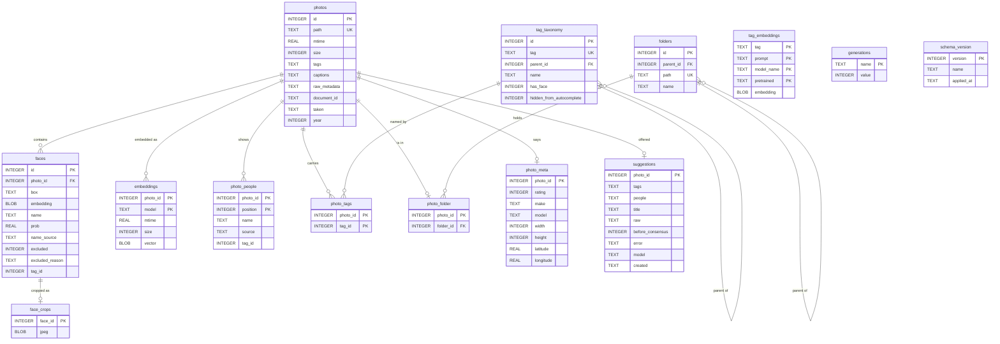
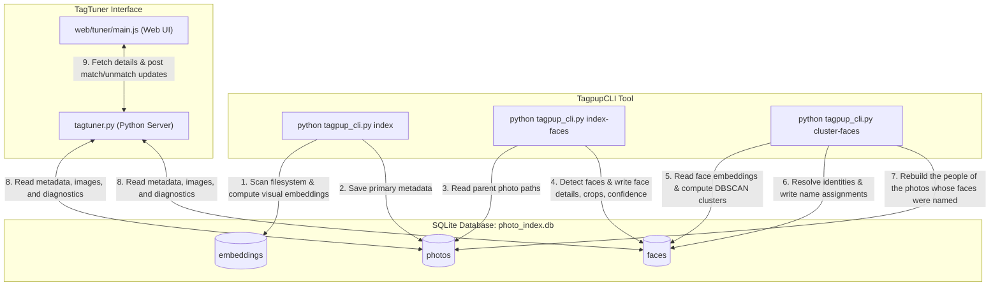

# TagPup Database Specification

---
[◀ Back to README](../README.md) | [📖 Tutorial](TUTORIAL.md) | [💡 CLI Examples](EXAMPLE.md) | [🖥️ TagPup GUI Spec](SPEC_TAGPUP_GUI.md) | [🎯 TagTuner UI Spec](SPEC_TAGTUNER.md) | [🐶 CLI Engine Spec](SPEC_TAGPUP_CLI.md) | [🗄️ Database Spec](DATABASE.md)
---

TagPup uses an SQLite database (by default stored at `data/photo_index.db`) to manage photo metadata, each photo's CLIP vectors, detected face crops and identity assignments.

---

## Concurrency

This program is a reader and a writer at the same time, constantly: the server answers
the page while a background thread indexes a folder or runs tag suggestions, and the
suggester records the faces it detects through a connection of its own.

**Every connection comes from `tagpup/store/db.py`.** It opens in **WAL** mode with an
explicit **`busy_timeout`** (30s) and `synchronous=NORMAL`, and it owns a **write lock
keyed by database file** so that this process writes to one database one thread at a
time. There were 71 places opening a connection and 72 statements writing through one,
each deciding these settings for itself -- which is to say, none of them deciding.
`tests/test_db_access.py` fails if any module calls `sqlite3.connect` directly.In SQLite's default rollback-journal mode a writer needs an
exclusive lock on the whole file and any open reader denies it -- which is how clicking
**Suggest Tags** came to produce a wall of `database is locked` against its own server,
losing the detected faces for those photos. `journal_mode` is a property of the database
file, so it carries to every connection once set; `busy_timeout` is per-connection and
must be set on each.

WAL alone is not enough, which is why the lock exists. WAL permits many readers beside
**one** writer; it says nothing about two writers, and nearly every writer here is
another thread of this same program -- both servers handle each request on its own
thread, and the suggester runs a thread pool. The busy timeout does not cover that case
either: a connection holding an open read transaction that then tries to write must
upgrade its lock, and SQLite refuses that immediately **without calling the busy
handler**, so a 30-second timeout expires instantly.

**A writer gets a connection to itself.** A connection has one transaction state, and
the index's main connection is opened `check_same_thread=False` and handed to a thread
pool. Two threads writing through it interleave into each other's implicit transaction,
and the loser is told the database is locked -- immediately, with the busy timeout never
applying, because there is nothing to wait for. That is why the embedding cache kept
failing in the same instant that recording faces succeeded: faces had always opened a
connection of their own. Concurrent writers use `db.write_with_connection()`, which
takes the lock, opens a connection, commits and closes it.

The lock cannot see another process or a checkpoint, so writes also retry with a short
backoff.Recording faces reports an **error** when it finally gives up.Those faces are lost until the photo is indexed again, which is not a
warning-shaped event.

Any new connection should go through `configure_connection()`.

## Database Schema

The database consists of seven primary tables: `photos`, `faces`, `embeddings`, `photo_people`, `suggestions`, `tag_taxonomy`, and `tag_embeddings`.

### 1. `photos` Table
Stores high-level image metadata, tags (keywords) and captions. Its people are in `photo_people`, its CLIP vectors in `embeddings`.

| Column | Type | Constraints | Description |
| :--- | :--- | :--- | :--- |
| `id` | INTEGER | PRIMARY KEY | The photo's row, and what its faces point at. Kept when the photo is renamed or moved: only `path` changes, and its faces go with it. Migration 4 gave every row its old rowid. |
| `path` | TEXT | NOT NULL UNIQUE | The image file. In a library with no roots (the table `roots` is empty), an absolute path in stored form -- `paths.stored()`: native separators, as the indexer writes it. In a library that holds a root (`roots`), a file under it is held as `@<root name>/<path under it>`, always with `/` (`paths.to_row()`), and a file under none keeps its native path: no native absolute path starts with `@`. Every read of the column goes through `paths.from_row()` and every write through `paths.to_row()` (`tagpup.store.roots`). Compared case-insensitively on Windows through `paths.sql_equals()`, which the `*_path_nocase` indexes answer; never by `LOWER()` or `LIKE`. |
| `mtime` | REAL | | Last modification time (epoch timestamp) of the image file. |
| `size` | INTEGER | | File size in bytes. |
| `tags` | TEXT | | JSON-serialized array of metadata keyword strings (e.g., `["nature", "sunset"]`). |
| `captions` | TEXT | | JSON-serialized array of caption/description strings. |
| `raw_metadata` | TEXT | | JSON-serialized key-value dictionary of raw EXIF/IPTC properties. |
| `document_id` | TEXT | INDEXED | The photo's identity, independent of its path: `XMP-xmpMM:DocumentID`. Read from the file where present — most photos already carry one, written by Lightroom or Camera Raw — and minted as `xmp.did:<uuid>` where absent. A path is a bad name for a photo: rename it and the row describes something that no longer exists, while the photo looks unindexed. `scripts/relink_renamed_photos.py` matches on this first. NULL on rows indexed before this column existed; they fill in as those photos are re-indexed. |
| `taken` | TEXT | | When the photo was taken: its first Date Taken field, as ExifTool gives it (`2026:06:27 12:00:00`), or NULL (`tagpup.core.dates.date_taken`). Derived from `raw_metadata` by `tagpup.store.photos.date_photos` at every write of the photo's metadata or path; added in migration 8. `idx_photos_taken` (`taken`, `id`) and `idx_photos_year` (`year`, `taken`, `id`), made by migration 20 (additive: indexes only, no row changes), are what the library views page by (`tagpup.store.library_view`): the whole library ordered by Date Taken then id, a month as a range of `taken` (`YYYY:MM` up to `YYYY:MM;`), a year as `year = ?` already in order; a keyset page -- the photos after one (`taken`, `id`) -- is a seek of either, photos with no `taken` being the entries before every date. |
| `year` | INTEGER | | The year it was taken: of `taken`, else a year in its file or folder names, or NULL (`tagpup.core.dates.photo_year`). Kept with `taken`; what the Identify views file faces under and what a face is compared across (`tagpup.core.clustering.KnownFaces`). |

### 2. `faces` Table
Stores details of faces detected within photos, including face crop coordinates, resolved name identities and confidence scores. Their crops are in `face_crops`.

| Column | Type | Constraints | Description |
| :--- | :--- | :--- | :--- |
| `id` | INTEGER | PRIMARY KEY AUTOINCREMENT | Unique face crop identifier. |
| `photo_id` | INTEGER | NOT NULL, FOREIGN KEY, INDEXED | The photo the face is in. References `photos(id)` with `ON DELETE CASCADE`; the store deletes faces explicitly too, since most connections leave foreign keys off. A face found in a photo never indexed -- the suggester records the faces it detects -- first gets its photo a row holding only the path (`photos.ensure_row`), its `mtime` and `size` empty so the scan reads the file: only in a folder the library holds a photo directly in, or one it was asked to add (`added_folders`, through `tagpup.services.libraries.add` and the indexer); in any other folder `ensure_row` raises `NotHeld` and makes nothing. |
| `box` | TEXT | | JSON-serialized bounding box coordinates `[x1, y1, x2, y2]`. |
| `embedding` | BLOB | | 512-dimensional face embedding vector (binary representation of float32 array). |
| `name` | TEXT | | The resolved name of the person (or `NULL` if unmatched). |
| `prob` | REAL | | Detection confidence/probability score from MTCNN. |
| `name_source` | TEXT | | Who decided `name`. `'manual'` marks a decision made by a person in TagTuner — including a deliberate unmatch, which is stored as `name = NULL` with this column set. `cluster-faces` re-derives every other name from scratch but preserves manual rows and uses them as anchors. `NULL` means the name was assigned automatically and may be revised. |
| `excluded` | INTEGER | DEFAULT 0 | `1` marks a face as not-a-person: a passer-by in a crowd shot, or a detection that is not a face at all. Excluded faces are dropped before identity resolution runs, and are hidden from match suggestions and the Identify Faces queue, so they cannot cluster, vote, or pull a person's centroid around. Reversible. |
| `excluded_reason` | TEXT | | Free text recorded alongside `excluded`, e.g. `stranger`, `bad crop`. |
| `tag_id` | INTEGER | INDEXED (with `name`) | The person `name` is: the id of the one `tag_taxonomy` node with `has_face` set, not a root, called `name` (compared trimmed and without case); NULL for no name, or a name no such node is called or two are (ARCHITECTURE.md, "Identity by id"). Added and filled by migration 21; derived from `name` and the tree, and written only by `tagpup/store/person_ids.py`, in the transaction of every write that names a face, renames a person or edits the tree, and by the journal's `_derive` (a derived column there, `journal.DERIVED_COLUMNS`). Read by nothing yet: stage 1. `idx_faces_person` is on (`name`, `tag_id`): the pairs come out of the index alone, and it serves every lookup by `name`. The doctor's `face_person_ids_out_of_step` finds a face whose id is not its name's; `tools/doctor.py --rebuild-derived --apply` puts it right. |

### 3. `embeddings` Table
Each photo's CLIP vector, one per set of model settings, with the stamp of the file it was computed from (`tagpup/store/embeddings.py`). Search reads the vectors of the model the config names; Suggest reads one when the file still matches its stamp, and computes it again when not. Replaced `photos.embedding` and the path-keyed `embedding_cache` in migration 5, which held the same vectors twice and let them drift apart (findings #62, #65).

| Column | Type | Constraints | Description |
| :--- | :--- | :--- | :--- |
| `photo_id` | INTEGER | PRIMARY KEY (with `model`), FOREIGN KEY | The photo, `photos(id)`. A trigger, `embeddings_go_with_their_photo`, deletes a photo's vectors with its row on any connection; a rename moves nothing. |
| `model` | TEXT | PRIMARY KEY (with `photo_id`) | `embeddings.model_key` of the five settings that change what a photo embeds to: model, weights, full frame or cropped, maximum aspect ratio, image size. Vectors compare only under one key. |
| `mtime` | REAL | | The file's mtime when the vector was computed. A metadata write of the app's own carries it forward (`restamp`); a rotation deletes the vector, since the embedder applies the Orientation. |
| `size` | INTEGER | | The file's size then, likewise. |
| `vector` | BLOB | NOT NULL | float32 bytes. |

### 4. `tag_taxonomy` Table
Stores the hierarchical tag relationships, autocomplete status, and person designations.

| Column | Type | Constraints | Description |
| :--- | :--- | :--- | :--- |
| `id` | INTEGER | PRIMARY KEY AUTOINCREMENT | Unique taxonomy node ID. |
| `tag` | TEXT | UNIQUE | Full hierarchical path representing the tag (e.g., `Family/John Doe`). |
| `parent_id` | INTEGER | FOREIGN KEY | References parent tag node. References `tag_taxonomy(id)` with `ON DELETE CASCADE`. |
| `name` | TEXT | | Leaf name of the tag (e.g., `John Doe`). |
| `has_face` | INTEGER | DEFAULT 0 | Flag (0 or 1) indicating if the branch represents a person/pet with a face. |
| `hidden_from_autocomplete` | INTEGER | DEFAULT 0 | Flag (0 or 1) to hide the tag from autocomplete prompts. |

### 5. `tag_embeddings` Table
Stores cached visual embeddings of tag prompts to accelerate zero-shot tag consensus calculations.

| Column | Type | Constraints | Description |
| :--- | :--- | :--- | :--- |
| `tag` | TEXT | PRIMARY KEY | Leaf tag name or path. |
| `prompt` | TEXT | PRIMARY KEY | The prompt string run through CLIP (e.g. `a photo of John Doe in 2026`). |
| `model_name` | TEXT | PRIMARY KEY | Name of the CLIP model used. |
| `pretrained` | TEXT | PRIMARY KEY | Pretrained weights identifier of the model. |
| `embedding` | BLOB | | Binary representation of float array for the prompt embedding. |

### 6. `face_crops` Table
Each face's crop, a JPEG no larger than 256 px on a side, cut when the face is detected or the first time it is shown (`tagpup.store.faces.cache_crop`). Out of `faces` since migration 3: 6 KB a face, carried by every read of `faces` that forgot to leave it out. The trigger `face_crops_go_with_their_face` deletes a face's crop with the face, whichever connection deletes it; rotating a photo whose boxes turn drops its faces' crops, to be cut again.

| Column | Type | Constraints | Description |
| :--- | :--- | :--- | :--- |
| `face_id` | INTEGER | PRIMARY KEY, → `faces.id` ON DELETE CASCADE | The face. |
| `jpeg` | BLOB | NOT NULL | The crop. |

### 7. `generations` Table
Counters that move whenever a table changes, whoever changes it: TagPup, TagTuner, the CLI or a script. A cache stores the generations it was built at and is current while they have not moved (`tagpup.store.generations`). Triggers made by `tagpup.store.schema` bump them:

- `photos`: every insert, delete and update of a photo row (`generation_photos_insert`, `_delete`, `_update`). The Suggest index reloads when it moves.
- `faces`: every insert and delete, and every update of `name`, `name_source`, `excluded`, `embedding` or `photo_id`. Caching a crop does not move it. Identify Faces keys its queue and match lists on it.
- `taxonomy`: every insert and delete in `tag_taxonomy`, and every update of `tag`, `name`, `parent_id` or `has_face`. TagPup keys who the tree says each person is on it, and so sees TagTuner's edits.

Replaces `faces_generation` and `taxonomy_generation`, one table each, whose counts it carried over (migration 2).

| Column | Type | Constraints | Description |
| :--- | :--- | :--- | :--- |
| `name` | TEXT | PRIMARY KEY | `photos`, `faces` or `taxonomy`. |
| `value` | INTEGER | NOT NULL | Bumped by the triggers; only ever compared for change. |

### 8. `photo_people` Table
Each photo's people, in order (`tagpup/store/people.py`). Written only by `people.rebuild`, from the photo's keywords, the names on its faces that are not excluded, and the tag tree, by the one rule (`vocabulary.people_in_photo`); read as the JSON list `photos.people` held (`people.PEOPLE_JSON`). Whatever changes one of the three rebuilds the photos it touched: a keyword write, every write of the faces store, and a tree edit that changes who is a person (`people.tree_edit`). Replaced `photos.people`, which seven face actions patched by a rule of their own and clustering, re-detection and tree edits never updated (findings #42, #63), in migration 6. The doctor's `people_out_of_date` finds a photo whose rows are not what the rule makes them.

| Column | Type | Constraints | Description |
| :--- | :--- | :--- | :--- |
| `photo_id` | INTEGER | PRIMARY KEY (with `position`), FOREIGN KEY | The photo, `photos(id)`. A trigger, `photo_people_go_with_their_photo`, deletes its rows with it on any connection. |
| `position` | INTEGER | PRIMARY KEY (with `photo_id`) | Order in the photo's list: keyword people first, then the names on its faces, each name once whatever its case. |
| `name` | TEXT | NOT NULL, INDEXED | The person, as spelled where they were first found. |
| `source` | TEXT | NOT NULL | `keyword` when the photo's metadata names them, else `face`. |
| `tag_id` | INTEGER | | The person `name` is, by the same rule as `faces.tag_id`: written by `tagpup/store/person_ids.py` for every row `people.rebuild` writes or looks at, and when the tree changes who its people are. Added and filled by migration 21. The doctor's `listed_person_ids_out_of_step` finds a row whose id is not its name's. |

A row's insert or delete moves the `photos` generation, as a change to the old list did.

### 9. `suggestions` Table
What Suggest offered each photo (`tagpup/store/suggestions.py`), read by TagPup's Suggest panel and Apply All through `tagpup.jobs.suggestions`. Kept by the photo's id: a trigger, `suggestions_go_with_their_photo`, deletes a photo's row with it, and a rename moves nothing. Replaced, in migration 7, a JSON file beside each library keyed by path, which deleting a photo, removing a folder or relinking left behind, and which a photo renamed outside TagPup's save lost (finding #64); the migration took in the entries of photos the library has, or whose files are still there, and left the file where it was. A run's own progress stays in the server's memory.

| Column | Type | Constraints | Description |
| :--- | :--- | :--- | :--- |
| `photo_id` | INTEGER | PRIMARY KEY, FOREIGN KEY | The photo, `photos(id)`. A photo Suggest saw that was never indexed gets a row holding only its path (`photos.ensure_row`), in a folder the library holds or was asked to add. |
| `tags` | TEXT | | JSON list of `{tag, score}` offered, after the folder's consensus. |
| `people` | TEXT | | JSON list of `{name, score}` offered. |
| `title` | TEXT | | The caption offered. |
| `raw` | TEXT | | JSON of the suggester's own output, from which consensus is taken again as a folder grows. |
| `before_consensus` | INTEGER | NOT NULL DEFAULT 0 | `1` while `raw` is as the suggester made it; entries saved before that was recorded are left out of consensus. |
| `error` | TEXT | | Why suggesting failed; the next run tries the photo again. |
| `model` | TEXT | | `embeddings.model_key` of the model the suggestion came from. |
| `created` | TEXT | | Local time it was made, `YYYY-MM-DD HH:MM:SS`. |

### 10. `schema_version` Table
The migrations applied to this library, one row each, in order (`tagpup.store.schema`). `schema.ensure()` applies the ones missing wherever a library is opened: by PhotoIndex, TagTuner's start-up, the desktop runner, the tag tree, and each request that names a library. Migration 1 makes the tables of 2026-09; each one after is a step forward. A library older than those tables -- missing a column such as `faces.excluded` -- is refused (`schema.TooOld`), not converted: every library in use was already that shape, and the conversions retired on 2026-09-24.

Each migration declares its kind (ARCHITECTURE.md, phase 7.5) and runs in one transaction with the checks it names, rolled back when one fails (`schema.CheckFailed`). An additive one takes no backup and may change no row that was there; a data-changing one records every row it changes in the journal, as a change named `migration N: name`; a destructive one -- dropping a column or a table, rebuilding a table, losing information -- takes one full backup first. Every run is a row of `changes`, whatever its kind.

| Column | Type | Constraints | Description |
| :--- | :--- | :--- | :--- |
| `version` | INTEGER | PRIMARY KEY | The migration's number. |
| `name` | TEXT | NOT NULL | What it did. |
| `applied_at` | TEXT | NOT NULL | Local time it was applied, `YYYY-MM-DD HH:MM:SS`. |

### 11. `changes` Table
The journal: one row for each bulk edit applied to the library (`tagpup.store.journal`, migration 9; ARCHITECTURE.md, phase 7.5). A maintenance operation (`tagpup.services.maintenance`) records what it changed here instead of copying the whole library first. A change is applied under the write lock in one transaction, only where every row is still what its plan read, and marked `derived_pending`; the derived data it touched (each photo's people and dates) is then rebuilt and it is marked `applied`. A change a crash left `derived_pending` is finished the first time a process opens the library (`journal.settle`, from `schema.ensure`). An undo is the same with old and new swapped, refused when a row is not what the change left, when a newer change touched the same rows, or when `schema_version` has moved on. After `journal.RETENTION_DAYS` (90) pruning deletes a change's `change_rows` and keeps this row, `pruned`.

| Column | Type | Constraints | Description |
| :--- | :--- | :--- | :--- |
| `id` | INTEGER | PRIMARY KEY AUTOINCREMENT | The change; `tagpup_cli.py undo <id>` and the MCP `undo` tool name it. |
| `operation` | TEXT | NOT NULL | What made it: `merge_duplicate_person_tags`, `dedupe_faces`, `refresh_rows`, `relink_renamed_photos`, `sync`, `backfill_document_ids`, `change settings`, `stamp settings from config.ini`, `stamp settings with the defaults`, `stamp library roots from its folders`, or a migration, `migration 11: photo files in the journal`; and the changes of photo files (`change_files`): `add to all selected`, `apply all suggestions`, `save photo`, `write suggestions`, `time shift`, `smart rename: original names`, `smart rename`, `rename tag`, `remove tag`, `backfill_document_ids: mint`, and the chunks of a bulk edit by photo id (phase 9d-1), one change for each 25 photos, named after their job: `bulk tags (job 12)`, `bulk people (job 12)`, `bulk time shift (job 12)`. |
| `status` | TEXT | NOT NULL, one of `planned`, `applied`, `derived_pending`, `undone`, `failed`, `pruned` | Where it stands. `planned`: a change of photo files whose files are not all written yet -- or, with `undone` set, not all put back. `failed`: a change of photo files every file was taken out of again, so nothing was written. |
| `schema_version` | INTEGER | NOT NULL | The migration the library was at when it was made; an undo at another is refused. A migration's change is at the version it made when it recorded rows, and at the one before when it did not, so that it is never undone. |
| `created` | TEXT | NOT NULL | Local time it was made, `YYYY-MM-DD HH:MM:SS`. |
| `applied` | TEXT | | When it was applied. |
| `undone` | TEXT | | When it was undone; NULL while it stands. |
| `summary` | TEXT | | JSON: the operation's counts and the rows it wrote per table -- or, for a change of photo files, how many files ended in each state. Never names; kept when the change is pruned. |
| `owner` | TEXT | | The process carrying a change of photo files out, `<host>:<pid>`, while it does (migration 11); NULL once it is finished, or when an error stopped it. A change owned by a process still running is not settled by another. |

### 12. `change_rows` Table
What each change found and left, one row per changed column (`tagpup.store.journal`). An update records the columns it changed; an inserted or deleted row records every column. A delete records what it takes with it as deletes of their own: a face's crop, a photo's faces, vectors and suggestions (`journal.CASCADES`); a photo's people are derived and rebuilt instead, and a tag node with nodes under it is refused. Rows are keyed only by ids SQLite never hands out again (AUTOINCREMENT), so putting a deleted row back cannot meet a newer one.

| Column | Type | Constraints | Description |
| :--- | :--- | :--- | :--- |
| `id` | INTEGER | PRIMARY KEY | The order the rows were written in; an undo reverses it. |
| `change_id` | INTEGER | NOT NULL, → `changes.id`, INDEXED | The change. |
| `action` | TEXT | NOT NULL, `insert`, `update` or `delete` | What was done to the row: tells an insert from an update whose old values were NULL. |
| `table_name` | TEXT | NOT NULL, INDEXED (with `row_key`) | The table: `photos`, `faces`, `tag_taxonomy`, `face_crops`, `embeddings`, `suggestions` or `settings` (`journal.KEYS`). |
| `row_key` | TEXT | NOT NULL | The row's key as a JSON list, `[123]` or `[123, "<model>"]`. |
| `column_name` | TEXT | NOT NULL | The column. |
| `old` | (none) | | The value before, as SQLite stored it: an integer, a real, text or a BLOB. No declared type, so nothing is converted. NULL for an insert. |
| `new` | (none) | | The value after; NULL for a delete. |

### 13. `settings` Table
The library's settings (`tagpup.store.settings`, `tagpup.services.settings`, migration 10; ARCHITECTURE.md, phase 7.6): the CLIP model its vectors are made with, the face-detection thresholds, Suggest's candidate words, the rename format and the ExifTool program. Each is declared once, in `tagpup.core.validation.SETTINGS`: its type, range, default, whether it is locked and what changing it does, and its info text, which the settings dialog is made from. Written only through the journal, so each change is a row of `changes` and can be undone. A new library is stamped with the defaults (`stamp settings with the defaults`); a library from before migration 10 is stamped once, the first time it is opened, from the home's `config.ini` if there is one (`stamp settings from config.ini`), else with the defaults. A setting a library does not hold reads as its default. Where the libraries are is not a setting: `data/` in `TAGPUP_HOME`.

| Column | Type | Constraints | Description |
| :--- | :--- | :--- | :--- |
| `key` | TEXT | PRIMARY KEY, NOT NULL | The setting, `<section>.<key>` as config.ini named it: `model.name`, `faces.min_face_size`, `candidates.tags`, `renaming.format`, `paths.exiftool`, `library.roots`, `library.ignored` ... A name, not an id: a row put back under it is that setting again (`journal.NAMED`). |
| `value` | TEXT | NOT NULL | Its value as text, as the validator reads it (`true`/`false`, `0.85`, `0.6, 0.7, 0.7`). An empty `paths.exiftool` is the machine's ExifTool; an empty `model.force_image_size` the model's own size. `library.roots` and `library.ignored` are folders, one a line; in a library that holds a root (`roots`) a folder under it is held as its row, `@pictures/2024` (and so are the old and new values of the journaled change), and read and shown as this machine's path. A stamp writes every setting but `library.roots`: a library has no roots until the owner sets them. Setting the roots adds the folders under a new root holding photos and no indexed photo to `library.ignored` in the same change. |

### 14. `change_files` Table
The photo files a change writes, one row each (`tagpup.store.file_journal`, `tagpup.services.file_changes`, migration 11; ARCHITECTURE.md, phase 7.5). A batch of file writes cannot be one transaction, so each file carries its own state, as dpkg's packages do: the plan -- every file's fields before and after -- is committed first, `planned`; a file is marked `writing` before ExifTool writes it and `done` in the transaction that records its row (`photos.follow_fields`, or `photos.move_rows_in` for a rename), and the change is `applied` once every file is done or a conflict. A file found holding neither what the plan read nor what it was to hold is a `conflict`: reported, never overwritten. The first time a process reads a library's settings (`tagpup.runtime.library_settings`), and before each change of photo files, a file a crash left `writing` or `planned` is settled by what it holds: the before, written again; the after, marked done and its row recorded; neither, a conflict. An undo writes each file still holding its after back to its before through the same states, `undone`, and refuses, by photo id, a file that does not. Pruning deletes a change's files with its `change_rows`.

| Column | Type | Constraints | Description |
| :--- | :--- | :--- | :--- |
| `id` | INTEGER | PRIMARY KEY AUTOINCREMENT | The file of the change, in the order planned. |
| `change_id` | INTEGER | NOT NULL, → `changes.id`, INDEXED | The change. |
| `photo_id` | INTEGER | | The photo's row when the plan was made, which reports name the file by; NULL for a file without one (one moved aside by Smart Rename). |
| `path` | TEXT | NOT NULL | The file, as `photos.path` holds a path (native, or `@<root>/...` in a library with a root); for a rename, its name before. A change recorded before the library was adopted by a root is converted with the rest by the adoption. |
| `new_path` | TEXT | | A rename's name after, held as `path` is; NULL for a change of fields. |
| `fields_before` | TEXT | NOT NULL | JSON: what the file held of each field the change writes, `{"XMP:Subject": ["Beach"], ...}`, a field it did not hold `[]`. For a rename, the file's `size` and `mtime_ns`, which renaming does not change and which find it under either name. Can name people. |
| `fields_after` | TEXT | NOT NULL | JSON: what it is to hold, in the same form. |
| `state` | TEXT | NOT NULL, one of `planned`, `writing`, `done`, `conflict`, `undone` | Where the write of this file stands. |
| `note` | TEXT | | Why a file is a conflict: changed outside since it was read, could not be read or written (ExifTool's error), not undone. |
| `stamp` | TEXT | | JSON `[mtime, size]` of the file just before its write, recorded as it is marked `writing` (migration 12): settling a write a crash stopped carries the photo's vectors over it. NULL for a rename, and for a file not written yet. |

### 15. `job_runs` Table
The runs of each recurring job (`tagpup.store.job_runs`, `tagpup.jobs.recurring`, migration 13; ARCHITECTURE.md, phase 8): the snapshots, pruning the journal, and sync. Any TagPup process up -- the web server, the CLI, the MCP server -- runs what is due, so what is due and who is running it are read from here: a job is due when its last run that ended started a period ago or more (a missed period runs once, not once for each missed), and a run is claimed by inserting its row `running` in one IMMEDIATE transaction, so two processes never run one job for one library at once. A `running` row whose owner has ended is marked `abandoned`, and the job claimed over it. The last 50 runs of each job are kept. Written outside the journal: a run is a record of work, not an edit to undo. A bulk edit by photo id (phase 9d-1, `tagpup.jobs.bulk_edits`) records its run here as `bulk edit`, its counts rewritten at most every two seconds while it runs (`what`, `state`, `job`, `total`, `done`, `changed`, `unchanged`, `skipped_missing`, `skipped_damaged`, `errors`; no tag or person is named). TagTuner's Roots records its work here too, under names of its own (`verify root <name>`, `change location of root <name>`): the run's counts are numbers, and its `changed.what` -- a sentence, "moved root pictures to <place> (was <place>)" -- is what the Activity page's timeline shows for it. A `running` row of a verify claims the root, so two Verifies of it never run at once, and a change of its place is refused while any row of the library is `running`.

| Column | Type | Constraints | Description |
| :--- | :--- | :--- | :--- |
| `id` | INTEGER | PRIMARY KEY AUTOINCREMENT | The run. |
| `job` | TEXT | NOT NULL, INDEXED with `library` | The job's name in the registry: `snapshots`, `prune-journal`, `sync`. |
| `library` | TEXT | COLLATE NOCASE | The library's name the run was for, compared without case as its file is found (`--db harbour` is `Harbour.db`); NULL for a job not run per library. |
| `started` | TEXT | NOT NULL | When it began, local time `YYYY-MM-DD HH:MM:SS`, as the journal's times. |
| `finished` | TEXT | | When it ended; NULL while running. |
| `outcome` | TEXT | NOT NULL, one of `running`, `done`, `failed`, `abandoned` | `failed`: the service raised, refused or reported an error; `abandoned`: its process ended before it finished. |
| `changed` | TEXT | | JSON counts of what it changed, from the service's Result: `{"attempted", "changed", "skipped", "errors"}` and the numbers among its details (a snapshot's `bytes`). No names or paths. |
| `owner` | TEXT | | While `running`, the process running it, `host:pid:start` as `changes.owner` names one; NULL once it ended. |
| `note` | TEXT | | Why it failed or was abandoned, for the CLI's `jobs`; can name a path, so never sent to a page. |

### 16. `sync_runs` Table
Each sync that was applied (`tagpup.store.sync_runs`, `tagpup.services.sync`, migration 14; ARCHITECTURE.md, phase 8): when it ran, whether it looked at the whole library, whether it left it in step with its folders -- nothing new, changed or moved left over; missing files, which are reported and never removed, do not count -- and what it found and changed, as counts. The pages' "last in step" is when the newest sync of the whole library that left it in step finished (`GET /api/sync`, the MCP tool `sync_state`). A record of runs, not a change of the library: not journaled, and undoing a sync's change leaves its record. A dry run records nothing, nor does an apply that was refused or whose write failed. The newest 500 records are kept, and always the newest sync of the whole library and the newest that left it in step: the folder watcher records one each time a folder settles.

| Column | Type | Constraints | Description |
| :--- | :--- | :--- | :--- |
| `id` | INTEGER | PRIMARY KEY AUTOINCREMENT | The run, in the order they ran. |
| `started` | TEXT | NOT NULL | Local time it started, `YYYY-MM-DD HH:MM:SS`. |
| `finished` | TEXT | NOT NULL | Local time it finished, after its write and its queueing. |
| `whole` | INTEGER | NOT NULL | 1 for every folder of the library, 0 for one folder (`--folder`). Only a whole run can say the library is in step. |
| `in_step` | INTEGER | NOT NULL | 1 when it left the library in step. |
| `found` | TEXT | NOT NULL | JSON `{what: count}`: `rows`, `files`, `folders_walked`, `new`, `new_folders`, `review_folders`, `review_photos`, `ignored_files`, `outside_roots_files`, `changed`, `never_stamped`, `to_write`, `unreadable`, `moved`, `moved_faces`, `moved_named`, `moved_changed`, `occupied`, `ambiguous_rows`, `ambiguous_files`, `held_back_folders`, `unreadable_files`, `missing`, `missing_folders`, `folders_gone`, `roots_gone`. Never a path. |
| `changed` | TEXT | NOT NULL | JSON `{what: count}`: `rows` the change wrote, `from_files` and `relinked` among them, and `queued_folders`, the folders of new files put on the index queue. |
| `change_id` | INTEGER | | The change of `changes` its rows were written as; NULL when it wrote none. |

### 17. `added_folders` Table
The folders the library was asked to add (`tagpup.store.added_folders`, migration 15): TagPup's Add to <library>, TagTuner's Add Folder, the CLI's `index`. A folder is the library's when it holds a photo directly in it, or when it -- or a folder above it added with its subfolders -- is here: Suggest may start in it before the index has read a photo, and a row is made for a photo as it is used (`photos.ensure_row`). Adding made a row for every photo under the folder instead, tens of thousands for a large tree, which sync then read again. A record of what was asked, not journaled, as indexing is not; removing a folder from the library forgets what was added at or under it.

| Column | Type | Constraints | Description |
| :--- | :--- | :--- | :--- |
| `path` | TEXT | PRIMARY KEY, compared as paths are (`NOCASE` on Windows) | The folder, as `photos.path` holds a path: native (`paths.stored`), or `@<root>/...` in a library with a root. |
| `subfolders` | INTEGER | NOT NULL | 1 when the folders under it were added with it, which covers every folder below; 0 when the folder alone was, which covers none of them: `index --no-subfolders`, which sync runs for the new files of a folder the library holds. A later add with its subfolders sets it to 1; one without never sets it back. |
| `added` | TEXT | NOT NULL | Local time it was added, `YYYY-MM-DD HH:MM:SS`. |

### 18. `damaged_files` Table
The photo files the indexer found damaged (`tagpup.store.damaged_files`, `tagpup.services.damaged_photos`, migration 16; findings #407). The indexer decodes a photo's whole picture before it writes anything into it; one that does not decode -- a file cut short, one of zero bytes -- is not indexed and has no row, so sync saw it as new each time and queued the indexer for it again. Recorded here with the stamp its file had when it was read, it is not queued or read again while the file keeps that stamp; replaced or changed, it is read at once, and forgotten when it reads whole. A photo that decodes but ends in 64 KiB or more of zero bytes, possibly an incomplete copy, is indexed and recorded as `incomplete`. The pages list a record only while its file has its stamp. An applied sync forgets the records of files changed since, or gone from a folder still there; removing a folder from the library forgets those under it. A record of what was found, not journaled, as indexing is not.

| Column | Type | Constraints | Description |
| :--- | :--- | :--- | :--- |
| `path` | TEXT | PRIMARY KEY, compared as paths are (`NOCASE` on Windows) | The file, as `photos.path` holds a path: native (`paths.stored`), or `@<root>/...` in a library with a root. |
| `mtime` | REAL | NOT NULL | The file's modified time when it was read and found damaged. |
| `size` | INTEGER | NOT NULL | The file's size then, in bytes. |
| `kind` | TEXT | NOT NULL | How: `truncated`, `zero-filled`, `all zeros`, `empty`, `not an image`, `damaged` (the picture does not decode; `tagpup.files.images.DAMAGE`), or `incomplete` (it decodes, and ends in zero bytes). |
| `detail` | TEXT | NOT NULL | What the decoder said, without the path. |
| `zero_tail` | INTEGER | NOT NULL, DEFAULT 0 | How many zero bytes the file ends in, when 64 KiB or more. |
| `found` | TEXT | NOT NULL | Local time it was first found with this stamp, `YYYY-MM-DD HH:MM:SS`. |
| `seen` | TEXT | NOT NULL | Local time it was last found so. |
| `run` | TEXT | | The run of the indexer that found it (`tagpup.core.runs`), or NULL. |

### 19. `faces_pending` Table
The photos whose faces are still to be detected (`tagpup.store.faces_pending`, migration 17; findings #407). A photo indexed from a damaged file -- a possibly incomplete copy -- has its vectors and its undecided faces taken away once its file reads whole, and is marked here: the indexer detects its faces whether or not it has a vector by then (Suggest makes one), where it would otherwise pass over a photo whose row describes its file and that has a vector. Recording the faces detected in it -- by the indexer or by Suggest -- clears the mark; a mark whose photo is gone is read as none (a photo's id is never handed out again), so deleting a photo takes nothing the journal must account for. `tools/doctor.py` and the Activity page count the marks, so one no index has cleared -- a sync that queued nothing -- is seen. Not journaled, as indexing is not.

| Column | Type | Constraints | Description |
| :--- | :--- | :--- | :--- |
| `photo_id` | INTEGER | PRIMARY KEY | The photo (`photos.id`). No foreign key: a mark whose photo is gone is read as none. |
| `since` | TEXT | NOT NULL | Local time it was marked, `YYYY-MM-DD HH:MM:SS`. |

### 20. `roots` Table
The library's roots (`tagpup.store.roots`, migration 18; ARCHITECTURE.md, "Roots and machines"): the places the library's photos are held relative to, so that the library does not say where a machine keeps them. Empty until the owner runs `roots adopt`: opening a library only ever makes this table, and a library with no roots behaves exactly as it did, every path in it native. A root is added, and every row under it converted, by one journaled change (`roots adopt`), and removed, the rows converted back, by its undo or `roots remove`. Each machine says where it keeps each root in `TAGPUP_HOME/machine_roots.json`, which `tagpup.config` reads; a root the machine does not place is refused, with a message naming the file and the line to add, and never read as an empty library. Migration 18 is exempt from the journal's schema rule (*owner, 2026-10-02*): a change made at an older schema is refused only when a migration since could have changed what its rows mean -- one that is not additive, or that touches a table a change can name or the journal derives (`journal.KEYS`, `journal.DERIVED`); `roots` is neither, so changes made at schema 17 stay undoable after it runs. Not a table the journal keys: it is written only by that one change, in the transaction that converts the rows. A `roots adopt --apply` that is refused (a wrong location, a row that would not convert) has still opened the library, and so migrated it to schema 18 first: the migration is additive and empty, and that was accepted (*decided 2026-10-02*). One root holds each folder: roots nested with each other (a place under, over or the same as another's) are resolved by the model, the deeper winning, but refused when a root is adopted. The adoption's backup is a full copy taken while the transaction holds the write lock, so another process's write waits for it (and is told why if it gives up: a `<library>.busy` note names the step and how long to expect). Measured on a synthetic library of photo_index's shape and real row sizes (68,466 photos with 4 KB of raw metadata, 225,000 faces, 120,000 of them with a 6 KB crop: 1,067 MB, warm disk; `TAGPUP_ROOTS_REAL_SIZE=1` in `tests/test_roots_at_scale.py`): a copy took 2.8 s (375 MB/s), the whole `--apply` 11.4 s, the dry run 2.3 s, the undo 9.7 s. photo_index itself (2.55 GB) was not measured: at that speed its copy would be about 7 s warm, an extrapolation, and longer on a cold disk or a slower one. Before any copy has been timed the estimate assumes 100 MB/s (about 26 s for 2.55 GB), then uses the speed of the last one on that library (`backups/backup_rate.<library>.json`, written whole; a rate that is not finite or is under 1 MB/s is not believed).

| Column | Type | Constraints | Description |
| :--- | :--- | :--- | :--- |
| `name` | TEXT | PRIMARY KEY, NOT NULL | The root's name, 1 to 32 characters of `a-z`, `0-9`, `_`, `-`, lower case: what a path under it begins with, `@pictures/2024/a.jpg`. |
| `address` | TEXT | NOT NULL | The share's own address, `\\idziserver\Pictures\Pictures`: a spelling that names the root, so a path typed as the share's address is under it. May be empty. |
| `added` | TEXT | NOT NULL | Local time it was added, `YYYY-MM-DD HH:MM:SS`. |

### 21. `photo_tags` Table
Each photo's keywords as tag-tree node ids (`tagpup/store/derived.py`, migration 19; ARCHITECTURE.md, "Phase 9" and "Identity by id"), derived from `photos.tags` and the tree as `photo_people` is, and never written by anything else: `derived.rebuild_all` (the migration, the doctor's repair) and `derived.refresh_photos` / `derived.record`, called in the same transaction by every writer of a photo's keywords, path or metadata (`store.photos`: `record_indexed`, `record_tags`, `record_saved`, `follow_fields`, `move_rows_in`, `ensure_row`; the journal's `_derive`), and by the tree's edits for the photos whose keywords a changed node names (`people.tree_edit`, `journal._derive`: `derived.follow_tree`, `derived.follow_nodes`). Not journaled (`journal.DERIVED`): an undo rebuilds it from the rows it wrote. A keyword is matched to the node whose tag it is, else the node it is without case, with its segments trimmed and `|` and `\` read as `/` (`vocabulary.normalize`), the lowest id when two nodes differ only in case. A keyword that names no node gets no row and **no node is made for it**: the owner's tree does not change by indexing a photo, and `derived.tags_without_a_node` (the doctor's "photo tags with no tree node") says which and how many photos. A bare leaf (`Cora Ingersoll` for `People/Cora Ingersoll`) is such a keyword: it is the people rule's to resolve (`store.people`), not the tree's. "A keyword and everything under it" is the node's id and the ids of the nodes under it, a range on `tag_taxonomy.tag` (`derived.under`: `tag = ?` and `tag >= 'tag/' AND tag < 'tag0'`, two seeks of its unique index, never LIKE), joined to this table by `tag_id` (`derived.photos_under_tag`, `derived.count_under_tag`). A node renamed or moved keeps its id, so its rows are unchanged and its range follows its new path; a node deleted takes its rows (a trigger, `photo_tags_go_with_their_node`, on any connection) and the keyword is reported, not made again. A photo deleted takes its rows (`derived_go_with_their_photo`). The doctor's `photo_tags_out_of_date` finds a photo whose rows are not what its keywords and the tree give; `tools/doctor.py --rebuild-derived --apply` makes them so.

| Column | Type | Constraints | Description |
| :--- | :--- | :--- | :--- |
| `photo_id` | INTEGER | PRIMARY KEY (with `tag_id`), FOREIGN KEY | The photo, `photos(id)`, ON DELETE CASCADE. |
| `tag_id` | INTEGER | PRIMARY KEY (with `photo_id`), FOREIGN KEY, INDEXED | The node of the tag tree, `tag_taxonomy(id)`, ON DELETE CASCADE. `idx_photo_tags_tag` is on (`tag_id`, `photo_id`): a tag's photos come out of the index alone. The table is WITHOUT ROWID. |

### 22. `folders` Table
The folder tree of the library's photos (`tagpup/store/derived.py`, migration 19): a row for every folder a photo is directly in and for every ancestor of one, up to the top of its spelling -- the root (`@pictures`) of a rooted path, the drive or the share of a native one -- so the navigator can draw the tree. A folder with no photo at or below it has no row: it goes with its last photo (`derived.prune`). Derived from `photos.path` and never written by anything else, as `photo_tags`. **`path` is a path column**: the folder in ROW form, as `photos.path` is -- `@pictures/2024/Coast` in a library that holds a root, the machine's native path in one that holds none -- unique and compared without case where the filesystem is, and converted to a native path on the way out (`derived.folder_tree`). The roots' adoption and its undo rebuild the folders in their own transaction (`derived.rebuild_folders`), so an adopted library's folders are those of an unconverted twin's, by `from_row`. A folder's id is kept while the folder is (`AUTOINCREMENT`: never handed out again), and is not kept across the adoption, which changes every path's spelling: a page names a folder by its path. Per-folder counts: the photos directly in a folder are one GROUP BY of `photo_folder`, those in it and below are that rolled up the tree (`derived.folder_tree`), or one range of `photos.path` (`derived.recursive_count`).

| Column | Type | Constraints | Description |
| :--- | :--- | :--- | :--- |
| `id` | INTEGER | PRIMARY KEY AUTOINCREMENT | The folder. |
| `parent_id` | INTEGER | FOREIGN KEY, INDEXED | The folder above it, `folders(id)`; NULL for a top. |
| `path` | TEXT | NOT NULL, UNIQUE, COLLATE NOCASE | The folder, in row form (see above). |
| `name` | TEXT | NOT NULL | The folder's own name, to show: its last segment; the root's name for `@pictures`; the drive or share for a native top. |

### 23. `photo_folder` Table
Which folder each photo is directly in (`tagpup/store/derived.py`, migration 19), derived from `photos.path` and kept with `folders`. There is no `folder_id` on `photos`, which would have been a second migration of every photo row beside the roots one. A photo whose path names no folder has no row. A trigger (`derived_go_with_their_photo`) takes a photo's row with it on any connection; the folders its delete emptied are taken by `derived.prune`, which the deletes call. The doctor's `photo_folders_out_of_date` finds a photo not in the folder its path names, and a folder that holds nothing, whose parent is not the one above it, or that a photo needs and does not have.

| Column | Type | Constraints | Description |
| :--- | :--- | :--- | :--- |
| `photo_id` | INTEGER | PRIMARY KEY, FOREIGN KEY | The photo, `photos(id)`, ON DELETE CASCADE. |
| `folder_id` | INTEGER | NOT NULL, FOREIGN KEY, INDEXED | The folder it is directly in, `folders(id)`. |

### 24. `photo_meta` Table
What a photo's metadata says of the photo itself (`tagpup/store/derived.py`, `tagpup/core/photo_meta.py`, migration 19): one row for every photo, NULL for what it does not say, derived from `photos.raw_metadata` and rebuilt whenever it is written (never edited). Counted on photo_index's 68,466 rows (2026-10-02): `rating` is `XMP:Rating`, else `EXIF:Rating`, else the bare name, a whole number from -1 (rejected) to 5 and 0 when the file says unrated; `make` and `model` are `EXIF:Make` / `XMP:Make` and `EXIF:Model` / `XMP:Model`, trimmed; `latitude` and `longitude` are `Composite:GPSLatitude` and `Composite:GPSLongitude`, the signed decimal degrees (the EXIF pair has no sign, so it is not read), both or neither, in range, and not the pair 0, 0 that a camera without a fix writes. **`width` and `height` are NULL in every row**: the indexer does not ask ExifTool for `ImageWidth`, `ImageHeight`, `ExifImageWidth` or `Orientation` (`fields.METADATA_FIELDS`), so no row holds one. The extraction reads them where a row has them -- the picture's own size, else the size EXIF declares, as shown (width and height swapped for Orientation 5 to 8) -- and they fill once the indexer asks; asking changes what every read records, and is the owner's to decide. No index yet: a filter on a rating or a camera scans this table (about 3 MB), which 9e adds an index for if measured.

| Column | Type | Constraints | Description |
| :--- | :--- | :--- | :--- |
| `photo_id` | INTEGER | PRIMARY KEY, FOREIGN KEY | The photo, `photos(id)`, ON DELETE CASCADE. |
| `rating` | INTEGER | | -1 rejected, 0 unrated, 1 to 5 stars; NULL when the metadata holds none. |
| `make` | TEXT | | The camera's make. |
| `model` | TEXT | | The camera's model. |
| `width` | INTEGER | | Pixels across as shown; NULL until the indexer reads the size. |
| `height` | INTEGER | | Pixels down as shown; NULL until the indexer reads the size. |
| `latitude` | REAL | | Signed decimal degrees, north positive. |
| `longitude` | REAL | | Signed decimal degrees, east positive. |

---

## Entity-Relationship (ER) Diagram

The relationships between the tables are structured as follows:

```mermaid
erDiagram
    photos {
        INTEGER id PK
        TEXT path UK
        REAL mtime
        INTEGER size
        TEXT tags
        TEXT captions
        TEXT raw_metadata
        TEXT document_id
        TEXT taken
        INTEGER year
    }
    
    faces {
        INTEGER id PK
        INTEGER photo_id FK
        TEXT box
        BLOB embedding
        TEXT name
        REAL prob
        TEXT name_source
        INTEGER excluded
        TEXT excluded_reason
        INTEGER tag_id
    }
    
    embeddings {
        INTEGER photo_id PK
        TEXT model PK
        REAL mtime
        INTEGER size
        BLOB vector
    }

    tag_taxonomy {
        INTEGER id PK
        TEXT tag UK
        INTEGER parent_id FK
        TEXT name
        INTEGER has_face
        INTEGER hidden_from_autocomplete
    }

    photo_people {
        INTEGER photo_id PK
        INTEGER position PK
        TEXT name
        TEXT source
        INTEGER tag_id
    }

    photo_tags {
        INTEGER photo_id PK
        INTEGER tag_id PK
    }

    folders {
        INTEGER id PK
        INTEGER parent_id FK
        TEXT path UK
        TEXT name
    }

    photo_folder {
        INTEGER photo_id PK
        INTEGER folder_id FK
    }

    photo_meta {
        INTEGER photo_id PK
        INTEGER rating
        TEXT make
        TEXT model
        INTEGER width
        INTEGER height
        REAL latitude
        REAL longitude
    }

    suggestions {
        INTEGER photo_id PK
        TEXT tags
        TEXT people
        TEXT title
        TEXT raw
        INTEGER before_consensus
        TEXT error
        TEXT model
        TEXT created
    }

    tag_embeddings {
        TEXT tag PK
        TEXT prompt PK
        TEXT model_name PK
        TEXT pretrained PK
        BLOB embedding
    }

    face_crops {
        INTEGER face_id PK
        BLOB jpeg
    }

    generations {
        TEXT name PK
        INTEGER value
    }

    schema_version {
        INTEGER version PK
        TEXT name
        TEXT applied_at
    }

    photos ||--o{ faces : "contains"
    photos ||--o{ embeddings : "embedded as"
    photos ||--o{ photo_people : "shows"
    photos ||--o{ photo_tags : "carries"
    tag_taxonomy ||--o{ photo_tags : "named by"
    photos ||--o| photo_folder : "is in"
    folders ||--o{ photo_folder : "holds"
    folders ||--o{ folders : "parent of"
    photos ||--o| photo_meta : "says"
    photos ||--o| suggestions : "offered"
    faces ||--o| face_crops : "cropped as"
    tag_taxonomy ||--o{ tag_taxonomy : "parent of"
```

---

## Use Case & Data Flow Diagram

The following diagram illustrates how different application workflows (CLI commands, Web Server, and Web UI) interact with the database tables.

```mermaid
flowchart TD
    subgraph CLI Commands [TagpupCLI Tool]
        A["python tagpup_cli.py index"]
        B["python tagpup_cli.py index-faces"]
        C["python tagpup_cli.py cluster-faces"]
    end

    subgraph Web App [TagTuner Interface]
        D["tagtuner.py (Python Server)"]
        E["web/tuner/main.js (Web UI)"]
    end

    subgraph DB [SQLite Database: photo_index.db]
        T1[(photos)]
        T2[(faces)]
        T3[(embeddings)]
    end

    %% CLI Indexing Interactions
    A -->|1. Scan filesystem & compute visual embeddings| T3
    A -->|2. Save primary metadata| T1
    
    %% CLI Face Extraction Interactions
    B -->|3. Read parent photo paths| T1
    B -->|4. Detect faces & write face details, crops, confidence| T2
    
    %% CLI Identity Clustering Interactions
    C -->|5. Read face embeddings & compute DBSCAN clusters| T2
    C -->|6. Resolve identities & write name assignments| T2
    C -->|7. Rebuild the people of the photos whose faces were named| T1

    %% Server & Web UI Interactions
    D <-->|8. Read metadata, images, and diagnostics| T1 & T2
    E <-->|9. Fetch details & post match/unmatch updates| D
```

---
[◀ Back to README](../README.md) | [📖 Tutorial](TUTORIAL.md) | [💡 CLI Examples](EXAMPLE.md) | [🖥️ TagPup GUI Spec](SPEC_TAGPUP_GUI.md) | [🎯 TagTuner UI Spec](SPEC_TAGTUNER.md) | [🐶 CLI Engine Spec](SPEC_TAGPUP_CLI.md) | [🗄️ Database Spec](DATABASE.md)
