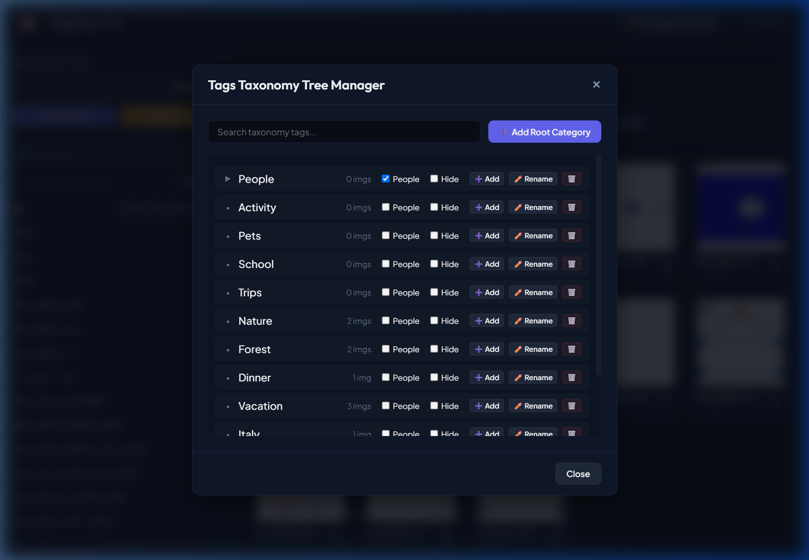
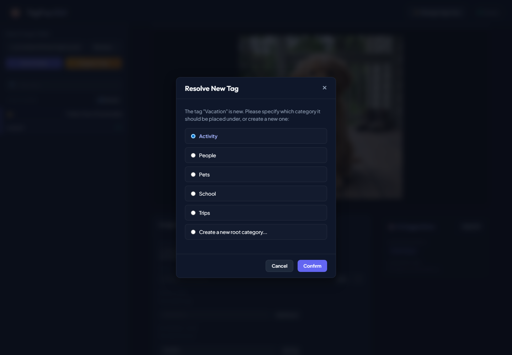
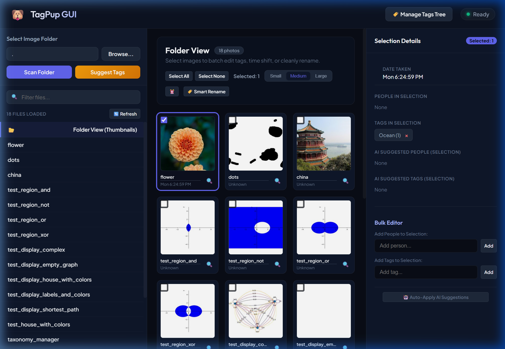

# TagPup GUI — Folder Tagging & Metadata Editor Specification

---
[◀ Back to README](../README.md) | [📖 Tutorial](TUTORIAL.md) | [💡 CLI Examples](EXAMPLE.md) | [🖥️ TagPup GUI Spec](SPEC_TAGPUP_GUI.md) | [🎯 TagTuner UI Spec](SPEC_TAGTUNER.md) | [🐶 CLI Engine Spec](SPEC_TAGPUP_CLI.md) | [🗄️ Database Spec](DATABASE.md)
---

This document records the design, specifications, prerequisites, and instructions for the TagPup Graphical User Interface (Web Workspace) and its matching tag taxonomy mechanics.

## Design and Visual Aesthetics
- **Core Principle**: Dark mode, premium styling with Outfit (headings) and Plus Jakarta Sans (body) typography.
- **Glassmorphism**: Header and modal elements feature subtle transparent background blur (`backdrop-filter: blur(12px)`) with elegant border outlines.
- **Layout**: Flexible layout consisting of a collapsible folder directory tree on the left sidebar, an interactive thumbnail grid in the center, and a multi-select editing metadata details panel on the right.

## Features and Mechanics

### 0. The Tagging Loop

The work TagPup exists for is: look at a photo, tag it, move to the next one. These
behaviours serve that loop and are specified together because they depend on each
other.

**Moving between photos.** `ArrowDown`/`ArrowRight` go forwards, `ArrowUp`/`ArrowLeft`
go back; both pairs do the same thing, because which one a person reaches for depends
on whether they are looking at the list or at the image. Movement stops at either end
rather than wrapping. A horizontal swipe or drag across the main image does the same,
right-to-left for forwards, matching every photo viewer people already use; the
gesture must clear 60px **and** exceed its own vertical movement, so a tap and a
scroll that drifts sideways are both ignored. Modifier combinations are left to the
browser.

**Zoom.** A click on the main image opens it over the whole window, as large as fits
(`object-fit: contain`, a few pixels of margin), for reading the writing on a sign or
a name tag. It loads the original — `/api/photo-file` without `size` — and shows the
800px preview, scaled up, until that arrives; if the browser cannot draw the original
(TIFF, HEIC) the preview stays. A click anywhere on it, or `Escape`, closes it. While
it is open the arrow keys do nothing rather than change the photo underneath. It is
not leaving the photo, so it neither asks about unsaved edits nor makes any. A drag
across the image is a swipe, not a click, and does not open it.

Arrow keys are ignored while the caret is in a field where they mean something to the
text being typed — but **not** in the filter box, which is a search control. A blanket
check on `INPUT` used to catch it and return before `preventDefault`, so the browser
scrolled instead: the keys appeared dead in the one place you most want them, right
after narrowing the list.

**Knowing where you are.** Each sidebar row carries a filled or hollow dot for tagged
or not, and a tag count where it has any. The count line reads `38 of 80 tagged, 42 to
go` rather than `80 files loaded` — on returning to a folder, the question is how much
is left. A photo counts as tagged if it has any tag, any person, or a title: the
question is "have I been here yet", not "is this perfect".

Beside the **Original Image** heading, `12 of 48` says where the open photo sits in
the list. It counts the rows the arrow keys walk — after any search — so the next
photo is always 13 of 48, and a search that narrows the list narrows the count. It
follows every change of photo and every rebuild of the list (search, rename, delete,
rescan), and is hidden with no photo open or when the search has left the open photo
out.

The folder's own name — the last segment of its path, not the whole thing — sits under
the path box and in the window title. The absolute path is long enough to be unreadable
in a sidebar, and the shoot's name is what identifies it.

A checkbox narrowing the list to untagged photos was removed: it added a line of noise
above a list that is read constantly, for a filter reached rarely. The idea is worth
returning to in a better home, and everything it was built on remains.

Selecting a photo resets the details panel to the top, so each one starts at its own
image rather than mid-panel at the previous photo's scroll position.

**Carrying tags forward.** **Same as previous** (`Ctrl+D`) copies the tags of the
photo above in the list onto the current one. It is additive — tags already present
are kept and only what is missing is added — because replacing would quietly undo work
on a partly tagged photo, which is the one you are most likely to be standing on. It
is offered only when the previous photo has something this one lacks, and the button
says what it would copy and from where.

**Not losing what was typed.** Enter in a field, its Add button, the title's own Save
and a click on a pill still write at once. What is typed and not yet written — text in
the tag or person field, or a title that differs from the photo's — is an **unsaved
edit**, and nothing is ever dropped silently:
- **Save** at the right of the Image Details header writes all of it in one request.
  It is disabled whenever the panel matches the photo: typing and deleting, or putting
  the title back, leaves nothing to save. Its tooltip is `Save (Ctrl+S)`.
- **`Ctrl+S`** (`Cmd+S` on macOS) does the same from anywhere, including from inside
  the field being typed in. It is always kept from the browser, so its Save Page
  dialog never opens.
- **Every way off the photo asks first** — arrow keys, swipe, clicking or pressing
  Enter on another row, the folder view, opening another folder, Refresh: "Save
  changes to `<file>`?" with **Save** (focused; `Enter`), **Discard** and **Cancel**
  (`Escape`). Save moves on only if the write succeeded; on failure you stay, with the
  error and the edit. Discard drops the edit and moves on. Cancel stays with the edit
  intact.
- Closing or reloading the tab with an unsaved edit raises the browser's own prompt.
- A typed name must resolve before anything is written. One whose placement is not
  settled (a placement question cancelled) stops the save and stays in the field.
  Names the photo already carries are not written again — compared the way the rest of
  the app compares them (`photoAlreadyHas`, so a person matches by name).

Leaving a field no longer commits it. It used to, and that lost the tag anyway: the
commit resolved the name first — a round trip for a pathed tag or a new person — and
clicking the next photo blurs the field on mousedown and navigates on click, long
before that returns. By then the field had been cleared for the next photo, and the
save found nothing. The prompt replaced it.

`Escape` in the tag or person field empties it; in the title field it puts back the
photo's title.

### 0.2 What the analysis found

Below the photo's details sit two halves of one row: **AI Suggestions** on the left,
**Detected Faces** on the right. Suggestions lead because they are the thing to act on;
the faces are reference, and the place to pick up a match the suggester was not
confident enough to propose. Either half takes the full width when the other is empty.

Clicking a face adds that person to the photo — a recognised one as readily as a
proposed one. Only unnamed faces carrying a suggestion used to be clickable, so a photo
whose faces were already identified offered no way to act on them: the strip said who
was in the picture while People Tags sat empty. A face whose person the photo already
names is dimmed and says so rather than looking live and doing nothing, and an excluded
face is never offered.

The suggestions box lists **only what the photo does not already carry**. It previously
listed everything the analysis produced, so after Apply All it sat there repeating back
the tags it had just written; a suggestion you have taken is a tag, and it is shown as
one a few inches above. Taking one removes it, and when nothing is left the box goes
away rather than becoming a heading over two empty lists. A person is matched by who
they are, so a bare suggested name counts as present on a photo tagged with their path.

### 0.1 Feedback, Scope and Undo

**One status channel.** Results and validation go to the status line, which was
already carrying them. Modals are kept for exactly two cases: a question that must be
answered before acting, and a failure that would otherwise pass unnoticed. Success
confirmations were removed — stopping the work to report that the work worked is
worst precisely during bulk operations, when you are moving fastest. Validation
messages appear beside the field they are about, which is marked, rather than in a box
that hides the form you need to correct.

**Scope before irreversible writes.** Auto-apply states how many photos it will write
to, how many of those already carry tags, that suggestions are added rather than
replacing, and that it writes into the photo files. The common mistake is not
misreading the button — it is having the wrong selection, which a bare count does not
surface. Camera time-shift states the number of photos affected, resolving
`All Cameras` to a real count, and says plainly that it **cannot be undone**, because
it rewrites EXIF timestamps that the undo below does not cover.

**Undo.** One step deep, covering the last bulk tag write (`Ctrl+Z`). Photos are
restored from a snapshot of the tags and title they had before the write, rather than
by reversing the change field by field: a snapshot cannot be confused about what an
addition or a removal was. It is one step on purpose — the mistake it catches is a
bulk write against the wrong selection, noticed immediately, and a deeper stack would
imply a guarantee this cannot make, since the photo files are the source of truth and
anything can edit them behind the app's back. A partial restore says so.

**Keyboard reachability.** Sidebar rows are focusable and carry `role="option"`;
`Enter` or `Space` opens the focused row, and focus is visible. Previously nothing in
the list was focusable, which is why the arrow keys worked only while focus happened
to be sitting on `<body>`.

### Activity

**Activity...** in the gear opens the Activity page in a new tab, at `/activity/` -- one page for the background work of every library in the data folder, served by both apps alike, and to this PC only (`web/activity/`, over `/api/activity/`). Its sections:

- **Needs attention**, first: each library's photos found damaged -- a picture that does not decode (cut short, zero bytes), never indexed or written to, and one that decodes but ends in zero bytes, possibly an incomplete copy -- with its path, why, when it was first found, its size and modified time, a link opening its folder in TagPup, and **Check again** (for each, and **Check all again** for a library) reading them again now whatever their modified time says; **Nothing needs attention.** when there is none, and the section's link in the page's menu counts them. A photo replaced by a good copy leaves the list by itself.
- **Now**, asked again every three seconds while the tab is in view and not while it is hidden: each library's indexing (the folders being indexed and how far, those waiting), its Suggest runs, a recurring job running, the folder watcher's sync, and the always-on process (an update waiting, the server draining, an update refused as not newer).
- **Scheduled jobs**: each job with why it is scheduled (`safety`, `retention`, `catch-up`) and, for each library, its last run -- when, how long, how it ended, what it changed as counts, why it failed -- and when it is due; **Run now**, asked first; its last runs, unfolded; a failed last run flagged until a later one is done. **Logs for this run** shows the lines the run logged.
- **Sync & watcher**: each library's root folders (on disk or missing, watched), when a change was last noticed, its last sync of one folder and of the whole library ("last in step"), and the folders to review, opening TagTuner's dialog.
- **Snapshots**: each library's, with kind, age and size, and the disk they take.
- **Always on**: the version answering, running since, crashes, the last update, an update refused.
- **Recent activity**: one timeline of what was done -- changes of the journal, job runs, syncs, runs of the indexer, updates -- newest first, with their counts; **More** reads further back.
- **Logs**: a tab for each log in `data/logs`, newest lines first, each as time, level, logger and message, filtered by level (warnings and worse unless asked) and by text; **Follow** asks for new lines every three seconds; **Raw** shows the end of the file as written, **Download** saves it.

### 1. Folder Browser & Grid Selection
- **Which library**: the header names the library the page works in, beside the logo, at all times: every change on the page goes to it (`web/tagpup/membership.js`, from the page's address).
- **Choosing a dog park**: the database picker is labelled *Dog Park* — it holds one library's photos, people, tags and suggestions. It is free to change until a folder is open, and locked behind a **Change** button afterwards: switching reloads the page carrying the same `?path=`, so the same folder would come back attached to a different index with nothing marking the change. Change closes the folder and drops it from the URL, so the new dog park starts from a deliberate choice.
- **Damaged photos**: a folder holding photos the indexer found damaged says so at its top, with each by name and why -- "2 photos in this folder can't be read — the file is damaged. Restore them from a backup.", and "1 photo in this folder may be an incomplete copy — the file ends in zero bytes, and the picture may be grey below a line." -- each name opening the photo (`/api/folder/damaged`), with **Check again** beside each and **Check all again** below: restored from a backup, a photo is read again now whatever its modified time says, and one that reads whole leaves the list and is indexed again (`/api/damaged-photos/check`). A card of a photo that cannot be read shows **Can't be read** where its picture would be, and is not asked for; one that may be incomplete carries **Incomplete?** on its picture. The open photo says why, and that nothing was written to it. Nothing shows for a folder with none, and a file replaced since has left the list. **Damaged photos** are said, not left as gaps (findings #407). The header carries a badge while the library has any -- "⚠ 13 unreadable photos, 1 possibly incomplete copy" (`/api/damaged-photos`) -- linking to the Activity page's Needs attention; nothing when it has none.
- **Adding a folder to a library**: only when asked. Opening a folder asks the library what it holds of it (`/api/folder/membership`); when photos under it are in folders the library holds none of, a dialog asks first, the library's name prominent: **Add this folder to kr-track?** (or **Add the rest of this folder**, when it holds some), with the folder, its photos, **Outside kr-track's root folders** when so, **kr-track's settings ignore this folder** when so. It names only the library the page is in; no other library is opened, read or named (2026-10-02). **Add to kr-track** adds it (`/api/folder/add`: recorded as added, so it is the library's at once, and indexed, the progress shown here) and the page works as for any folder; **Just look** (and Escape) shows its photos and lets the owner edit their files -- captions, tags and people (one photo or many), Smart Rename, rotating, deleting, Date Taken and Time Shift are written to the photo files only, not to the library -- and runs **Suggest**, which analyses the photos against what the library already knows (its photo vectors, its named faces, its tag tree: all read) and keeps what it finds in the server's memory only -- nothing is added to the library; Apply All, a suggestion's chip, the title wand and carrying tags forward (Ctrl+D) write the files only. Only **face naming** is held back (the faces strip dimmed, its clicks stopped) because naming a face makes a person record in the library. A note says so: "Just looking: kr-track does not hold this folder. Tags, captions, renames, rotating, deleting and date changes are made to the photo files only, not to kr-track. Suggest analyses the photos against kr-track without adding them; nothing is saved to kr-track. Face naming is off until you add the folder.", with an **Add to kr-track** of its own. When such a run finishes the status line says "Analysed against kr-track; nothing was added to kr-track." and what the library had too little of to compare with (a new library: "has no photo vectors yet", "has no named faces yet"). A new tag or person typed there is written to the file as typed and filed, and no node is made in the library's tag tree. After a write the status says where it went ("Written to the files only: kr-track does not hold this folder", or "1 to the files only (kr-track does not hold their folder), 2 with their rows"); a delete there says the file went to the Recycle Bin (through this PC's, from a share) and nothing in kr-track changed. The folder just looked at is not asked about again while it stays open. Whether a Suggest only looks is the server's answer at its start (`/api/folder/suggest-start`), never a flag from the page. TagTuner's Add Folder adds through the same service. Keywords TagPup writes are recorded in the index as it writes them, so there is nothing to press afterwards.
- **Opening a folder**: Choosing one opens it. Browse, picking from the autocomplete list, pressing Enter, or leaving the path box all scan immediately; there is no separate Scan Folder step, because choosing a folder and asking to see it were never two decisions. Re-committing the folder already open does nothing, so blurring the box does not rescan. **Refresh** re-reads the open folder from disk.
- **Views of the library** *(phase 9b-2)*: the gear's **Browse the whole library** shows every photo of the library, by Date Taken, in the grid a folder uses, from the library's index (no folder is read); **Library view of this folder** (greyed with no folder open) shows the library's photos of the open folder and its subfolders. The address names the view -- `?view=<all|folder|keyword|person|year|month>&value=<value>[&recursive=1]` (a folder by its path, a keyword by its tag, a person by name, a year as 2024, a month as 2024-06) -- so Back, Forward and a bookmark work; a `?view` wins over a `?path`, and an address that names no view (an unknown kind, no value, a year that is not one) opens an empty view that says so in a sentence. One floating header above the grid (#713) says which view is open and how many photos it holds and holds the view's controls, always at hand while the grid scrolls: **Refresh view** (an icon button), **Sort by** (#714: a menu of two sections, the field -- Date Taken, Caption, File name -- and the direction -- Ascending, Descending --, each a radio group showing the current choice; arrow keys, Enter, Escape; the address keeps the order as `order`, and the next view opened is read in it), Select All, Select None, Delete, the selection's count and the thumbnails' size; a card the arrow keys walk to is kept below it. Organize's header is the folder's own, and does not float. (The strip's "Back to folder view" went with #670: Back, the navigator's Organize or a folder of the selection's **Folders to Organize** leave a view; that folder opens with the sidebar's switch on **Organize**, #712.) Only the cards near the window are fetched (`/api/library/cards`) and drawn, the others are placeholders; the order is read once (`/api/library/ids`) and is not recomputed until **Refresh view**, which keeps the place near the same photo: a photo edited, deleted or renamed updates its card in place, a deleted one goes and the total drops. Selecting is by photo id (see "Editing the selection of a library view", phase 9d-2), instant over cards not yet fetched. The details panel opens the photo whole (`/api/library/photo`) and edits it by path as in a folder; its Previous and Next follow the view's order. While a view is open the folder's own machinery is idle: no scan, no add-folder question, no Suggest, no sidebar list, no filter (search arrives with the later stages), no Smart Rename or Camera Time Shift, and nothing is kept in this browser's folder cache. Choosing another dog park drops the view.
- **The navigator, and the move between a folder and its view of the library** *(phase 9c)*: the sidebar is two panes behind a switch at its top, **Library** and **Organize** (called **Folder** until #668, when it was mistaken for the library's Folders tab). **Organize** is the work on one folder on disk, what it always was (the folder box, Suggest, the open folder's file list, Smart Rename, Camera Time Shift); **Library** is the navigator, four tabs -- **Folders**, **Keywords**, **People**, **Dates** -- each a filter box and a tree or list of what the library holds with the photos counted (`/api/library/navigator`, read when a tab is first opened, and again a moment after a write that finished and at once on **Refresh view**; a section that cannot be read says why in the server's own sentence, a library with none says there is nothing). Folders and Keywords are lazy trees (only what is open is drawn, at most 1,500 rows, and a line says how many were left out; the keyword tree is alphabetical), People an alphabetical list, Dates the years newest first opening to January..December, with years before 1970 or after next year gathered under one collapsed **Other years (N)**. A click on a row opens the library view of it (a folder with its subfolders; a keyword and everything under it) and the row of the view that is open is highlighted, in the tab it belongs to, opened to it -- also when the page is opened by its address, and by Back and Forward. **Several rows at once** *(the owner's review, #672)*, in every tab: a click selects a row and every row under it (shown selected); Ctrl-click adds or takes away a row (and the rows under it); Shift-click selects the rows drawn from the last one picked (Ctrl+Shift adds them); Ctrl+A every row drawn; Space, Ctrl+Space and Shift+Space do the same from the keys. The grid is the union of the rows selected, each photo once: a row with a row under it taken off keeps its own photos (a folder's own, a keyword alone, a year's "Other"). The address holds it (`?view=any_of&value=<the sources, as JSON>`), so Back, Forward and a bookmark restore it; a selection whose address would be longer than 100,000 characters (the server reads at most 262,144 bytes of a request's first line and headers, so it could never be reloaded) is a sentence and opens nothing -- about 1,000 short rows, 400 of a network share's long folder paths. In a library view the Library pane is shown and in a folder view the Organize pane, until the person chooses the other (remembered until the page is left). The trees and tabs follow the ARIA patterns: one tab stop, arrow keys, Right and Left to open and close, Enter to open the view; Left and Right move between tabs. **Show in library** (beside Select All, with a folder open on disk) opens the same folder's library view with its subfolders and lands on the photo that was at the top; a folder of the selection's **Folders to Organize** opens that folder in Organize -- scanning it first, so that a folder that is not there any more, or a share that is away, leaves the view open and says so in its strip --, the selection cleared by either. The strip of a folder's view had **Show on disk** and **This folder only** / **With subfolders** until #670, when the owner found them not needed; an address with `recursive` absent still opens a folder's view of the folder alone. When the disk holds photos the library does not, a banner under the strip of a folder's view says "N photos in this folder are not in kr-track." with **Add them** (the same add-folder question a folder opened asks, with **Not now** for Just look; nothing is indexed until it is answered) and **Dismiss**; it is asked after the view has painted (`/api/folder/membership`, an answer later than 15 seconds is not wanted), by itself only for a view of this folder only or one with subfolders of under 1,000 photos (a larger one shows the link "Check this folder on disk for new photos"), and kept for the page; a share that is away, a folder that is gone or a library that cannot say shows nothing. The strip says when the library was last in step with its folders (`/api/sync`) **only when something is wrong** (#670): "Could not read when the library was last in step with its folders.", "A sync is running now. Last in step with its folders: 5 min ago.", "Never in step with its folders: no sync of the whole library has finished.", "The last sync found photos not in step with the library yet. Last in step ...", "Last in step with its folders: 3 days ago." (more than 48 hours), or, beside the banner of photos on disk the library does not hold, "Last in step with its folders: 5 min ago."; an in-step library says nothing. A card whose file changed since the library read it is marked **changed on disk** and one whose file is gone **missing** (`/api/library/cards` looks at each file once; a share that does not answer gives no mark); a missing photo opens with a notice and cannot be edited (its write controls are inert), a changed one is read from its file when opened and its mark clears. The grid is one tab stop: Tab reaches the card the keys are on, the arrow keys move one card or one row, Home and End to the first and last photo, PageUp and PageDown a window, Enter opens the photo, Space selects it, Shift with an arrow or Space extends the selection from where it began; the card is an option of the grid's listbox, named by its file name, date, whether it is selected and whether it is damaged, changed or missing; the window's edge and 20,000 photos are no obstacle, and the focused card stays in the page while it has the focus.
- **Editing the selection of a library view** *(phase 9d-2)*: a library view's selection is the photos' ids, not their paths -- the ones picked, or the view's whole source but the ones left out -- so **Select all** of 68,000 photos is instant and asks nothing, a **Shift**-click or Shift+arrows select the range between by the view's order whether or not its cards were fetched, and **Invert** swaps what is selected with what is not (up to 20,000 either way; past that it says "Too many to invert: use Select all and deselect"); stepping a Shift+arrow back toward where the run began takes the photos off again. The selection is kept by Refresh view and by edits, and cleared when another view opens. The **Selection Details** panel counts what the selected photos carry -- the tags and people, each with how many photos hold it, alphabetical, "N more" past 500 -- on the server (`/api/library/selection/tally`), a moment after the selection stops changing ("counting..." meanwhile). Under **Folders to Organize** it names the folders the selected photos are in, by their own names (two of one name with the folder above them), each with how many of its photos are selected, when there are 10 or fewer: a click opens that folder in Organize (scanned first; a folder gone or a share away keeps the view and says so in its strip). More than 10 is one sentence: "These photos are in 2,672 folders. Narrow the selection to 10 folders or fewer to open one in Organize." A view's panel has no Date Taken (#675); Organize's has, and has no Folders to Organize. **Add person**, **Add tag**, and the **×** and the arrow of a tag or person in that panel each ask first -- "Add Trips/Lighthouse to 3,412 photos? This changes the photo files and takes about 4 minutes. It cannot be undone as one step; remove the tag to reverse it.", and "This is N photos. Continue?" over 5,000 -- and then run as a **job** (`/api/library/bulk/start`): a strip under the header shows a bar, "done of total", what was changed, left unchanged, missing, damaged and refused, the time left and **Cancel**; it ends in a sentence ("Added Trips/Lighthouse to 3,380 photos; 32 missing on disk were skipped; 0 errors.") with the first 50 errors and their file names, and **Resume** for a time shift that stopped, **Start again** for a tags or people job that was cancelled or abandoned. **Smart Rename and Shift Date Taken are not offered in a library view** (#669, the owner's review): they are work on one folder, in Organize. The server's bulk time shift (`/api/library/bulk/start` with `op: time_shift`) is still there, and a time shift job found running or stopped part-way is shown in the strip and resumed as before; the library page no longer starts one. **Delete** beside Select None (a view's only, #674) deletes the selection: it first asks the server where the files would go (`/api/library/selection/delete-check`, "Looking where the files of N photos are..."), then asks "Delete 3,412 photos? The files go to the Recycle Bin, where they can be restored. Their rows leave the library, with their faces. It runs as a job you can watch and cancel; it cannot be undone in TagPup." -- or, where some have no Recycle Bin, "1,200 of them are where there is no Recycle Bin (1,200 on a network share): they are copied to this PC (2,345 MB), the copies go to this PC's Recycle Bin, and then the originals are deleted. Restored from the Recycle Bin, a copy goes to C:\\Users\\...\\Downloads\\TagPup deleted from shares, not back to where it was. The other 2,212 go to the Recycle Bin." -- with how long it takes (at 15 photos a second, measured) and that saving a photo elsewhere waits for the photos being deleted at that moment; when this PC has not room for the copies it says so and asks nothing; the question names the server's count of the photos, which the start's token is of; a second time over 5,000, and runs as a job of op `delete` in the strip ("Delete 3,412 photos to the Recycle Bin", "deleted N" in its counts); when it ends the view's order is read again, so the deleted photos leave the view, its total and the selection, and a photo open in the details panel that was deleted is closed onto the grid. A selection over 200,000 photos is refused before anything is asked of the server, as the other bulk edits. Only one bulk edit runs in a library at a time: while one does, the view's edit controls are disabled with a tooltip, and a second start shows the server's sentence with **Show it**. The job goes on when the tab is closed, the view changes or the page is reloaded (the strip comes back: `/api/library/bulk/current`); it is also listed on the Activity page. A selection a request cannot carry (more than 20,000 photos picked one by one and more than 20,000 not picked, or more than 200,000 photos) is said in a sentence beside the panel before anything is asked. Ctrl+D stays off in a view; a folder's own selection, bulk tags, Smart Rename and Camera Time Shift are as they were, in Organize.
- **Directory Tree**: Scans image folders and lists subfolders grouped chronologically by capture year. Folder structures start collapsed on page boot.
- **Thumbnails sizes**: Segment buttons dynamically switch card sizes between **Small**, **Medium**, and **Large**.
- **Multiselect actions**: Standard checkbox check toggles and range select (Shift-Click) select contiguous items in the list.

### 2. Smart Renaming & Eviction
- Sequential renaming based on a custom `[Grouping] - [Index] - [Caption]` format.
- Evicts conflicts automatically to temporary filenames.
- Preserves the original filename in `XMP-xmpMM:PreservedFileName` metadata.

### 3. Tag Taxonomy Tree Manager
- Open the hierarchical tree modal from the gear at the right of the top bar: **Tag editor**. The editor is one module both pages open (`web/common/tag-editor.js`), and TagTuner's gear opens the same one; its routes are served by both apps.
- **Settings** in the gear opens the library's settings for TagPup's own features -- Suggest's candidate words and Smart Rename's format -- in the same dialog TagTuner's gear opens for the model, face detection and ExifTool (`web/common/settings-dialog.js`, over `/api/settings`, which answers each app its own groups). Neither is locked: a change applies from the next Suggest or rename, and is journaled, so it is in the library's history and can be undone.
- **History...** in the gear lists the library's last changes -- each bulk edit, file write, save and settings change, newest first, with when and how many rows and files -- and offers **Undo** beside each that can be undone (`web/common/history-dialog.js`, over `/api/history`). Undo rehearses first and says what would be put back and what refused; **Confirm undo** makes it. A photo file changed since is refused, named by photo id, never overwritten. After an undo that changed photos the folder is scanned again. The same dialog is in TagTuner's gear.
- **Activity...** in the gear opens the Activity page in a new tab: the background work of every library (below, "Activity").
- The gear's last item, **Open in TagTuner**, opens TagTuner on the same library in a new tab (its address from `/api/apps`). The menu opens on click, Enter or Space; the arrow keys move through it, Escape closes it and puts the focus back on the gear, and a click anywhere else closes it. Below its items the gear says which version of TagPup answers (`/api/server`, asked at each opening), not an item itself.
- While the always-on process moves onto a new version, a request the server turns away (503, `X-TagPup-Updating`) is sent again after its `Retry-After`, and again while nothing answers during the restart, for up to two minutes (`web/common/api.js`): the page waits out the update rather than showing an error. A page left open while its server was replaced by another version (a launch of a newer one, `tagpup.launcher`) says so in the banner at the top -- "TagPup was updated while this page was open. Reload this page to use it" -- at the first response naming the new version (`X-TagPup-Version`), and runs the version it was opened with until reloaded: a reload would lose an unsaved edit.
- Lists categories in a tree starting collapsed by default. **Every level is in alphabetical order**, roots included: case and accents ignored, digits read as numbers ("Trip 3" before "Trip 10"), ties broken by the exact spelling and then the id (`compareTagNames`, `web/common/vocabulary.js`). It is the display's order only; the stored order and the server's are not changed, and the delete question lists the tags it offers to move photos to in the same (tree) order.
- **The editor changes the tree in place** (`web/common/tag-tree.js`, driven by `web/common/tag-editor.js`). An action never rebuilds the tree: what is open, the scroll, the search typed and the focus stay, and only the rows the action touches change. A **rename** is shown at once -- the new name, its branch's tag paths, the node moved to where the name sorts among its siblings (scrolled into view and briefly highlighted if it moved) -- with a marker on the node ("renaming... the photos are being rewritten") until the server answers. Answered, the marker goes and nothing else moves; refused or failed, the node goes back to its old name and place and the reason is shown; answered with a warning ("some photos not rewritten"), the new name stays and the warning is shown. A **new tag** appears at once under its parent (which opens) in its place, marked until the server answers, and is taken out if the server refuses; a name that is a path ("A/B"), whose levels only the server names, appears when it has answered, and a name already among the siblings is shown, not sent. **Face Matching** and **Hide** are set at once on the node and its branch and put back if refused. A **delete** keeps its question; the node then stays, marked, until the server has done it -- it can fail part-way, and the tree keeps a node whose photos could not all be rewritten -- and is then taken out with its branch, the focus passing to the node beside it. A node with something in flight refuses a second action ("still being changed"); actions on different nodes are shown at once and sent to the server one at a time, in the order asked, since a rename and a delete may rewrite the same photo file. After the server answers, the page's own tree is read again (as before), and the editor patches what differs from it -- a node added, removed, renamed or moved by someone else -- leaving rows with something in flight as shown. A read that comes back empty is not taken for an empty tree. While the search is typed, a node just renamed stays shown until the search is typed again. Opening the editor again shows the same rows, with what was open, the search and the scroll as they were.
- Review rules of the in-place editor. A rename to a name a sibling already has (case ignored, other than the node itself) is refused at once with the note `"<tag>" is already there.`, as a new tag is, and nothing is sent. The delete question's "move photos to" list leaves out the branch being deleted and every tag in a branch with a rename, delete or create in flight, whose names the server may not have; the choice is checked again when its turn comes, and a target that is no longer a tag of the tree is not sent (a move would make it) -- the note says to ask again. A new tag is shown unhidden, as the server stores it. When the focus was in a row that is removed, by a delete or by a reread, it goes to the name of the row beside it, never a button, or to the tree itself when none is left, so Escape still closes the editor. Closing or reloading the page while a change is queued or under way asks first ("Tag changes are still being sent to the server"): the queue is in the page's memory only. A change that has waited 30 seconds is reported in the editor ("Still waiting for the server: N changes are queued. They are sent in order.", with the list of what is queued); one that has waited 5 minutes is called stuck, with the advice to reload the page to see what the server holds. It stays in flight, since nothing says what the server did, and later changes stay queued behind it, never dropped. A request has no timeout of its own.
- **Create Child**: Prompts for a child category tag and inserts it under the parent.
- **Rename**: Prompts for a new name, automatically updates the tag itself, updates all child sub-tags recursively in the database and fallback files, and dynamically updates any photo files on disk and records using the tag.
- **Delete with check**: Inspects how many photos use the tag. If a tag is used, displays a conflict modal offering to remove it from all photos or move the photos to another target category before deleting.
- **People List Toggle**: Root branches can be toggled as "People" category lists, which drives the dynamic extraction of names from tags.
- **Hide Toggle**: Allows hiding tags and children from auto-complete datalists on new photo metadata entry.

### 4. Interactive Tag Resolution
- **Tags are shown alphabetically wherever they are a set**: alphabetical, case and accents ignored, numbers in order ("Trip 3" before "Trip 10"), a path one level at a time (`compareTagNames` / `sortedTags`, `web/common/vocabulary.js`; the server's `tag_sort_key`, `tagpup.core.vocabulary`, is the same order, and `tests/fixtures/tag_order.json` holds the two to one table). That is a photo's tag and people pills (each group on its own), the selection panel's tallies, the Add person / Add tag suggestions, and the roots offered when a new tag is placed. The AI suggestions are ranked on purpose -- the most confident first -- and the alphabet only breaks a tie. It is the display's order only: a save sends the photo's tags in the order the file holds them, and nothing stored or written is reordered.
- Typing a new tag name when tagging single/bulk photos triggers a placement selector modal.
- The dialog asks which existing root category to place the new tag under, or allows creating a new root category.
- Resolves ambiguous names (e.g. if the same name exists under different parent paths) by letting the user choose the correct path.

### 5. Detected Faces Strip
- The details panel lists the faces detected on the selected photo, each as a cropped thumbnail.
- Face recognition already runs during tag suggestion; this shows its result rather than only the resulting name pill, so an unidentified face is visible while tagging instead of being discovered later in TagTuner.
- A face carrying a name shows it. An unidentified face shows the closest match and its confidence when one clears 0.70 similarity -- the floor every screen offers a name from (`tagpup.core.clustering.OFFER_A_NAME`) -- and reads *Unidentified* otherwise. Excluded faces appear dimmed with their reason.
- Clicking a suggested face adds that person to the photo — the small correction TagPup is for; grouping and confidence work belongs to TagTuner.

### 6. Camera Time-Shifting
- Toggles a clock adjustment panel to offset capture timestamps recursively for specific camera models.

## Backend APIs

**Who can reach it.** The server listens on this PC only: 127.0.0.1 and ::1, one socket each, so `localhost` answers at once whichever address the browser tries first (`tagpup.web.app.bind`) *(owner, 2026-09-26)*. `tagpup_web.py --listen lan` binds every interface instead; it is for phase 10, when the apps have logins, and off by default. Every request must also name this machine in its Host header and, when it has one, its Origin (`tagpup.web.security`), else 403.

### `GET` Endpoints
- `/api/databases`: Returns `{"databases": list}` — the selectable database names (without the `.db` suffix). Test databases and internal ones (validation, startup, embedding-cache) are excluded. Which one was opened last is the browser's to remember: a bare URL goes to it, or shows the picker empty.
- `/api/folder/index-status?path=<folder_path>`: Returns how far indexing a folder has got, as `{"status": string, "percent": int, "message": string, "folder": string}`. Status values are `queued`, `running`, `completed`, `failed` or `cancelled`. A folder not asked about in this session reports `completed`, with the message `Ready` and no `folder`. The queue belongs to this server's process (`tagpup.jobs.indexing`), so an index started in TagTuner does not show here until one process serves both apps (findings.md, #34).
- `/api/browse-folder`: Invokes native folder dialog and returns selected path.
- `/api/autocomplete-folder?path=<path_prefix>`: Returns autocomplete folder path suggestions based on Windows folder hierarchies.
- `/api/folder/scan?path=<path>`: Scans folder and returns JSON array of photos.
- `/api/folder/damaged?path=<path>`: The photos under a folder, at any depth, the indexer found damaged and whose files are unchanged since (`tagpup.services.damaged_photos.listed`): `{"folder": path, "photos": [{"path", "name", "folder", "kind", "reason", "detail", "zero_tail", "indexed", "size", "mtime", "found", "seen", "run"}]}`, as `/api/activity/attention` gives each: the folder's notice, its cards' marks, and why on the open photo. One listing of each folder holding one, no file read. Paths to this PC only: another address is answered an empty list.
- `/api/folder/membership?path=<path>`: What the library the URL names holds of a folder (`tagpup.services.libraries.membership`), asked as the page opens one: `{"library": name, "folder": path, "photos": int, "photos_held": int, "photos_ignored": int, "photos_not_held": int, "folders_not_held": int, "first_not_held": path or null, "has_roots": bool, "under_roots": bool, "ignored": bool, "permanent_delete": bool, "permanent_reason": string or null}` -- the photos on disk under it at any depth; the library's rows under it; the photos in its ignored folders (`library.ignored`), which are neither held nor offered, as sync passes them over; whether the place has no Recycle Bin (a network share; `permanent_delete`, a name kept from before #694: a delete there now goes through this PC's Recycle Bin, never for good); the photos in folders under it the library holds no photo directly in, ignored folders left out (a folder is a library's when it holds one of its photos -- and for a write, whatever its ignored list says), how many such folders and the first; whether the library has root folders, and whether this one is one of them or under one, or under an ignored folder. No other library is opened or named. One walk of the folder, no file read, on a thread of its own: a request for a folder under walk is answered by that walk (never a second), and one that outlives 12 s, or is for a folder on a network share (a UNC path or a mapped drive) that does not say it is there within a second, answers `200` with `{"folder": path, "could_not_check": true, "why": sentence}` and none of the counts (phase 9c, findings #568). `400` for a local path that is not a folder.
- `/api/folder/suggest-status?path=<folder_path>`: Returns the status, counts, and computed suggestions of the background tag suggest thread. Status values are `idle`, `preparing`, `running`, `completed`, or `error`. For a folder the library does not hold (a run that only looked) the answer is from the server's memory and says `"in_memory": true`; when the run is completed it adds `"notes"` (sentences: what the library lacked to compare with, photos that could not be analysed, photos left out by the limit) and `"unread"` (how many photos have no suggestion for want of being read), and an `error` ends "Nothing was changed." (the models not made ready, no images in the folder, a scan that failed: a run that only looks has written nothing to the library in any of them). The same shape, the same entries, as one kept in the library.
- `/api/photo-faces?path=<photo_path>`: Returns `{"faces": list, "total": int, "unmatched": int}` for the faces detected on one photo. Each entry carries its box, any assigned `name`, whether it is `excluded`, and for unidentified faces the closest `suggestion` with its `similarity` — measured against the nearest single resolved face of that person, the same way TagTuner's suggestion list measures it. A suggestion is only offered at 0.70 similarity or above (`tagpup.core.clustering.OFFER_A_NAME`); below that the nearest name is noise rather than a candidate, and two strangers in three reached the 0.5 this used (findings.md, #75). Named faces are listed first, then by confidence, then by size.
- `/api/face-crop?id=<face_id>`: Serves the face thumbnail as JPEG, cropping from the original photo and caching the result in `faces.crop_image` when it is not already stored.
- `/api/photo-file?path=<photo_path>`: Serves the photo image binary (supports resizing via `size` parameter).
- `/api/library/navigator?section=<folders|keywords|people|dates>`: The counts one section of the library navigator (phase 9, `tagpup.services.library_view.navigator`), each one read of the library and nothing computed per node. `folders`: `{"folders": [{"path", "name", "parent", "direct", "recursive"}]}` -- the library's folder tree by native path (`parent` the path above it or null; `direct` the photos in the folder itself, `recursive` those in it and below), parents before children. `keywords`: `{"keywords": [{"tag", "name", "parent", "count"}]}` -- every node of the tag tree with the photos carrying its tag or a tag under it, each photo once for a node however many of its tags lie under it. `people`: `{"people": [{"name", "count", "group"}], "groups": [{"tag", "name", "parent", "count"}], "unfiled": n}` -- by photos, most first; names that differ only in case are one person; `group` the tag of the branch the person's node is under (a leaf `has_face` node, not a root, the only one called that name: a branch is never a person), null for a name no such node is; `groups` every branch above a person with the photos naming anyone under it, each photo once, alphabetically (`parent` the branch above, or null); `unfiled` the photos naming someone with no group. `dates`: `{"years": [{"year", "count", "months": [{"month": "YYYY-MM", "count"}], "other"}], "undated": n}` -- by `photos.year` and, within it, by Date Taken (`other`: the photos of the year whose Date Taken is no month of it). `400` for any other section; `409` with a sentence for a library not yet brought up to date for the views (migrations 19 and 20: TagPup does it as it opens a library) and for a root this machine does not place (the gate answers that first). To this PC only (`403`).
- `/api/library/view?kind=<all|folder|keyword|person|year|month|keyword_only|year_other|any_of|search>&value=<value>&folder=<path>&recursive=<bool>&order=<taken|taken-desc|name|name-desc|caption|caption-desc>&after=<token>&limit=<n>`: A page of the photos of a source (`tagpup.services.library_view.view`; also a POST, for a union too long for an address: Expects JSON body `{"kind", "value", "folder", "recursive", "order", "after", "limit"}`): `{"source": {"kind", "value", "recursive"}, "order", "total", "ids": [photo id], "next": token or null, "limit", "cards": [{"id", "name", "path", "taken", "damaged", "damage", "thumb"}]}`. `kind` is one of: `all`; `folder` (`folder` the path, any spelling the Roots ingress resolves; `recursive=true` includes its subfolders); `keyword` (`value` the tag as the tree spells it, and everything under it: a photo is once however many of its tags lie under it; a tag with no node holds nothing); `person` (`value` the name as `photo_people` holds it, compared without case); `year` (`value` as 2024, by `photos.year`); `month` (`value` as 2024-06, by Date Taken); `keyword_only` (the keyword's node alone, not the nodes under it); `year_other` (`value` as 2024: the photos of the year whose Date Taken is in none of its months); `any_of` (`value` a JSON list of at most 1,000 sources of the other kinds, each `{"kind", "value", "recursive"}`: the photos of any of them, each once, one statement; the same source twice is one, a union of one is that source, a source naming nothing adds nothing; a nested union, an empty or over-long list, or JSON that is not one is `400`); `search` (phase 9e-1: `value` a JSON object -- an object itself in a POST body -- `{"all_of": [source], "any_of": [source], "none_of": [source], "words": "text"}`, each part optional, any other part `400`: the photos in EVERY source of `all_of`, in AT LEAST ONE of `any_of`, in NONE of `none_of`, and holding every word of `words`, in one statement, each photo once. Each list holds at most 1,000 sources of the kinds a union holds; a union (`any_of` source) in `all_of` is one member -- the navigator's selection the search looks within -- and in `any_of` or `none_of` its sources; a search in a search is `400`. A person is by name, as `person` is. `none_of` keeps a photo with no date out of no month. A member naming nothing makes `all_of`/`any_of` hold nothing and takes nothing away in `none_of`. `words`: at most 500 characters, split at blanks into at most 20 terms, each found -- as a prefix of a word of the photo's keywords (path and leaf, as the row holds them), captions and titles, and people, without case or accents, or, from three characters, anywhere inside its file name or the names of its folders below the root (the root's name is never a word; a native row's own folder only) -- and ANDed; everything typed is text, never search syntax (`OR`, `NOT`, `"`, `*`, `:`, `-` and the rest are looked for as written), a term with no letter or digit under three characters says nothing; never ranked: the order is the `order` asked. A search that says no more than a source is answered as that source (`source` in the reply says which: no part is `all`, `any_of` alone its union, one member of `all_of` alone that member); words of a library whose migration 24 is under way or due -- the server's startup thread, or another program, holds it --
are `503` with `Retry-After: 5` and "The word index is being made now; try again in a few seconds." (#753; a search without
words is answered meanwhile), and of a library at 24 without its tables `400` with a sentence). Ordered by Date Taken and then id, photos with no date after them by id (never by file time); `order=taken-desc` newest first, the undated still after the dated, by id from the highest; `order=name` / `name-desc` by the file name without case, ties by id (`idx_photos_name`, migration 22); `order=caption` / `caption-desc` by the photo's caption -- the first of its captions, the one the page shows, its first 200 characters -- without case, ties by id, the photos with no caption after the captioned ones in both directions, by id in the order's direction, as the undated are (`idx_photos_caption`, migration 23); another order is `400`. `after` is the `next` of the page before, an opaque keyset token -- never an offset -- so a photo added, deleted or re-dated between two pages neither repeats nor skips another; a token this server did not make, or made for another order, is `400`. `limit` is 200 when absent, at most 500 (a larger one is 500), `400` below 1 or not a number. `total` is the whole source's, not the page's. A card is small -- `taken` the Date Taken text or null, `damaged` whether the photo is recorded damaged or possibly incomplete (`damage` the kind), `thumb` the URL of its thumbnail by id (`/api/photo-thumb?id=..&v=<modified time>`, for the page to put the library in front of) -- one read of the page's rows, no query for each photo and no look at the disk. A source holding nothing is an empty page. `400` for a request that cannot mean anything, `409` with a sentence as for the navigator. To this PC only (`403`).
- `/api/library/ids?kind=<all|folder|keyword|person|year|month|keyword_only|year_other|any_of|search>&value=<value>&folder=<path>&recursive=<bool>&order=<taken|taken-desc|name|name-desc|caption|caption-desc>`: The whole ordered id list of a source, for a grid that jumps to the middle of it (phase 9b-2, `tagpup.services.library_view.ids`): `{"source": {"kind", "value", "recursive"}, "order", "total", "ids": [photo id], "complete"}`. Also a POST, which a union too long for an address takes (the page sends every union so: #696): Expects JSON body `{"kind", "value", "folder", "recursive", "order"}`, the same words, a union's `value` the list itself, a search's the object itself. The source and the order are named as for `/api/library/view` and the order is that one's (by default Date Taken, then id, photos with no date after them by id), so a page of `view` is a slice of this list. One read of ids alone -- no card, no BLOB -- of at most 200,000 ids; for a larger source `ids` is cut there, `total` is still the source's and `complete` is false. A source holding nothing is an empty list. `400`, `409` and `403` as for `/api/library/view`.
- **Long JSON replies are gzipped** (phase 9c, findings #572): a `200` JSON reply of 100,000 bytes or more is sent with `Content-Encoding: gzip` (and `Vary: Accept-Encoding`) to a client whose `Accept-Encoding` names gzip -- the navigator's folders (811 KB for 2,746 folders -> 60 KB) and a view's order (400 KB for 68,000 ids -> 159 KB) are the replies it matters for; every other reply, and a client that does not accept it, is as it was. The page's `fetch` decodes it unseen.
- `/api/library/cards?ids=<id>,<id>,...`: The cards (as `/api/library/view` makes them) of the photos named, at most 200 (phase 9b-2, `tagpup.services.library_view.cards`): `{"cards": [...]}` in the order asked, each photo once; each card's file is looked at, one stat each (phase 9c; a network share is asked within a second and a share found away is answered at once), and a card carries `"stale": "changed"` when the file's size and time no longer describe the row, `"stale": "missing"` when the file is gone, and no `stale` otherwise (as when the share did not answer, the file cannot be read, or the row was never stamped); an id the library has no photo of (deleted since the list was read, or never one) is simply absent. One read in batches whatever the number. `400` with a sentence for no ids, more than 200, or anything that is not a whole number; `409` and `403` as for `/api/library/view`.
- `/api/library/find?path=<photo path>`: The id of the photo whose row is at `path` (phase 9c, `tagpup.services.library_view.find`): `{"id": int or null}`. The page asks it when it moves from a folder on disk to the folder's library view, to land on the photo it was looking at. `path` is resolved through the first place of its root like every path of a request; `{"id": null}` when the library holds no photo there (the page asks speculatively; a `404` would be a line in the browser's console each time); `400` with a sentence for no path. This PC only, as the others of the views.
- `/api/library/selection/tally` (POST `{"selection": SELECTION}`): The tags and people a selection of photos carries, with how many of its photos carry each (phase 9d-1, `tagpup.services.selection.tally`), for the selection panel of a library view, whose page holds only the cards near the window. SELECTION is `{"ids": [photo id, ...]}` (at most 20,000; an id with no photo, or named twice, counts once or not at all) or `{"source": {"kind", "value", "recursive"}, "excluded": [photo id, ...]}` (every photo of the source -- named as for `/api/library/ids`, a union's `value` the list itself -- but the excluded ones, at most 20,000; the source is joined in SQL, not sent). Answers `{"total": photos selected, "tags": [{"tag", "count"}], "more_tags": n, "people": [{"name", "count"}], "more_people": n, "folders": {"count": n, "listed": [{"path", "name", "photos"}]}}` -- `folders` the folders the selected photos are in, counted, and named (native path, the folder's own name, how many of its photos are selected; in the shared order of the names) only when there are 10 or fewer, else `listed` is empty (#675: one grouped read of `photo_folder` in the tally's read transaction; a Select all of photo_index is 2,672 folders, about 40 ms more, never a path of a photo); tags by the tag tree's node, exactly (not the tags under it; a keyword no node holds is not counted), people as `photo_people` holds them (names that differ only in case are one entry), each list alphabetical in the shared order (`tag_sort_key`), at most 500 of each -- the most used kept -- and the rest counted in `more_*`. Not capped at a job's 200,000: the panel may tally the whole library (68,472 photos: about 150 ms). `400` for a selection that means nothing (with a sentence), `409` for a library not brought up to date for the views, `403` from any other address than this PC.
- `/api/library/selection/delete-check` (POST `{"selection": SELECTION}`): Where a Delete of the selection would send its files, for the question asked before it (#674, `tagpup.services.selection.where_deleted`): `{"total": photos, "token": hash of the photos' ids, "folders": n, "through_this_pc": photos in folders with no Recycle Bin, "reasons": [{"reason", "photos"}], "copy_bytes": what their copies take on this PC (by the index's sizes), "restores_to": the folder the copies go in, "too_long": how many of them would have a copy's path of 260 characters or more (left, each an error), "no_room": null or the sentence when they cannot be copied and kept here -- Downloads under OneDrive, not room on its drive with 1 GB to spare, or this PC's Recycle Bin unable to keep them (#703: its size asked of Windows now, SHQueryRecycleBinW, and its per-volume MaxCapacity and NukeOnDelete)}` -- `total` and `token` are of the photos the selection resolves to now (#691: the delete's start must carry the token, and is refused when the selection no longer resolves to exactly those photos); a reason as the one-photo delete says it ("on a network share", "on a removable drive", "on a substituted (SUBST) drive", "on a drive without a Recycle Bin"). Asked once a folder (`tagpup.files.recycle_bin.no_bin_reason` of the folder; a UNC path and a mapped drive are told by their spelling and the drive's type, the share is not read), never once a photo: a Select all of photo_index is 2,672 folders, about 2 s. Nothing is deleted. `400` for a selection that means nothing or of more than 200,000 photos, `409` for a library not brought up to date, `403` from any other address than this PC.
- `/api/library/bulk/start` (POST `{"op": "tags"|"people"|"time_shift"|"delete", "selection": SELECTION, "params": {...}}`): Begin a bulk edit of a selection of photos BY ID, as a job (phase 9d-1, `tagpup.jobs.bulk_edits`); answers `{"success", "job", "op", "total" (the photos it will do), "requested", "missing" (ids the library has no photo of), "excluded"}` at once, the work going on in a thread of the server. SELECTION is as for `/api/library/selection/tally`; the ids of a source are read on the server, in `/api/library/ids`'s order, so a page never sends 68,000 of them. `params` for `tags` and `people` are `{"add": [text], "remove": [text]}` (at most 200 each; a tag is checked by the rules every write of a tag meets and what is taken off is not; a person is a bare name, filed as a click on their chip files them -- one the tree files in two places is refused -- and added only to a photo that does not name them by their leaf already; no tree node is made), for `time_shift` `{"minutes": nonzero integer}`, for `delete` `{"token": text}` (#674: each photo deleted as `/api/photo/delete` deletes one -- its file to the Recycle Bin, through this PC's where its place has none (#694), its row, faces and thumbnail forgotten, no journal change, as that has none -- under the lock of changes of photo files a chunk at a time; a file already gone is `skipped_missing` and keeps its row; a photo whose copy or delete failed is an error entry and keeps its file and row; `changed` counts the files deleted). The `token` is `/api/library/selection/delete-check`'s: the selection is resolved again at the start and a delete whose photos are not exactly those its question named is refused, `409`, "The selection changed since you were asked (photos came into it or left it): nothing was deleted. Ask again: click Delete once more.", nothing begun (#691); no token is `400`. A delete's list of photos is fixed when it starts (a cancelled or stopped one is not resumed; the page's Start again asks the question again). It never replaces a list: it adds and removes against each file's own tags, re-reading the file before the write, and a file another program changed meanwhile is a conflict (reported, never overwritten). The photos are written 25 at a time, each chunk under the lock of changes of photo files and one journaled change named `bulk <op> (job N)`; other writes interleave between chunks. `400` for what means nothing (a sentence; nothing starts), a selection of more than 200,000 photos or of none; `409` when a bulk edit runs already in this library (its sentence names it) or the library is not brought up to date; `403` from any other address than this PC.
- `/api/library/bulk/status?job=<id>[&ids=1]`: How a bulk edit is getting on (in memory: no query of the library): `{"success", "job", "op", "state": running|done|cancelled|failed|abandoned|expired, "total", "done" (photos settled), "changed" (files written), "unchanged", "skipped_missing", "skipped_damaged", "errors": [first 50 {"id", "name", "why"}], "error_count", "started", "finished" (epoch seconds), "eta_seconds" (null unless running), "message", "cancelling", "resumable", "what"}`; every photo is exactly one of changed, unchanged, skipped_missing, skipped_damaged or an error. A job this process did not run -- the server was restarted -- is read from what the library and its cache folder kept and is `abandoned`, with how far it got; `ids=1` adds `shifted_ids`, the photos a time shift has shifted, by the journal. `404` for a job that is none of this library's, `400` for an id that is not digits.
- `/api/library/bulk/current`: The bulk edit a page that opens the library should show again (phase 9d-2, `tagpup.jobs.bulk_edits.current`): `{"success", "job": STATUS or null}`, STATUS as `/api/library/bulk/status` gives it. The one running (in this process, or another's while that process lives); else the latest one that stopped part-way (`cancelled`, `failed`, `abandoned`) within 30 days of its start; `null` when the latest finished (`done`) or is too old to resume (`expired`), or the library has had none. A running job is answered from memory; otherwise one read of the library's latest bulk run. This PC only.
- `/api/library/bulk/cancel` (POST `{"job": id}`): Ask a bulk edit to stop after the chunk it is writing; answers its status (`cancelling` true while it is running). One that has already ended is no error (the click may have come as it did): its status, `cancelling` false. `404` for a job that is none of this library's.
- `/api/library/bulk/resume` (POST `{"job": id}`): Carry on a TIME SHIFT that was cancelled, stopped or abandoned by a restart, from where its record says (`{"success", "job", "total", "done", "message"}`, the message saying a chunk you undid is shifted again; the same job id, a new run): no photo already shifted is shifted again -- the chunk that was in flight is settled by the journal. A tags or people job is not resumed, it is started again (adding a tag a photo holds changes nothing): `400`. `400` too for one that is done or whose list of photos is lost; `409` for one that is running, when another bulk edit runs, when the last chunk could not be settled just now ("Could not settle the last chunk that was being written: try again in a moment.": nothing changed, the record is intact, resume again) and when another TagPup process moved the job on meanwhile ("Another TagPup process moved this job on: reload and look at it again."). The record resumed from is the job's state file and the journal, never this process's memory. `resumable` is true only where a resume would work (the job's list of photos and its state both exist); `expired` is a time shift whose record was removed after 30 days ("Too old to resume"), `resumable` false. The job id resolves to the newest run of the job, so a resumed job that finished is `done`. A resume or a start that could not be set up answers `409` "The bulk edit could not be set up (...): nothing was changed. Try again in a moment." and leaves nothing behind. A failed job's `message` is a fixed sentence and the exception's class name, never its text; a job that is over leaves no state file (a time shift that can still be resumed keeps it, for at most 7 days), and an error's `name` and `why` are cut at 200 characters. A time shift of more than 100 years (52,560,000 minutes) is refused up front (`400`), and a photo whose date it would move out of the years 1 to 9999 is an error entry ("the shifted date would be after the year 9999"), not `unchanged`.
- `/api/library/photo?id=<photo_id>`: One photo of the library by id, as the details panel needs it (phase 9b-2, `tagpup.services.library_view.photo`): `{"photo": {...}}`, the record `/api/folder/scan` gives a photo of a folder (`path`, `filename`, `tags`, `people`, `title`, `mtime`, `size`, `year`, `taken`, `raw_metadata`) and `id`, read from the library's row -- the file is not touched. `404` with a sentence for an id the library has no photo of, `400` for one that is not a whole number, `409` and `403` as for `/api/library/view`. **The record is as fresh as a folder scan's** (findings #533): the file's stamp is taken and set against the row's; where the row describes the file the row's tags, people and captions are the record, and where it does not -- the file changed since the index read it, or the row has no stamp (made for a photo nobody read) -- the file is read with ExifTool exactly as the folder view's scan reads it. `mtime` and `size` are the FILE's, the stamp a write names. A file that is gone is the row's record with `"missing": true`. `damaged` and `damage` are what the library records of the photo, as its card says. `id` is digits only (`1_0`, `+5` and `-1` are `400`).
- `/api/photo-thumb?id=<photo_id>&v=<modified time>`: A photo's thumbnail by its id, JPEG, 300 px on the long side, from the library's thumbnail cache (`tagpup.services.thumbnails`: derived, `cache/<library>/thumbs` beside the library, made on first ask, never bounded). When `v` is the file's modified time the answer is kept by the browser for a year (`Cache-Control: private, max-age=31536000, immutable`; a file changed has another `v`); otherwise it is revalidated (`no-cache`) by its `ETag`, and `If-None-Match` is answered `304`. A damaged photo, and one that does not decode, are answered a small placeholder (`X-TagPup-Thumb: damaged` or `unreadable`) and nothing is kept; one whose file is gone is answered the last thumbnail kept (`X-TagPup-Thumb: last known`) or `404` with a sentence. `404` for an id the library has no photo of, `400` for a missing or non-numeric one, `503` with `Retry-After` when the file cannot be reached just now (a share away), `409` as above. A cache that cannot be written (read-only, full) costs only the cache: the thumbnail is made and answered, not kept. To this PC only (`403`).
- `/api/tags`: Returns all autocomplete-visible tags, alphabetical (`tag_sort_key`).
- `/api/people`: Returns all autocomplete-visible people names, alphabetical (`tag_sort_key`).
- `/api/taxonomy/tree`: Returns the hierarchical tree nodes of tags with counts of photo usage and status attributes (`has_face`, `hidden_from_autocomplete`). The tree's routes (this and the five `/api/taxonomy/` POSTs below) are served by both apps alike (`tagpup.web.taxonomy_routes`).
- `/api/apps`: Returns `{"this": "tagpup" | "tuner", "apps": {"tagpup": url, "tuner": url}}` -- each app's page for the library the request names, on the host the page was reached by and the port the process serves that app on. The gear's link to the other app is read from it, so a page never spells a port. Both apps serve it alike.
- `/api/history?limit=<n>`: Returns the last `n` (default 20, at most 100) changes of the library the URL names, newest first, as the gear's History dialog lists them (`web/common/history-dialog.js`): `{"library": name, "retention_days": int, "changes": [{"id", "operation", "status", "created", "applied", "undone", "summary", "rows": {table: {action: count}}, "files": {state: count}, "undoable": bool, "why_not": text or null}]}`. Counts only, never a change's values, which can name people (`tagpup_cli.py history --reveal` shows them). `why_not` is why the undo would be refused out of hand -- a stamp of the library's first settings, not applied, pruned, made at another schema version, or a newer change not undone of the same rows or photo files -- the account the rehearsal refuses by (`tagpup.services.journal.refusals`, over `tagpup.store.journal.refusal`); the dialog shows it instead of Undo. A change of files is still offered when its files changed since; its rehearsal reads them. Both apps serve it alike (`tagpup.web.history_routes`).
- `/api/sync`: Returns when the library the URL names was last in step with its folders, and its last applied sync (`tagpup.services.sync.last`, over `sync_runs`): `{"library": name, "last_in_step": time or null, "last_run": null or {"id", "started", "finished", "whole", "in_step", "found": {what: count}, "changed": {"rows", "from_files", "relinked", "queued_folders"}, "change_id"}}`. `last_in_step` is when the newest sync of the whole library that left it in step finished. `syncing` (phase 9c) is whether this process's folder watcher is syncing the library at this moment (false when it runs no watcher); TagPup's library view says so beside "last in step". Counts and times only, never a path. Both apps serve it alike (`tagpup.web.sync_routes`).
- `/api/damaged-photos`: How many of the library's photos the indexer found damaged and not replaced since (`tagpup.services.damaged_photos.counts`): `{"library": name, "unreadable": int, "incomplete": int}` -- pictures that do not decode, which are not indexed and not written to, and possibly incomplete copies (they decode, and the file ends in 64 KiB or more of zero bytes), indexed and not written to. Counts only, never a path; the header's badge. Both apps serve it alike (`tagpup.web.sync_routes`).
- `/api/damaged-photos/check` (POST): Expects JSON body `{"paths": [path]}` (optional). Check again: reads the library's photos recorded damaged -- those of `paths`, or every one -- again now, decoding each whole picture whatever its stamp says (a good copy laid over a damaged file can keep its modified time and size), `tagpup.runtime.check_damaged`: one that reads whole is forgotten and indexed again for real -- its vectors taken away, and its faces unless one carries a decision -- its folder on this process's index queue; one still damaged stays listed. The folder watcher does the same for a photo it is told was written. Returns `{"success", "library", "checked", "whole", "still", "unreachable", "queued", "kept_faces"}`, counts only. Both apps serve it alike (`tagpup.web.sync_routes`).
- `/api/sync/review`: Returns the folders to review in the library the URL names (`tagpup.runtime.review`, over `tagpup.services.sync.review`): each folder under the library's root folders that holds photos and no indexed photo at any depth, and is not under an ignored folder, as the topmost such folder below a root, with how many photos it holds: `{"library": name, "count": int, "photos": int, "folders": [{"path", "photos"}]}`. Paths, for the page that asks, as Remove Folder's list gives them. One walk of the roots and no file read. Both apps serve it alike (`tagpup.web.sync_routes`).
- `/api/jobs`: Returns `{"library": name, "jobs": [{"name", "period", "reason", "per_library", "about", "last": {"started", "finished", "outcome", "changed": {count: int}} or null, "running": bool, "next_due": time}]}` -- each recurring job (`tagpup.jobs.recurring`: `snapshots`, daily, for `safety`; `prune-journal`, weekly, for `retention`; `sync`, daily, a `catch-up`; a job is scheduled only for what no event announces, and says which: `safety`, `retention` or `catch-up`), when it last ran for the library the URL names and how it ended (`running`, `done`, `failed`, `abandoned`), what it changed as counts, and when it is due next (local time, `YYYY-MM-DD HH:MM:SS`; now for a job never run). Counts only, never the note a failed run left. The runs are the library's own (`job_runs`), recorded by whichever TagPup process ran them. Both apps serve it alike (`tagpup.web.jobs_routes`).
- `/api/server`: Returns `{"version": name or null, "supervised": bool, "taking_work": bool, "requests": int, "busy": [what]}` -- which version of TagPup answers (the installed version's name, `YYYYMMDD-HHMMSS-<commit>`, or null for one run from its code folder), whether the always-on process started this server, whether it takes new work (false while it drains for an update), how many requests are in flight, and what runs beside them (Suggest runs, indexing, the background tasks). The gear shows the version below its items. Answered while the server drains, with a library in the URL or none. Both apps serve it alike (`tagpup.web.lifecycle`). Every response of both apps, this one and a 503 among them, names the version answering in `X-TagPup-Version` (`checkout` for one run from its code folder): a page shows a banner, "TagPup was updated while this page was open", at the first response naming another version than its first did, and is not reloaded for the owner (`web/common/api.js`).
- `/api/server/drain`: Expects JSON body `{"seconds": number, "quiet": number, "lease": number}`. The always-on process's -- the `X-TagPup-Supervisor` header carrying the token it gave the server -- or a launch's on this machine: the `X-TagPup-Launcher` header carrying the token in the server's own record of where it answers (`tagpup.launcher`, in the user's own folder), from 127.0.0.1 or ::1 only. Else 403, whatever another machine sends. Refused at once, `{"success": true, "drained": false, "waiting_for": [what]}`, while a Suggest run, an index, a bulk edit, the startup migrations or a recurring job is under way, or a request came in the last `quiet` seconds (default 0; the supervisor asks for 120 until an update has waited an hour), nothing turned away. Otherwise the server takes no new work -- every other request is answered 503 with `Retry-After` and `X-TagPup-Updating: 1`, having done nothing, which the pages wait out and send again (`web/common/api.js`) -- stops its background tasks, and waits up to `seconds` (default 120, more than 0 and at most 1800; else 400) for the requests in flight to finish, a write among them: `{"success": true, "drained": true}`, after which the supervisor, or the launch, ends it; or, the time run out, it takes work again and answers `{"success": true, "drained": false, "waiting_for": [what]}`. A drained server not stopped within `lease` seconds (more than 0 and at most 180, else 400; default 180) takes work again: a launch asks for 20, so a launcher window closed between its drain and the end leaves no server turning requests away.
- `/api/server/resume`: The always-on process's or a launch's on this machine, as the drain: take work again after a drain. Returns `{"success": true, "resumed": bool}` -- whether it had stopped taking work.
- `/api/settings`: Returns the settings of the library the URL names, as the settings dialog is made from them: `{"library": name, "stamped": bool, "exiftool_found": path, "groups": [{"name", "title", "locked", "consequences": [text], "settings": [{"key", "kind", "label", "type", "default", "info", "locked", "consequences", "value"}]}]}`. Each setting's declaration is `tagpup.core.validation.SETTINGS`'; `kind` is what `/api/rules` checks its value as; `exiftool_found` is the ExifTool the machine has, which an empty `paths.exiftool` runs. A library holding no settings is stamped first (from the home's config.ini if it has one, else with the defaults). Both apps serve it alike (`tagpup.web.settings_routes`).
- `/api/rules`: Returns `{"version": string, "kinds": {kind: {"rules": list}}}` -- what may be set, as data: every kind of input (`tag`, `name`, `caption`, `library name`, `grouping`, `folder`, `time shift`, `exclusion reason`, `rotate direction`, and `setting <section>.<key>` for each setting), each with its rules in order (patterns, forbidden text, lengths, ranges, choices) and the message each gives. The rules are `tagpup.core.validation`'s, which every service checks before it writes; `web/common/validate.js` fetches them once and the page checks against them before sending. `version` changes whenever a rule does. The same for every library, so both apps serve it alike, and a page open on no library may ask it.

- `/api/activity/now`: The Activity page's "Now", which it asks every three seconds while it is in view: `{"at": time, "libraries": [{"name", "indexing": {"running": null or {"run", "started", "folders", "name", "percent", "message"}, "queued": [{"name", "folders"}]}, "suggesting": [{"library", "folder", "status", "completed", "total"}], "jobs": [{"job", "run_id", "started", "run"}]}], "syncing": null or {"library", "folder", "started"}, "watching": bool, "server": {"version", "taking_work", "requests", "busy"}, "supervisor": null or {...}}` -- for every library in the data folder, its index queue and Suggest runs in this process, and the recurring jobs a process is running for it now (their `running` rows in `job_runs`, whichever process runs them); the folder watcher's sync under way; whether the server takes work (false while it drains for an update); and what the always-on process says in `data/supervisor.json` (its state -- running, restarting, waiting for the ports, gave up -- why, since when, the version it runs and the one before, an update refused as not newer, crashes in its window, server starts, `alive`), less the token it gave its server. A folder is named by its last part. The Activity routes answer this PC only: a request from any other address is refused `403` (`tagpup.web.activity_routes`). Neither this nor the page's other reads count as somebody using the app: an update's quiet moment is not held back by an open Activity page. Both apps serve the Activity routes alike, under no library's address.
- `/api/activity/jobs?runs=<n>`: Each recurring job for each library: `{"runs_jobs": bool, "check_every": seconds, "running_here": [{"job", "library", "run_id", "started", "forced", "run"}], "libraries": [{"name", "jobs": [{"name", "period", "reason", "per_library", "about", "last", "running", "next_due", "failing": bool, "runs": [{"id", "started", "finished", "seconds", "outcome", "changed": {count: int}, "error": text or null, "run": tag}]}]}]}` -- as `/api/jobs` says each, with its last `n` runs (default 10, at most 50), newest first, and `failing` while its newest run that ended did not end `done`. `error` is the note a failed or abandoned run left, which can name a folder. `run` is the run's tag (`job:<library>:<id>`), which the lines it logged carry. `runs_jobs` says whether this server runs the recurring jobs (the always-on process does; one a test started or with `TAGPUP_NO_JOBS` does not).
- `/api/activity/sync`: Each library's syncs and watched folders: `{"watching": bool, "libraries": [{"name", "last_in_step", "last_whole", "last_folder", "review_folders", "review_url", "roots": [{"path", "there", "watched"}], "watches": [path], "watcher": null or {"last_event", "pending_folders", "whole_pending", "last_sync", "not_watched"}}]}` -- when it was last in step, its newest sync of the whole library and of one folder (`{"id", "started", "finished", "seconds", "whole", "in_step", "found", "changed", "change", "run"}`, counts), how many folders under its roots wait to be reviewed (as its newest whole sync counted them) with TagTuner's page on the library opening Folders to review (`?review=1`), its root folders -- each on disk or not, watched or not -- the folders the watcher watches for it, when a change in them was last noticed, and the watcher's last sync of it.
- `/api/activity/snapshots`: Each library's snapshots, read-only: `{"libraries": [{"name", "snapshots": [{"name", "kind", "taken", "age_seconds", "bytes"}], "bytes"}], "bytes"}` -- kind (daily, weekly, monthly, before-restore), when taken, age and size, and the disk they take, each library's and all together. Restoring one is the CLI's (`snapshots restore`).
- `/api/file-access/check?library=<name>&refresh=1`: Which other programs can interfere with TagPup's files, read-only, for the Activity page's File access section; this PC only (403 from any other address), under no library. Returns `{"checked_at": time, "cached": bool, "findings": [{"id", "level": "ok" | "info" | "warn", "title", "why", "what_to_do", "commands": [text], "places": [folder]}], "facts": {...}}` -- Microsoft Defender's real-time scanning and whether its exclusions cover the data folder and the roots' places (unreadable without administrator: then a warning with the commands for the owner to run), Defender scanning of network files, other registered antivirus products, Windows Search's scope and the not-indexed attribute, cloud-synced folders, and the scanning, sync and backup programs running. `library` limits the places to that library's roots (404 for one that is not there; every library's when none is named); `refresh=1` reads again instead of the answer remembered for ten minutes. Changes nothing: the commands are for the owner to run (`tagpup.services.file_access`).
- `/api/activity/server`: The always-on process: `{"version", "supervised", "taking_work", "busy", "running_since", "pid", "background": [task], "supervisor": null or {...}}` -- the version answering, since when this server runs, the background tasks it runs, and what the supervisor says (as `/api/activity/now`).
- `/api/activity/attention`: Needs attention: every library's photos found damaged and not replaced since (`tagpup.services.damaged_photos`): `{"unreadable": int, "incomplete": int, "libraries": [{"name", "faces_to_detect": int, "photos": [{"path", "name", "folder", "folder_url", "kind", "reason", "detail", "zero_tail", "indexed", "size", "mtime", "found", "seen", "run"}], "error"}]}` -- `kind` how it is damaged (`truncated`, `zero-filled`, `all zeros`, `empty`, `not an image`, `damaged`, or `incomplete`: it decodes, and ends in 64 KiB or more of zero bytes), `reason` what the owner is told, `detail` what the decoder said, `indexed` true for a possibly incomplete copy (indexed, and left as it is), `found` when the indexer first found it with this stamp, `run` the run of the indexer that did, and `folder_url` TagPup's page on its folder; `faces_to_detect`, how many of the library's photos, indexed from a damaged copy and whole now, still wait for their faces to be detected (`faces_pending`). Paths, to this PC only, as every Activity route.
- `/api/activity/attention/check` (POST): Expects JSON body `{"library": name, "path": path}` (each optional). Check again from Needs attention: as `/api/damaged-photos/check`, for `library` (every library without), only `path` when given: `{"success", "libraries": [{"name", "checked", "whole", "still", "unreachable", "queued", "kept_faces"}]}`. `404` for a library there is none of. To this PC only.
- `/api/activity/timeline?limit=<n>`: One timeline of what was done, newest first, at most `n` entries (default 50, at most 500): `{"limit", "more": bool, "entries": [{"kind": "change" | "job" | "sync" | "found" | "index" | "update", "library", "time", "finished", "seconds", "what", "outcome", "counts": {what: int}, "id", "run", "error"}]}` -- each library's journal changes (a sync's own change is its sync's entry), recurring job runs and syncs, the damaged photos its indexer found ("found 2 unreadable photos", one entry for each run that found some, with `run`, as they are recorded now), this process's runs of the indexer, and the always-on process's moves onto a new version (from the end of its log). Every run the Activity routes list -- here, in Now, a job's runs, a library's last syncs -- carries `logs`: the logs its lines are in, its own first (a run of the indexer's own file, then the server's; a sync or a job run, the server's, then the own file of each run of the indexer it queued, whose lines carry its tag too), named by `tagpup.logs` alone; the page reads a run's lines from the names it is sent and never spells one.
- `/api/activity/logs`: The logs in `data/logs`: `{"folder", "server": the web server's own log, "levels": [level], "logs": [{"name", "program", "source", "bytes", "modified", "rotated": [{"name", "bytes"}]}]}`, the most recently written first: the web server's (`tagpup_web.log`), its console output (`tagpup_web.console.log`), the always-on process's (`supervisor.log`), each run of an indexer (`indexer-<library>-<run>.log`, one file a run, the oldest beyond 30 removed as a run starts), the MCP server's, and any other TagPup wrote. Each rotates at 5 MB, keeping five (`<name>.1` ... `.5`); the console output is rotated when the server starts.
- `/api/activity/logs/<name>?limit=<n>&level=<level>&text=<text>&run=<tag>&before=<offset>&after=<offset>`: The newest `n` records (default 200, at most 1000) of the log `name` (a file in `data/logs`; `404` for any other name), newest first, each `{"time", "ms", "level", "thread", "logger", "runs": [tag], "message", "offset"}` -- a line and the lines under it (a traceback) are one record; a line the log's format did not write (the console's) is a record of its own, with `level` null -- at `level` or above (`DEBUG` ... `CRITICAL`; a line without a level always is), holding `text` in any case, and carrying the run's tag `run`. Read from the end, never more than 2 MB of it: `before`, the `start` a read answered, reads the records before it; `after`, the `end` a read answered, only those written since -- a file smaller than that has rotated, and is read from its end again (`rotated`). Returns `{"name", "bytes", "records", "start", "end", "looked_at", "complete", "rotated"}`; `400` for an unknown level or a `run` that is no run's tag.
- `/api/activity/logs/<name>/raw`: The end of the log `name` as written, at most 1 MB, from a line's start, as plain text.
- `/api/activity/logs/<name>/download`: The whole log `name` as a file to save, streamed from the disk.

### `POST` Endpoints

**What may be set as a tag.** A tag being set is refused with `400` and a message saying why if it holds `|` or `\` (which other programs read as a break between levels), a control character such as a tab or a line break, or an empty level (`A//B`, `A/`). A tag's own name, as on rename, is one level and also may not hold `/`. Only what is being set is checked: a photo holding such a tag from another program still saves, and can lose it. A tag being set is written in its one spelling, each level trimmed (`People / Rowan` is written `People/Rowan`, as the tag tree holds it); a tag the photo already holds is written as it is. The rules are the `tag` and `name` kinds of `tagpup/core/validation.py`, which `/api/rules` publishes and the page asks before sending (`tests/validation_cases.json` holds both to one list). A caption may not hold a control character other than a tab or a line break, nor be longer than 2,000 bytes, unless the file holds it already; a Smart Rename grouping may not be empty or hold ` - `; a time shift is a whole number of minutes; a rotation is `left` or `right`; a new library's name holds only letters, numbers, `_` and `-`, and is not one of the app's own routes. Each is refused with `400` and the rule's message.

- `/api/databases/create`: Expects JSON body `{"db_name": string}`. Creates a new empty database file, seeded with the default taxonomy categories.
- `/api/folder/suggest-start`: Expects JSON body `{"folder_path": string}`. Starts the background tagging suggest thread for a folder, and answers `{"success": true, "status", "in_memory": bool}`. **Where the library holds every folder of photos under the one asked for** (its ignored folders left out of the run) the run records faces, vectors and what it offered on each photo's row, as it always did. **Where it does not, the run only looks** (`tagpup.services.libraries.suggest_how`, decided here, now, by the library's own answer): each photo is analysed against the library's vectors, named faces and tag tree, all read, and what is found is kept in the process's memory (`tagpup.jobs.suggestions.SuggestionRuns.looks`) -- no suggestion, face, crop, vector, candidate-word embedding or photo row is made, nothing is recorded of a photo that does not decode, no thumbnail or file is made. At most 2000 photos' results of a folder and 3 folders of a library are kept (the oldest folder is dropped; `notes` says when photos were left out), and they are let go when the library is forgotten or the process has not used them for the idle period. A folder added to the library while such a run is going finishes in memory; the next start is a run that saves, and drops what was in memory. A refusal, `409`, only for an ignored folder itself (`<folder> is ignored in kr-track ...`); a library that cannot answer whether it holds the folder just now, `503`, starting nothing. No row is ever made in a folder the library neither holds a photo in nor was asked to add (`tagpup.store.photos.ensure_row`).
- `/api/folder/add`: Expects JSON body `{"folder_path": string}`. Adds the folder to the library the URL names, as the person asked ("Add to <library>", `tagpup.services.libraries.add`): the folder, with its subfolders, is recorded as added (`added_folders`), so it is the library's at once and Suggest may start on it, and it is queued on this process's index queue with its subfolders, as `/api/folder/index-start` queues one; the indexer makes each photo's row as it reads it. No row is made by the add. Returns `{"success": bool, "status": "running", "library": name, "folder": path, "added": int, "queued": [], "already_queued": [], "invalid": [], "pending": int}` -- `added` 1 when the folder was not added before; `400` for a path that is not a folder.
- `/api/folder/index-start`: Expects JSON body `{"folder_path": string, "cluster": bool (optional, default false)}`. Queues the folder behind any others being added to this library. The queue is TagTuner's (`tagpup.jobs.indexing`) and indexes one folder at a time. Each folder is indexed by `tagpup_cli.py index`, then by `cluster-faces` only if `cluster` is true, and its progress shows at `/api/folder/index-status`. Returns `{"success": true, "status": "running", "queued": [], "already_queued": [], "invalid": [], "pending": int}`, or `400` when the path is not a folder. The page calls `/api/folder/add` instead; both add through `tagpup.services.libraries.add`, which records the folder as added before it is queued. Every photo is indexed, tagged or not.
- **A photo gets a row, and what derives from one, only through a library that holds its folder -- and its file may be written without.** The CLI's `write` of suggestions refuses, `409`, writing nothing, when the library the URL names holds no photo directly in the folder of a photo asked for: `{"success": false, "error": "<folder> is not in <library>. Add it to <library> first."}` (`tagpup.services.libraries.refuse_writes`). The other writes -- `/api/folder/auto-apply` (Apply All of what a run that only looked offered, read from memory), `/api/photo/save-metadata` (caption, tags, people, Date Taken, and the rename after a caption), `/api/photos/bulk-tags`, `/api/photo/rotate`, `/api/folder/rename-photos`, `/api/folder/time-shift` and `/api/photo/delete` -- decide **per photo, at the time of the write, by whether the library holds its folder** (`tagpup.services.libraries.split`; never by anything the page sends). A held photo is written as always: its row, the journal, what derives from it. A photo of a folder the library does not hold is written to its **file only** (`tagpup.services.file_only`): no row is made or touched, no journal change planned (`change` is null), nothing derived, no thumbnail, no damaged-photo record, nothing for sync or the watcher; the library's database is not changed at all. A folder partly held is written both ways in one request. The reply says how many files were written each way, never how many were attempted: `"file_only": int` (no row, because the folder is not the library's) and `"with_rows": int`; `/api/photo/delete` adds `"message"` when the file only went to the Recycle Bin. A photo that does not decode, or may be an incomplete copy, is never written into either way: found by decoding it, nothing recorded. Such a write has no History entry to undo; a file that changed outside since it was read is never overwritten. `/api/folder/add` adds the folder.
- **Nothing is written into a photo found damaged** (a picture that does not decode, or a possibly incomplete copy, unchanged since it was found; `tagpup.services.damaged_photos`). A write of that one photo -- a title, its tags, a rotation -- is refused, `409`, saying so; Delete is allowed. Smart Rename and Time Shift (`/api/folder/rename-photos`, `/api/folder/time-shift`) are refused whole, `409`, naming the damaged photo, and nothing is moved or written: skipping one in a rename left it holding a name the numbering gave another photo. A bulk tag write -- `/api/photos/bulk-tags`, `/api/folder/auto-apply` -- skips it and writes the rest: its reply carries `"skipped_damaged": int` and `"skipped": [{"path", "why"}]`, the page leaves those photos' records as they were, and the write queue's status says "All changes saved; 1 skipped: damaged".
- `/api/photo/delete`: Expects JSON body `{"path": string}`. Sends the photo to the Windows Recycle Bin and removes it from the index; a photo of a folder the library does not hold only goes to the Recycle Bin (`"file_only": 1`, and a `"message"` saying nothing in the library changed). Only an existing photo file is deleted: a folder, a non-photo, a missing path or one ending in a separator is refused, `400`, nothing moved. **Nothing is deleted for good** (#694, the owner's decision): a file on a network share or a drive with no Recycle Bin goes THROUGH THIS PC -- copied to <Downloads>\TagPup deleted from shares\<server>\<share>\<path> (the Downloads known folder, `SHGetKnownFolderPath`, wherever it was moved; the profile's Downloads if Windows cannot say), the copy checked against the original (size and SHA-256), the copy sent to this PC's Recycle Bin, and only then the original deleted at its place (`tagpup.files.recycle_bin.delete_file`, the one way every delete of a photo takes). Restored from the Recycle Bin, the copy goes back to that folder under Downloads, not to the share. Any step that fails leaves the original, and its row: a copy that fails or differs is taken away; this PC's Bin refusing the copy, the copy taken away; the original that cannot be deleted after its copy is in the Bin stays, and is then there twice, which the error says. Before copying, the Downloads folder's drive must have room for the copy and 1 GB to spare, and **this PC's Recycle Bin must keep it** (#703): Windows makes room in a full Bin by deleting its oldest items for good, so the Bin of the Downloads volume must hold what it holds, the copy and 5 % of its capacity spare (its MaxCapacity; no key: 5 % of the volume); a Bin set to delete at once (NukeOnDelete) and a photo larger than the Bin are refused. The Bin's size is asked of Windows once (seconds on a large Bin), then counted on with what TagPup sent, and asked again after ten minutes; the bulk Delete checks each chunk of 25 before copying. A copy whose path would be 260 characters or more is refused, the original kept (#704); a Downloads folder under OneDrive is refused (a copy would be synced to the cloud, #706); a `.partial` a crash left for that name is taken away first. Each refusal is a sentence and nothing is copied. The reply carries `"through_this_pc": bool`, `"no_bin_reason"` ("on a network share", "on a removable drive", "on a substituted (SUBST) drive" or "on a drive without a Recycle Bin"), `"restores_to"` (where the copy was put) and a `"message"` saying where it restores to; the page's confirmation says it first (`/api/folder/membership` answers `"permanent_delete": bool` -- the place has no Recycle Bin -- and `"permanent_reason"` for the folder). The file is judged by its long name, not its 8.3 spelling.
- `/api/photo/rotate`: Expects JSON body `{"path": string, "direction": string}`. Rotates the photo 90 degrees on disk. `direction` must be `"left"` or `"right"`; any other value is rejected with `400`. Answers `{"success": true, "mtime": float, "file_only": int, "with_rows": int}`. The reply carries `size` as well as `mtime`: the stamp of the file now.
- `/api/photo/open-explorer`: Expects JSON body `{"path": string}`. Opens the photo's directory in Windows File Explorer and selects it.
- `/api/photo/open`: Expects JSON body `{"path": string}`. Opens the photo in the application Windows associates with its type — what clicking the path in Image Details does. Refuses (`400`) anything that is not an existing file with a photo extension, since opening a file runs it.
- `/api/photo/save-metadata`: Saves caption, people, and tags metadata directly to the image file via ExifTool and syncs the DB. Each tag the file does not already hold must be one that may be set (above). Answers `{"success": true, "new_path": ..., "file_only": int, "with_rows": int}` (above, "A photo gets a row..."). **A stamp precondition** (findings #533): the body may carry `stamp: {"mtime": number, "size": number}`, the file's modified time and size as the record the save was built from had them (the panel sends the whole tag list, which would write over keywords another program put in the file since). When the file's own stamp differs (the comparison the folder scan trusts a row by, `store.photos.describes`: size equal, time within 0.1 s) or the file is gone, nothing is written and the answer is `409` with `{"success": false, "error": "This photo changed on disk since you opened it: reload it first.", "changed_on_disk": true}`; the page then reads the photo again and says so. Held and file-only (Just look) photos alike. No `stamp` (the CLI, the MCP) is no check, as it was. A successful reply carries `mtime` and `size` of the file now (under its new name when the caption renamed it), the stamp the page's record takes for its next save. **A base precondition** (findings #551, #552): the body may carry `base: {"tags": [text], "title": text}`, the keywords and caption the page read; the server compares the file's keywords (as a set) and caption with it under the lock, after reading the file, and refuses a difference exactly as it refuses a stamp (`409`, `changed_on_disk`), writing nothing; a field the save does not touch is not compared. A page's save (one with a `stamp`) whose `base` is `null` -- the record of a photo ExifTool could not read -- is refused `409` "This photo could not be read just now: reopen it."; a malformed `base` is `400`; neither `stamp` nor `base` is no check. The reply's `base` is the tags and caption as written, the next save's.

- `/api/photos/bulk-tags`: Expects JSON body `{"paths": list, "add_tags": list, "remove_tags": list}`. Adds or removes tags in bulk across a selection of photo paths. `add_tags` must be tags that may be set (above); `remove_tags` are not checked, so a bad tag can always be taken off. Answers `{"success": true, "written": {path: tags}, "file_only": int, "with_rows": int, "skipped_damaged": int, "skipped_missing": int, "skipped": [{"path", "why"}]}`, the tags each photo holds now and how many files were written each way; a photo whose file is gone is skipped (`skipped_missing`, listed in `skipped` with a reason starting "missing, ") and the photos after it are written -- only a read or write ERROR of a present file stops the run (findings #566); a write that stops at a photo it cannot write answers `500` with `{"success": false, "error": ..., "written": {...}}` naming the photos written before it. At most 5,000 photos in one request, else `400` "Narrow the selection: bulk edits over 5000 photos arrive with the editing stage. N were named." before anything is read or written (findings #535). It adds and removes against the tags each file holds, so it needs no stamp; the reply's `stamps` is `{path: {"mtime", "size"}}` of each photo written, for the page's records.

- `/api/folder/auto-apply`: Expects JSON body `{"folder_path": string, "threshold": float, "photo_paths": list (optional)}`. Applies the folder's computed suggestions scoring at or above `threshold` (default `0.75`). Suggestions are read from the server's in-memory results for that folder, not sent in the request; omit `photo_paths` to apply across the whole folder. Returns `400` if no suggestions have been computed. Answers `written` as `bulk-tags` does, on success and on a failure part-way, and `file_only` / `with_rows` as the other writes do; for a photo of a folder the library does not hold the file only is written, no row is made, and a tag the tree does not hold is written as offered, and a person it does not hold under the library's one people root (`People/<name>`, as a click on the suggestion's chip files them; held or not), the tree untouched.
- `/api/folder/time-shift`: Shifts timestamps recursively by camera model. Answers `updated_photos`, `updated_count` (files written), `requested_count`, `file_only` and `with_rows`.
- `/api/folder/rename-photos`: Expects JSON body `{"photo_paths": list, "grouping": string}`. Sequentially renames selected photos based on the custom pattern and grouping template. A grouping holding " - " is refused with `400`: it separates the parts of a photo's name, and editing a caption later splits the name there to find the photo's number. A dash without spaces, as in `2019-06`, is fine. Answers `updated_paths`, `updated_photos`, `index_rows_moved`, `index_skipped`, `file_only` and `with_rows` (a mixed rename that stops part-way answers `500` with `error`, `updated_paths` and `updated_photos` for what did change; the error says to run Smart Rename on the folder again, and names `tmp_rename_*` files); the photos of a folder the library does not hold are renamed among themselves, all together or not at all, with no journal change and no row to move. At most 5,000 photos in one request, refused as `/api/photos/bulk-tags` is.
- `/api/history/<int:change_id>/undo`: Expects JSON body `{"apply": bool}`. Without `apply`, rehearses undoing the change (`tagpup.services.journal.undo`): nothing is written, and the answer says what would be put back and what refused. With `apply`, undoes it: a change of rows only where the rehearsal restores every row exactly, a change of photo files file by file, each file no longer holding what the change left refused and named by photo id. Returns `{"success", "dry_run", "change", "attempted", "changed", "refused", "errors": [{"what", "why"}], "differences": [text], "would_put_back": int}` (`would_put_back`, of a rehearsal: the rows or files the undo would put back; `differences`: what it would not), with `error` when it is not a success; a refusal, with nothing written, is `400`. After an undo that changed something, TagPup's cached folder scans are let go. Both apps serve it alike (`tagpup.web.history_routes`).
- `/api/sync` (POST): Expects JSON body `{"apply": bool, "folder": path}`. Syncs the library the URL names with its folders -- its root folders (`library.roots`) and every folder it holds photos in -- or with `folder` (`tagpup.runtime.sync`, over `tagpup.services.sync`): each file compared with its row by path, size and modified time. Without `apply`, a dry run: what it found, and a rehearsal of the rows it would write; nothing is written, neither a row nor a file. A library behind this version's migrations is not migrated by a dry run: `behind` counts the migrations it lacks, and the rehearsal waits until an app has opened it. With `apply`, rows of files changed outside are read again from the files and rows of files that moved follow them (by name, size and modified time where that match is one-to-one, else by DocumentID; a match that is not one-to-one is counted as ambiguous, and the folders of its files are not queued), as one change of the journal (`sync`), undoable; the folders the library holds that hold new files go on this process's index queue, each without its subfolders (TagTuner's indexing panel shows them); a folder under a root holding no indexed photo is counted to review (`/api/sync/review`), never indexed on its own, and one under an ignored folder is passed over; a new file the indexer found does not decode, unchanged since, is passed over and counted (`unreadable_files`; `tagpup.services.damaged_photos`), so a folder holding nothing else new starts no indexer, and it does not keep the library out of step; missing files are counted, never removed; and the run is recorded (`GET /api/sync`) -- unless it was refused or its write failed, when nothing is queued or recorded; a record that could not be written is a `warnings` entry, not a failure of the write. Returns `{"success", "dry_run", "refused", "attempted", "changed", "changed_by_kind": {"from_files", "relinked"}, "queued", "in_step", "change", "counts": {"rows", "files", "folders_walked", "new", "new_folders", "review_folders", "review_photos", "ignored_files", "outside_roots_files", "changed", "never_stamped", "to_write", "fields", "unreadable", "moved", "moved_faces", "moved_named", "moved_changed", "occupied", "ambiguous_rows", "ambiguous_files", "held_back_folders", "unreadable_files", "missing", "missing_folders", "folders_gone", "roots_gone"}, "behind": int, "skipped": int, "warnings": [text], "errors": int}`, with `error` when it is not a success; counts only, never a path. A refusal, with nothing written, is `400`: for a `folder` that is not a full path (`tagpup.core.validation`'s `folder`), and for one the library holds no photo under that is under none of its root folders. After an apply that changed rows, TagPup's cached folder scans are let go. Both apps serve it alike (`tagpup.web.sync_routes`).
- `/api/sync/review/include` (POST): Expects JSON body `{"folder": path}`. Include: queues the folder, with its subfolders, on this process's index queue (`tagpup.runtime.include`); sync keeps it in step from then on. Returns `{"success": true, "queued": int}`; `400` for a folder that is not a full path, not on disk, or under none of the library's root folders. Both apps serve it alike.
- `/api/sync/review/ignore` (POST): Expects JSON body `{"folder": path}`. Ignore: adds the folder to the library's ignored folders (`library.ignored`, `tagpup.services.settings.ignore_folder`), a journaled change of its settings that History can undo; sync never offers it, or a folder under it, again. Returns `{"success": true, "changed": 0 or 1, "change": id or null}` (`changed` 0 when it was ignored already); `400` for a folder that is not a full path. Both apps serve it alike.
- `/api/settings` (POST): Expects JSON body `{"values": {key: value}}`. Changes those settings as one journaled change (`change settings`), so it is in the library's history and can be undone (`tagpup_cli.py undo`). Refused with `400` and the validator's message, and nothing written, for a key that is no setting or a value that may not be set. Returns `{"success": true, "changed": int, "settings": [key], "locked": bool, "change": id}`: `changed` counts the settings whose value changed; `locked` says one of them was a locked one (the CLIP model, face detection, the ExifTool program), after which the page reloads.
- `/api/taxonomy/create`: Expects JSON body `{"name": string, "parent_id": int, "has_face": int}`. Creates a new tag path. `name` may itself be a path, and must be a tag that may be set (above). With `parent_id`, `name` is placed below that tag, one node per level; a `name` typed as the whole path from the root does not repeat the levels the parent already is. Returns `{"success", "id", "tag"}` for the deepest node.
- `/api/taxonomy/update`: Expects JSON body `{"id": int, "has_face": int, "hidden_from_autocomplete": int}`. Updates attributes for the tag and propagates to child nodes.
- `/api/taxonomy/delete-check`: Expects JSON body `{"tag_id": int}`. Checks if a tag is used by any photo and returns the count of affected files.
- `/api/taxonomy/delete-confirm`: Expects JSON body `{"tag_id": int, "action": string, "target_tag": string}`. Takes the tag, and every tag under it, off the photos carrying them, on disk and in the index. With `action` `move`, `target_tag` replaces them, and the node's branch goes on under the target in the tree, joining nodes already there. Otherwise the branch is deleted. `target_tag` may not be the tag or under it. A photo that could not be rewritten still carries the tag, so the tree keeps it and the reply is `{"success": false, "error"}` with the counts.
- `/api/taxonomy/rename`: Expects JSON body `{"tag_id": int, "new_name": string}`. Renames a tag node, cascades path updates to descendants, and updates photo metadata on disk/db. `new_name` is one level, so it may not hold `/` either (above). For a node holding faces, the faces named for it and each photo's list of people follow, a name matching whatever its case.

- `/api/activity/jobs/run`: Expects JSON body `{"job": string, "library": string}`. Runs the recurring job now for the library (`library` is ignored for a job not run per library), on this server's runner, on a thread of its own, forced whether or not it is due. Answered once the run is claimed or refused: `{"success": true, "started": true, "run_id", "run"}`; `{"success": false, "started": false, "why", "error"}` when a run of it is under way already, or the library is behind this version's migrations; `{"success": true, "started": null, "why"}` when it has not started within ten seconds. `404` for a job or library there is not, `409` from a server that runs no recurring jobs. The page asks first.

## Database Schema (SQLite)

### Table: `tag_taxonomy`
- `id` (INTEGER PRIMARY KEY AUTOINCREMENT)
- `tag` (TEXT UNIQUE)
- `parent_id` (INTEGER, FOREIGN KEY)
- `name` (TEXT)
- `has_face` (INTEGER DEFAULT 0)
- `hidden_from_autocomplete` (INTEGER DEFAULT 0)

---

## 📸 Visual Previews

### 1. Hierarchical Tag Taxonomy Tree Manager
Displays a clean, collapsed tree of tag hierarchies. Users can manage category attributes, add children, rename tags, or clean up deletion dependencies.

### 2. Interactive New Tag Placement & Resolution Prompt
Triggers when entering a new keyword tag. Allows the user to select which category it belongs under or create a new root category.

### 3. TagPup GUI Workspace Main Screen
Displays the primary tagging interface containing the scanned photo thumbnail grid, interactive selections, and the metadata editing panel on the right.

---
[◀ Back to README](../README.md) | [📖 Tutorial](TUTORIAL.md) | [💡 CLI Examples](EXAMPLE.md) | [🖥️ TagPup GUI Spec](SPEC_TAGPUP_GUI.md) | [🎯 TagTuner UI Spec](SPEC_TAGTUNER.md) | [🐶 CLI Engine Spec](SPEC_TAGPUP_CLI.md) | [🗄️ Database Spec](DATABASE.md)
